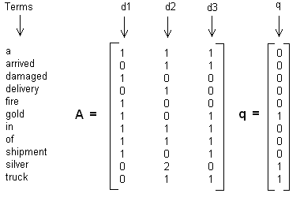
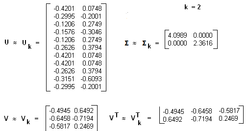

# 主题模型之LSI

在数据分析中，经常会使用非监督学习的聚类算法，对特征数据进行非监督的聚类。主题模型也是一种非监督的算法，目的是得到文本按照主题的概率分布。从这方面来说，主题模型和普通的聚类算法非常类似。然而两者还是有区别的。

聚类算法关注于从样本特征的相似度方面将数据聚类，采用数据样本之间的欧式距离、曼哈顿距离的大小聚类等等。主题模型是对文字中隐含主题的一种建模方法，如"人民的名义"和"达康书记"这两个词是具有很强主题相关度，但是如果通过词特征来聚类的话则很难找出，普通的聚类算法是不能考虑到隐含的主题。

## 潜语义索引算法原理

潜语义索引(Latent Semantic Indexing,简称LSI)，有时候也叫作Latent Semantic Analysis(简称LSA)是一种简单实用的主题模型。LSI是基于奇异值分解(SVD)的方法来得到文本的主题。

对于一个$m\times n$的矩阵$A$，可以分解为以下三个矩阵：

$$
A_{m\times n} = U_{m\times n} \Sigma_{n\times n} V^T_{n\times n}
$$

有时为了降低维度到$k$，SVD的分解可以近似写成：

$$
A_{m\times n}\approx U_{m \times k} \Sigma_{k \times k} V^T_{k \times n}
$$

现有$m$个文本，每个文本有$n$个词，$A_{ij}$则对应第$i$个文本的第$j$个词的特征值，这里的特征值可以使用基于预处理后的标准化TF-IDF值。

SVD分解以后，$U_{il}$对应第$i$个文本和第$l$个主题的相关度，$V_{jm}$对应第$j$个词和第$m$个词义的相关度，$\Sigma_{lm}$对应第$l$个主题和第$m$个词义的相关度。

## LSI简单实例

先假设有下面10个词的三个文本$d_1,d_2,d_3$的词频TF对应矩阵如下：

这里直接简单的使用词频作为特征，在实际应用中最好使用TF-IDF值矩阵作为输入。假定主题数$k=2$，则通过SVD降维后得到的三个矩阵为：

从矩阵$U_k$可以看到词和词义之间的相关性，矩阵$V_k$中可以看到3个文本和两个主题的相关性。可以发现里面有负值，所以这样得到的相关度比较难解释。

通过LSI得到文本主题矩阵后可以用于文本相似度计算，一般采用余弦相似度。如计算第一个文本和第二个文本的余弦相似度得到：

$$
sim(d_1,d_2)=\frac{(-0.4945)\cdot(-0.6458)+(0.6492)\cdot(-0.7194)}{\sqrt{(-0.4945)^2+(0.6492)^2}\cdot\sqrt{(-0.6458)^2+(-0.7194)^2} }
$$

## 总结

LSI是最早出现的主题模型，其算法原理很简单，一次奇异值分解就可以得到主题模型，同时解决了词义的问题。但是LSI算法也有很多的不足，导致现在实际应用中已基本不再使用。

主要存在的问题：

（1）SVD计算十分耗时，尤其在处理大文本的情况，高维度的奇异值分解是很难的；

（2）主题值的选取对结果的影响非常大，很难选择合适的$k$值；

（3）LSI得到的不是概率值，缺乏统计基础，结果难以直观解释；

