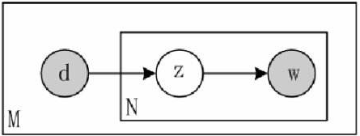
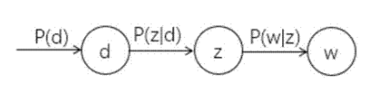

# 主题模型之pLSA

尽管基于SVD的LSA取得一定的成功，但是由于其缺乏严谨的数理统计基础，且SVD分解非常耗时。于是出现了LSA的改进算法pLSA。

概率潜语义模型(Probability Latent Semantic Analysis,简称pLSA)也是一种主题模型，是针对文本中隐含主题的建模方法。pLSA给定了文档$d$之后，需要以一定的概率选择与文档相对应的主题$z$，然后再从主题$z$中以一定的概率选择单词$w$。

## pLSA数学模型

pLSA的概率图模型如下：

其中$D\in \{d_1,d_2,...,d_N\}$代表文档，$Z\in \{z_1,z_2,...,z_k\}$表示隐含类别或主题，$W\in \{ w_1,w_2,...,w_M\}$为观察到的单词。其中$P(d_i)$表示选中文档$d_i$个概率，$P(z_k|d_i)$表示文档$d_i$中出现主题$z_k$的概率，$P(w_j|z_k)$表示给定主题$z_k$出现单词$w_j$个概率，$P(w_j|d_i)$表示给定文档$d_i$出现单词$w_j$的概率。

整个文档$d_i$个生成过程如下：

（1）以$P(d_i)$的概率选中文档$d_i$；

（2）以$P(z_k|d_i)$的概率选中主题$z_k$；

（3）以$P(w_j|z_k)$的概率生成一个单词$w_j$

可以观察到的数据是$(d_i,w_j)$，而$z_k$是隐含变量，$(d_i,w_j)$的联合分布为：

$$
\begin{align}
p(d_i,w_j)&=p(d_i)p(w_j|d_i)\\
p(w_j|d_i)&=\sum_{k=1}^K p(w_j|z_k)p(z_k|d_i)
\end{align}
$$

使用最大似然估计来估计参数，其数学表达式为：

$$
\prod_{i=1}^N \prod_{j=1}^{M}p(w_j | d_i)^{n(d_i,w_j)}
$$

其中$n(d_i,w_j)$表示第$j$个单词在第$i$篇文档中出现的次数。为了使式(3)取得最大值，一般先取对数，得到：

$$
\begin{align}
&\log(\prod_{i=1}^{N}\prod_{j=1}^M p(w_j|d_i)^{n(d_i,w_j)})\\
=&\sum_{i=1}^N \sum_{j=1}^M n(d_i,w_j) \log p(w_j|d_i)\\
=&\sum_{i=1}^N \sum_{j=1}^M n(d_i,w_j) \log \sum_{k=1}^K p(w_j|z_k) p(z_k | d_i)\\
=&\sum_{i=1}^N \sum_{j=1}^M n(d_i,w_j) \log \sum_{k=1}^K Q_{ij}(z_k)\frac{p(w_j|z_k) p(z_k | d_i)}{Q_{ij}(z_k)} \\
\ge & \sum_{i=1}^N \sum_{j=1}^M n(d_i,w_j)  \sum_{k=1}^K Q_{ij}(z_k) \log \frac{p(w_j|z_k) p(z_k | d_i)}{Q_{ij}(z_k)} \\
=&\sum_{i=1}^N \sum_{j=1}^M n(d_i,w_j)  \sum_{k=1}^K \left\{ Q_{ij}(z_k) \log p(w_j|z_k) p(z_k | d_i) -Q_{ij}(z_k)\log Q_{ij}(z_k) \right \} \\
\end{align}
$$

上式中$Q_{ij}(z_k)\log Q_{ij}(z_k)$是和变量$p(w_j|z_k),p(z_k | d_i)$ 无关的常量，可以直接忽略掉。其中

$$
Q_{ij}(z_k)= \frac{p(w_j|z_k) p(z_k | d_i)}{\sum_{k=1}^K p(w_j|z_k) p(z_k | d_i)}
$$

所以最终优化目标可以写成：

$$
\sum_{i=1}^N \sum_{j=1}^M n(d_i,w_j)  \sum_{k=1}^K [ Q_{ij}(z_k) \log p(w_j|z_k) p(z_k | d_i)]
$$

同时还必须要满足约束条件：

$$
\begin{align}
\sum_{j=1}^M p(w_j|z_k)=1 \\
\sum_{k=1}^K p(z_k|d_i)=1
\end{align}
$$

利用拉格朗日乘子法，最终的损失函数可以写成：

$$
L = \sum_{i=1}^N \sum_{j=1}^M n(d_i,w_j)  \sum_{k=1}^K [ Q_{ij}(z_k) \log p(w_j|z_k) p(z_k | d_i)]\\+\alpha\sum_{k=1}^K(1-\sum_{j=1}^M p(w_j|z_k))+\beta \sum_{i=1}^N(1-\sum_{k=1}^K p(z_k|d_i))
$$

然后对$p(w_j|z_k)$求导并令其等于零，有：

$$
\begin{align}
0 &= \frac{\partial L}{\partial p(w_j|z_k)}\\
&= \sum_{i=1}^N n(d_i,w_j)Q_{ij}(z_k)\cdot \frac{p(z_k|d_i)}{p(w_j|z_k)p(z_k|d_i)}-\alpha\\
&= \sum_{i=1}^N n(d_i,w_j)Q_{ij}(z_k)\cdot \frac{1}{p(w_j|z_k)}-\alpha\\
&= \frac{1}{p(w_j|z_k)}\cdot \sum_{i=1}^N n(d_i,w_j)Q_{ij}(z_k)-\alpha\\
\end{align}
$$

通过可以移项得到：

$$
\begin{align}
&p(w_j|z_k) \cdot \alpha = \sum_{i=1}^N n(d_i,w_j)Q_{ij}(z_k)\\
\Rightarrow
&\sum_{j=1}^M p(w_j|z_k)\cdot \alpha =  \sum_{j=1}^M  \sum_{i=1}^N n(d_i,w_j)Q_{ij}(z_k)\\
\Rightarrow  
&\alpha =  \sum_{j=1}^M  \sum_{i=1}^N n(d_i,w_j)Q_{ij}(z_k)
\end{align}
$$

将$\alpha$带回到原等式，可以得到：

$$
p(w_j|z_k)=\frac{\sum_{i=1}^N n(d_i,w_j)Q_{ij}(z_k)}{\alpha}=\frac{\sum_{i=1}^N n(d_i,w_j)Q_{ij}(z_k)}{  \sum_{j=1}^M  \sum_{i=1}^N n(d_i,w_j)Q_{ij}(z_k)}
$$

同理可以得到$p(z_k|d_i)$:

$$
p(z_k|d_i)=\frac{\sum_{j=1}^M n(d_i,w_j)Q_{ij}(z_k)}{n(d_i)}
$$
