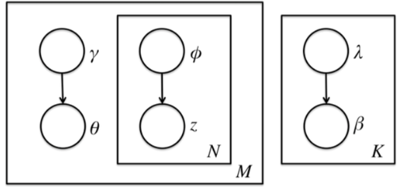

# 主题模型之LDA(三)

变分推断EM算法中通过"变分推断"(Variational Inference)和EM算法来得到LDA模型的文档主题分布和主题词分布。首先来看EM算法在这里的使用，模型里面有隐藏变量$\theta,\beta,z$，模型的参数是$\alpha,\eta$。为了求出模型参数和对应的隐藏变量分布，EM算法需要在E步先求出隐藏变量$\theta,\beta,z$的基于条件概率分布期望，接着在M步极大化这个期望，得到更新的后验模型参数$\alpha,\eta$。

在EM算法的E步，由于$\theta,\beta,z$的耦合，很难求出隐藏变量$\theta,\beta,z$的条件概率分布，也很难求出对应的期望，需要"变分推断"来帮忙，这里所谓的变分推断，就是在隐藏变量存在耦合的情况下，通过变分假设即假设所有的隐含变量都是各自的独立分布形成的，从而去掉了隐藏变量之间的耦合关系。使用各个独立分布形成的变分分布来模拟近似隐藏变量的条件分布，这样就可以顺利使用EM算法了。

当进行若干轮的E步和M步迭代更新后，就可以得到合适的近似隐藏变量分布$\theta,\beta,z$和模型后验参数$\alpha,\eta$，进而就得到了我们需要的LDA主题文档分布和主题分布。

## LDA变分推断

在给定参数$\alpha$和$\eta$，可以得到文档主题分布$\theta,\beta,z,w$的联合概率分布：

$$
p(\theta,\beta,z,w|\alpha,\eta) =\bigg ( \prod_{k=1}^K p(\beta|\eta) \bigg ) \cdot p(\theta|\alpha)\cdot \bigg (\prod_{n=1}^N p(z_n|\theta)p(w_n|z_n,\beta_{z_n})\bigg )
$$

由式子(1)可以得到文档的边缘概率，即对$\theta,\beta,z$求积分即可：

$$
p(w|\alpha,\eta)=\int\int p(\beta|\eta)p(\theta|\alpha)\bigg (\prod_{n=1}^N\sum_{z_n} p(z_n|\theta)p(w_n|z_n,\beta_{z_n})\bigg)d_{\theta}d_{\beta}
$$

要使用EM算法，需要求出隐藏变量的条件概率分布如下：

$$
p(\theta,\beta,z|w,\alpha,\eta)=\frac{p(\theta,\beta,z,w|\alpha,\eta)}{p(w|\alpha,\eta)}
$$

由于$\theta,\beta,z$之间是互相耦合的，条件概率式(2)是无法直接求出来的。为了解决这个问题引入变分推断，具体就是引入基于mean field assumption的变分推断，这个推断假设所有的隐藏变量都是通过各自的独立分布形成的，如图所示：

假设隐藏变量$\theta$是由独立分布$\gamma$形成的，隐藏变量$z$是由独立分布$\phi$形成的，隐藏变量$\beta$是由独立分布$\lambda$形成的。于是就可以得到了三个隐藏变量联合的变分分布$q$为：

$$
\begin{align}
q(\beta,\theta,z|\lambda,\phi,\gamma)
&=\prod_{k=1}^K q(\beta_k|\lambda_k)\prod_{d=1}^M p(\theta_d,z_d|\gamma_d,\phi_d)\\
&=\prod_{k=1}^K q(\beta_k|\lambda_k)\prod_{d=1}^M\bigg (  q(\theta_d|\gamma_d)\prod_{n=1}^{N_d}q(z_{dn}|\phi_{dn})  \bigg )\\
\end{align}
$$

现在可以用$q(\beta,\theta,z|\lambda,\phi,\gamma)$来近似估计$p(\theta,\beta,z|w,\alpha,\eta)$，让两个分布尽可能的相似，因此最优化的目标是最小化两个分布之间的KL距离：

$$
(\gamma^*,\phi^*,\lambda^*)=\arg\min_{\gamma,\phi,\lambda} D( q(\beta,\theta,z|\lambda,\phi,\gamma)  || p(\theta,\beta,z|w,\alpha,\eta))
$$

> $D(q||p)$即为KL散度或KL距离，对应分布$p$和$q$的交叉熵，即：
>
> $$
> D(q||p)=\sum_{x}q(x)\log \frac{q(x)}{p(x)}=E_{q(x)}(\log q(x)-\log p(x)) \notag
> $$
>

然而直接优化这个KL散度求$\gamma^*,\phi^*,\lambda^*$并不是很好求，需要对式(6)进行深入推导。为了简化表示，用$\mathbb{E}_q(x)$代替$\mathbb{E}_{q(\beta,z,\theta)|\lambda,\phi,\gamma)}(x)$，用来表示$x$对于变分分布$q(\beta,z,\theta|\lambda,\phi,\gamma)$的期望。

$$
\begin{align}
 &D( q(\beta,\theta,z|\lambda,\phi,\gamma)  || p(\theta,\beta,z|w,\alpha,\eta))\\
 =& \quad \mathbb{E}_q\log q(\beta,\theta,z|\lambda,\phi,\gamma)- \mathbb{E}_q\log  p(\theta,\beta,z|w,\alpha,\eta)\\
 =& \quad \mathbb{E}_q\log q(\beta,\theta,z|\lambda,\phi,\gamma)- \mathbb{E}_q\log \frac{p(\theta,\beta,z,w|\alpha,\eta)}{p(w|\eta,\alpha)}\\
=& \quad \mathbb{E}_q\log q(\beta,\theta,z|\lambda,\phi,\gamma)- \mathbb{E}_q\log p(\theta,\beta,z,w|\alpha,\eta)+\mathbb{E}_q \log p(w|\eta,\alpha)\\
=& \quad \mathbb{E}_q\log q(\beta,\theta,z|\lambda,\phi,\gamma)- \mathbb{E}_q\log p(\theta,\beta,z,w|\alpha,\eta)+ \log p(w|\eta,\alpha)\\
=&-\bigg (- \mathbb{E}_q\log q(\beta,\theta,z|\lambda,\phi,\gamma)+ \mathbb{E}_q\log p(\theta,\beta,z,w|\alpha,\eta) \bigg )+ \log p(w|\eta,\alpha)\\
\overset{\Delta}{=} & -\mathcal{L}(\lambda,\phi,\gamma;\alpha,\eta) + \log p(w|\eta,\alpha) 
\end{align}
$$

式(7)-(8)利用KL散度的定义进行展开；式(8)-(10)利用贝叶斯公式并展开；式(11)-(12) $q$和$p$是无关的，所以求期望等于其本身；式(12)-(13)引入$\mathcal{L}(\cdot)$函数，一般称为ELBO(Evidence Lower BOund)。 

现在就可以得到$KL(\cdot)$和$\mathcal{L}(\cdot)$之间的关系：

$$
\begin{align}
\log p(w|\eta,\alpha)&=\mathcal{L}(\lambda,\phi,\gamma;\alpha,\eta)+D( q(\beta,\theta,z|\lambda,\phi,\gamma)  || p(\theta,\beta,z|w,\alpha,\eta))
\\
\mathcal{L}(\lambda,\phi,\gamma;\alpha,\eta) & = \mathbb{E}_q\log p(\theta,\beta,z,w|\alpha,\eta) - \mathbb{E}_q\log q(\beta,\theta,z|\lambda,\phi,\gamma)
\end{align}
$$

式(14)中左侧对数似然部分是关于可观测变量$w$的可以看成常数。因此最小化KL散度等价于最大化ELBO，现在变分推断最终等价的转换为要求ELBO的最大值。

## 极大化ELBO求解变分参数

首先对ELBO函数进行整理得到：

$$
\begin{aligned}
\mathcal{L}(\lambda,\phi,\gamma;\alpha,\eta)
=&
\mathbb{E}_q[\log p(\beta|\eta)] +\mathbb{E}_q[\log p(z|\theta)]+\mathbb{E}_q[\log p(\theta|\alpha)]+\mathbb{E}_q[\log p(w|z,\beta)]\\
&-\mathbb{E}_q[\log p(\beta|\lambda)]-\mathbb{E}_q[\log p(z|\phi)]-\mathbb{E}_q[\log p(\theta|\gamma)]
\end{aligned}
$$

展开后公有7项，现在需要对这7项分别做一个展开。

对于第一项$\mathbb{E}_q[\log p(\beta|\eta)]$有：

$$
\begin{align} 
\mathbb{E}_q[logp(\beta|\eta)]  
& =  \mathbb{E}_q[log\prod_{k=1}^K(\frac{\Gamma(\sum\limits_{i=1}^V\eta_i)}{\prod_{i=1}^V\Gamma(\eta_i)}\prod_{i=1}^V\beta_{ki}^{\eta_i-1})] \\ 
& = Klog\Gamma(\sum\limits_{i=1}^V\eta_i) - K\sum\limits_{i=1}^Vlog\Gamma(\eta_i)  + \sum\limits_{k=1}^K \mathbb{E}_q[\sum\limits_{i=1}^V(\eta_i-1) log\beta_{ki}] \\
& = Klog\Gamma(\sum\limits_{i=1}^V\eta_i) - K\sum\limits_{i=1}^Vlog\Gamma(\eta_i)  + 
\sum\limits_{k=1}^K\sum\limits_{i=1}^V(\eta_i-1) \mathbb{E}_q[ log\beta_{ki}] \\
& = Klog\Gamma(\sum\limits_{i=1}^V\eta_i) - K\sum\limits_{i=1}^Vlog\Gamma(\eta_i)  + 
\sum\limits_{k=1}^K\sum\limits_{i=1}^V(\eta_i-1)  (log\Gamma(\lambda_{ki} ) - log\Gamma(\sum\limits_{i^{'}=1}^V\lambda_{ki^{'}}))^{'} \\
& = Klog\Gamma(\sum\limits_{i=1}^V\eta_i) - K\sum\limits_{i=1}^Vlog\Gamma(\eta_i)  + 
\sum\limits_{k=1}^K\sum\limits_{i=1}^V(\eta_i-1)  
(\Psi(\lambda_{ki}) - \Psi(\sum\limits_{i^{'}=1}^V\lambda_{ki^{'}}) \\
\end{align}
$$

式(16)-(17)直接展开；式(17)-(18)利用期望性质$\mathbb{E}(X+Y)=\mathbb{E}(X)+\mathbb{E}(Y)$；式(19)~(20)利用指数分布族性质。

> 指数分布族是值分布函数满足如下形式的概率分布：
>
> $$
> p(x|\theta)=h(x) \exp \bigg ( \eta(\theta)\cdot T(x)-A(\theta) \bigg) \notag
> $$
>
> 分布函数中$T,\eta$和$A$的都是具有特殊的意义：
>
> + $T(x)$是分布的充分统计量(sufficient statistic)；
>
> + $\eta$是自然参数；
>
> + $A(\theta)$被称为对数配分函数(partition function)实际上就是归一化因子的对数形式它使概率分布的积分1
>   $$
>   A(\theta)=\log (\int h(x)\exp (\eta(\theta)\cdot T(x))dx) \notag
>   $$
>
>
>
> 指数分布族包含了很多常见的分布，如正态分布，Gamma分布，beta分布，狄利克雷函数分布，伯努利分布，泊松分布，Wishart分布，Inverse-Wishart分布等等。指数分布具有很多性质，如：
>
> $$
> \begin{align}
> \frac{d}{d\eta(\theta)}A(\theta)
> &=\frac{d}{d\eta(\theta)} \log \bigg ( \int h(x)\exp (\eta(\theta)\cdot T(x))dx \bigg ) \\
> &= \frac{ \int T(x) h(x)\exp (\eta(\theta)\cdot T(x))dx}{ \int h(x)\exp (\eta(\theta)\cdot T(x))dx} \\
> &=\frac{ \int T(x) h(x)\exp (\eta(\theta)\cdot T(x))dx}{ \exp (A(\theta))}  \\
> &=\int T(x) h(x)\exp (\eta(\theta)\cdot T(x)-A(\theta))dx  \\
> & = \mathbb{E}_{p(x|\theta)}T(x)
> \end{align}
> $$
>
> 以上式中$\mathbb{E}_q(\log \beta_{ki})$为例：
>
> $$
> \mathbb{E}_q[\sum\limits_{i=1}^Vlog\beta_{ki}] = (log\Gamma(\lambda_{ki} ) - log\Gamma(\sum\limits_{i^{'}=1}^V\lambda_{ki^{'}}))^{'} = \Psi(\lambda_{ki}) - \Psi(\sum\limits_{i^{'}=1}^V\lambda_{ki^{'}}) \notag
> $$
>
> 其中$\Psi(x)=\frac{d}{dx}\log \Gamma(x)=\frac{\Gamma(x)^‘}{\Gamma(x)}$

剩余的六项直接给出结果：

$$
\begin{align} 
\mathbb{E}_q[logp(z|\theta)] 
&= \sum\limits_{n=1}^N\sum\limits_{k=1}^K\phi_{nk}\Psi(\gamma_{k}) - \Psi(\sum\limits_{k^{'}=1}^K\gamma_{k^{'}})
\\
\mathbb{E}_q[logp(\theta|\alpha)]   
&= log\Gamma(\sum\limits_{k=1}^K\alpha_k) - \sum\limits_{k=1}^Klog\Gamma(\alpha_k)  + \sum\limits_{k=1}^K(\alpha_k-1)(\Psi(\gamma_{k}) - \Psi(\sum\limits_{k^{'}=1}^K\gamma_{k^{'}})) 
\\
 \mathbb{E}_q[logp(w|z, \beta)] 
 & = \sum\limits_{n=1}^N\sum\limits_{k=1}^K\sum\limits_{i=1}^V\phi_{nk}w_n^i(\Psi(\lambda_{ki}) - \Psi(\sum\limits_{i^{'}=1}^V\lambda_{ki^{'}}) )
\\
 \mathbb{E}_q[logq(\beta|\lambda)] 
 &= \sum\limits_{k=1}^K(log\Gamma(\sum\limits_{i=1}^V\lambda_{ki}) - \sum\limits_{i=1}^Vlog\Gamma(\lambda_{ki})) + \sum\limits_{k=1}^K\sum\limits_{i=1}^V (\lambda_{ki}-1)(\Psi(\lambda_{ki}) - \Psi(\sum\limits_{i^{'}=1}^V\lambda_{ki^{'}}) )
 \\
 \mathbb{E}_q[logq(z|\phi)] & = \sum\limits_{n=1}^N\sum\limits_{k=1}^K\phi_{nk}log\phi_{nk}
 \\
\mathbb{E}_q[logq(\theta|\gamma)] & =  log\Gamma(\sum\limits_{k=1}^K\gamma_k) - \sum\limits_{k=1}^Klog\Gamma(\gamma_k)  +  \sum\limits_{k=1}^K(\gamma_k-1)(\Psi(\gamma_{k}) - \Psi(\sum\limits_{k^{'}=1}^K\gamma_{k^{'}}))
\end{align}
$$

现在得到了$\mathcal{L}(\gamma,\phi,\lambda;\alpha,\eta)$之后，目标就是极大化这个下界ELBO关于$(\gamma,\phi,\lambda)$得到真实后验概率分布的近似分布$q(\cdot)$ 即EM算法的E步，然后固定变分参数，极大化ELBO关于$(\alpha,\eta)$即EM算法的M步。

## EM算法之E步

**(1)ELBO对$\phi$求导**

为了简单起见，直接省略不包含$\phi$的项，仅根据包含参数的$\phi$的项构造拉格朗日函数：

$$
\begin{align}
L_{[\phi]}
=& \sum_{n=1}^N\sum_{k=1}^K \phi_{nk}\bigg (  \Psi(\gamma_k)-\Psi(\sum_{k'=1}^K\gamma_{k'}) \bigg)
+ \sum\limits_{n=1}^N\sum\limits_{k=1}^K\sum\limits_{i=1}^V\phi_{nk}w_n^i \bigg (\Psi(\lambda_{ki}) - \Psi(\sum\limits_{i^{'}=1}^V\lambda_{ki^{'}}) \bigg )\\
& -  \sum\limits_{n=1}^N\sum\limits_{k=1}^K\phi_{nk}log\phi_{nk}
+\sum_{n=1}^N \upsilon_n \bigg( \sum_{k=1}^K \phi_{nk}-1 \bigg)
\end{align}
$$

求$L_{[\phi]}$对参数$\phi$求偏导并令导数等于0，可以得到

$$
\begin{align}
0
=\frac{\partial L}{\partial \phi_{nk}}
=\Psi(\gamma_k)-\Psi(\sum_{k'=1}^K\gamma_{k'}) +\sum\limits_{i=1}^V w_n^i \bigg (\Psi(\lambda_{ki}) - \Psi(\sum\limits_{i^{'}=1}^V\lambda_{ki^{'}}) \bigg )-\log \phi_{nk}+\upsilon_n
\end{align}
$$

最终可以得到

$$
\phi_{nk}\approx \exp \bigg(  \Psi(\gamma_k)-\Psi(\sum_{k'=1}^K\gamma_{k'}) +\sum\limits_{i=1}^V w_n^i \bigg (\Psi(\lambda_{ki}) - \Psi(\sum\limits_{i^{'}=1}^V\lambda_{ki^{'}}) \bigg )   \bigg)
$$

**(2)ELBO对$\gamma$求导**

构造对应包含$\gamma$的拉格朗日函数：

$$
\begin{align}
L[\gamma]
=&\sum\limits_{n=1}^N\sum\limits_{k=1}^K\phi_{nk}\Psi(\gamma_{k}) - \Psi(\sum\limits_{k^{'}=1}^K\gamma_{k^{'}})
+\sum\limits_{k=1}^K(\alpha_k-1)(\Psi(\gamma_{k}) - \Psi(\sum\limits_{k^{'}=1}^K\gamma_{k^{'}})) \\
&-log\Gamma(\sum\limits_{k=1}^K\gamma_k) + \sum\limits_{k=1}^Klog\Gamma(\gamma_k)  -  \sum\limits_{k=1}^K(\gamma_k-1)(\Psi(\gamma_{k}) - \Psi(\sum\limits_{k^{'}=1}^K\gamma_{k^{'}}))\\
=&\sum_{k=1}^K \bigg ( \Psi(\gamma_k)-\Psi(\sum_{k'=1}^K \gamma_{k'})  \bigg) \bigg ( \sum_{n=1}^N \phi_{nk}+\alpha_k-\gamma_k \bigg)- \log \Gamma(\sum_{k=1}^K \gamma_k)+\sum_{k=1}^K log \Gamma(\gamma_k)
\end{align}
$$

求$L_{[\gamma]}$对参数$\gamma$求偏导并令导数等于0，可以得到

$$
\begin{align}
0
=\frac{\partial L}{\partial \gamma_{k}}
=\bigg (\Psi'(\gamma_k)-\Psi'(\sum_{k'=1}^K \gamma_{k'}) \bigg ) \bigg (\sum_{n=1}^N \phi_{nk}+\alpha_k-\gamma_k \bigg)
\end{align}
$$

最终可以得到

$$
\gamma_k = \alpha_k +\sum_{n=1}^N \phi_{nk}
$$

**(3)ELBO对$\lambda$求导**

构造对应包含$\lambda$的拉格朗日函数：

$$
\begin{align}
L_{[\lambda]}
=& \sum\limits_{k=1}^K\sum\limits_{i=1}^V(\eta_i-1) (\Psi(\lambda_{ki}) - \Psi(\sum\limits_{i^{'}=1}^V\lambda_{ki^{'}})
+ \sum\limits_{n=1}^N\sum\limits_{k=1}^K\sum\limits_{i=1}^V\phi_{nk}w_n^i \bigg (\Psi(\lambda_{ki}) - \Psi(\sum\limits_{i^{'}=1}^V\lambda_{ki^{'}}) \bigg )
\\
&-\sum\limits_{k=1}^K\bigg (log\Gamma(\sum\limits_{i=1}^V\lambda_{ki}) - \sum\limits_{i=1}^Vlog\Gamma(\lambda_{ki})\bigg ) -\sum\limits_{k=1}^K\sum\limits_{i=1}^V (\lambda_{ki}-1)\bigg (\Psi(\lambda_{ki}) - \Psi(\sum\limits_{i^{'}=1}^V\lambda_{ki^{'}}) \bigg )
\end{align}
$$

求$L_{[\lambda]}$对参数$\lambda$求偏导并令导数等于0，可以得到：

$$
\begin{align}
0
=\frac{\partial L}{\partial \lambda_{ki}}
=\bigg ( \eta_i+\sum_{n=1}^N \phi_{nk}w_n^i-\lambda_{ki}  \bigg)  \bigg ( \Psi'(\lambda_{ki})-\Psi'(\sum_{i'=1}^V \lambda_{ki'})  \bigg)
\end{align}
$$

最终得到：

$$
\lambda_{ki}=\eta_i +\sum_{n=1}^N \phi_{nk}w_n^i
$$

由于参数$\lambda$决定了$\beta$分布，对于整个训练预料$\beta$是共有的，因此参数$\lambda$实际应该按照如下方式更新：

$$
\lambda_{ki}=\eta_i +\sum_{d=1}^M \sum_{n=1}^{N_{d}}\phi_{d_{nk}}w_{dn}^i
$$

最终的E步就是用(27)、(28)、(30)来更新三个变分参数。不断迭代更新直到三个变分参数收敛。当变分参数收敛后，下一步就是M步，固定变分参数，更新模型参数$\eta,\alpha$了。

## EM算法之M步

在E步已经得到了当前最佳的变分参数，现在M步就可以固定变分参数，极大化ELBO得到最优的模型参数$\eta,\alpha$。求解最优模型参数$\alpha,\eta$的方法很多，如梯度下降法，牛顿法等都是可以。LDA这里一般使用的是牛顿法，即通过求出ELBO对$\alpha,\eta$的一阶导数和二阶导数表达式，然后迭代求解$\alpha,\eta$在M步的最优解。

(1)从下界$L(\gamma,\phi,\lambda;\alpha,\eta)$中提取仅包含$\alpha$的项（基于整个训练语料$M$篇文档）：

$$
\begin{align}
L_{[\alpha]}
=& \sum_{d=1}^M \bigg (log\Gamma(\sum\limits_{k=1}^K\alpha_k) - \sum\limits_{k=1}^Klog\Gamma(\alpha_k) \bigg) 
+ \sum\limits_{d=1}^M \sum\limits_{k=1}^K(\alpha_k-1)(\Psi(\gamma_{dk}) - \Psi(\sum\limits_{k^{'}=1}^K\gamma_{dk^{'}}))
\end{align}
$$

对$L_{[\alpha]}$求偏导有：

$$
\begin{align}
\nabla_{\alpha_k}L 
=\frac{\partial L}{\partial \alpha_k} &= M(\Psi(\sum\limits_{k^{'}=1}^K\alpha_{k^{'}}) - \Psi(\alpha_{k}) ) + \sum\limits_{d=1}^M(\Psi(\gamma_{dk}) - \Psi(\sum\limits_{k^{'}=1}^K\gamma_{dk^{'}}))
\\
\nabla_{\alpha_k \alpha_j}L 
=\frac{\partial L}{\partial \alpha_k \alpha_j}  &= M(\Psi^{'}(\sum\limits_{k^{'}=1}^K\alpha_{k^{'}})- \delta(k,j)\Psi^{'}(\alpha_{k}) )
\end{align}
$$

其中当且仅当$k=j$时，$\delta(k,j)=1$否则$\delta(k,j)=0$。

(2)从下界$L(\gamma,\phi,\lambda;\alpha,\eta)$中提取仅包含$\eta$的项：

$$
\begin{align}
L_{[\eta]}
& = Klog\Gamma(\sum\limits_{i=1}^V\eta_i) - K\sum\limits_{i=1}^Vlog\Gamma(\eta_i)  + 
\sum\limits_{k=1}^K\sum\limits_{i=1}^V(\eta_i-1)  
(\Psi(\lambda_{ki}) - \Psi(\sum\limits_{i^{'}=1}^V\lambda_{ki^{'}}) \\
\end{align}
$$

对$L_{[\eta]}$求偏导有：

$$
\begin{align}
\nabla_{\eta_j}L=\frac{\partial L}{\partial \eta_j}
&= K(\Psi(\sum\limits_{i^{'}=1}^V\eta_{i^{'}}) - \Psi(\eta_{i}) ) + \sum\limits_{k=1}^K(\Psi(\lambda_{ki}) - \Psi(\sum\limits_{i^{'}=1}^V\lambda_{ki^{'}}))
\\
\nabla_{\eta_j \eta_i}L=\frac{\partial L}{\partial \eta_j \eta_i}
&=  K(\Psi^{'}(\sum\limits_{i^{'}=1}^V\eta_{i^{'}}) -  \delta(i,j)\Psi^{'}(\eta_{i}) )
\end{align}
$$

其中，当且仅当$k=j$时，$\delta(k,j)=1$否则$\delta(k,j)=0$。

最终牛顿迭代法的更新公式为：

$$
\begin{align} 
\alpha_{k+1} = \alpha_k + \frac{\nabla_{\alpha_k}L}{\nabla_{\alpha_k\alpha_j}L} 
\\
\eta_{i+1} = \eta_i+ \frac{\nabla_{\eta_i}L}{\nabla_{\eta_i\eta_j}L} 
\end{align}
$$

