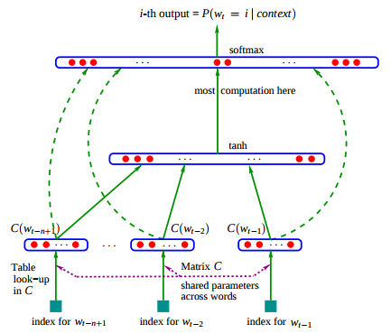

# 词向量之word2vec(一)

word2vec是Google在2013年推出的一个NLP工具，它的特点是将所有词向量化，这样词与词之间就可以定量的去度量它们之间的关系，挖掘词之间的联系。

## 词向量基础

自然语言处理转化为机器学习问题，第一步就是要找到一种方法将这些语言符号数学化。其中最直观和最常用的词向量表示方法是One-hot representation，这种方法把每个词表示为一个很长的向量，向量的长度就是此表的大小，其中绝大多数元素为0，只有一个维度的值为1。比如现有5个词组成的词表，如`(king,queue,man,woman,child)`其中`queue`的序号为2，那么`queue`的词向量就是`(0,1,0,0,0)`。同理词`man`的词向量为`(0,0,1,0,0)`。

One-hot representation用来表示词向量非常简单，但是却有很多问题：①维度灾难：如果词汇表非常大如百万级别，那么每个词向量都是百万维度的；②词汇鸿沟：任意两个词之间都是孤立的，从词向量中看不出两个词之间是否有联系。

Distributed representation可以解决One-hot representation的问题，其思路是通过训练，将每个词都映射到一个较短的词向量上来。所有这些词向量就构成了向量空间，进而可以用普通的统计学方法来研究词与词之间的关系，这个较短词向量的维度一般需要在训练是由用户指定。

比如下图将词汇表里的词用`Royalty`,`Masculinity`, `Femininity`和`Age`4个维度来表示，`King`这个词对应的词向量可能是`(0.99,0.99,0.05,0.7)`。当然在实际情况中，并不能对词向量的每个维度做一个很好的解释。

## 神经网络语言模型

神经网络训练语言模型的经典之作是论文《A Neural Probabilistic Language Model》，论文中使用了一个三层的神经网络来构建语言模型，如图所示

最下方的$w_{t-n+1},...,w_{t-2},w_{t-1}$就是前$n-1$个词，现在需要根据这已知的$n-1$个词预测下一个词$w_t$。$C(w)$表示词$w$所对应的词向量，整个模型中公用一套唯一的词向量，存在矩阵$C\in \mathbb{R}^{|V|\times m}$中，其中$|V|$表示词表的大小即预料中的总词数，$m$表示词向量的维度，$w$到$C(w)$的转化就是从矩阵中取出一行。

网络的第一层(输入层)将$C(w_{t-n+1}),...,C(w_{t-2}),C(w_{t-1})$这$n-1$个向量收尾相连拼接在一起，形成一个$(n-1)m$维的向量，记作$x$，即：

$$
x =\bigg ( C(w_{t-n+1}),...,C(w_{t-2}),C(w_{t-1}) \bigg ) \in \mathbb{R}^{(n-1)m}
$$

网络的第二层(隐藏层)就是一个普通的神经网络，直接使用$d+H x$计算得到，使用$tanh(\cdot)$作为激活函数。其中$H\in \mathbb{R}^{h\times (n-1)m},d \in \mathbb{R}^h$ 这里的$h$就是隐藏节点个数。

网络的第三层(输出层)一共有$|V|$个节点，每个节点$y_i$表示下一个词为$i$的未归一化$\log$概率。最后使用softmax激活函数将输出值$y$归一化成概率。其中$b\in \mathbb{R}^{|V|}$是输出层偏置项，于是$y$个完整计算公式为：

$$
y = b+W x + U \tanh(d+Hx)
$$

式(2)中$U \in \mathbb{R}^{|V|\times h}$ 是隐藏层到输出层的参数，整个模型的多数计算集中在$U$和$\tanh(d+Hx)$的矩阵乘法中，因此后续对这一环节简化，可以提升计算速度。

式(2)中$W \in \mathbb{R}^{|V|\times (n-1)m}$ 这个矩阵包含了从输入层到输出层的直连边，是一个输出层到输出层的线性变换。如果不需要直连边，可以将$W$置为0即可。在论文中有提到直连边虽然不能提升模型效果，但是可以减少一半的迭代次数。

神经网络中的参数为：

$$
\theta =(b,d,W,U,H,C)
$$

一共有$|V|(1+nm+h)+h(1+(n-1)m)$个参数需要优化。这里有一个需要注意的是，一般神经网络的输入层只是一个输入值，但是在这里输入层$x$(也即$C$)也是参数，也是需要优化的。优化结束之后词向量$C$就有了，语言模型也有了。

## CBOW 和Skip-Gram

由于DNN模型的处理过程非常耗时，且一般词汇表都是在百万级别以上的，所以在DNN输出层进行softmax计算各个词的输出概率计算量很大。

word2vec中有两个重要的模型：CBOW和Skip-Gram。

如果用一个词作为输入，来预测它周围的上下文，这个模型就是Skip-Gram模型；而如果是拿一个词语的上下文作为输入，来预测这个词语本身，就是CBOW模型。

在CBOW模型中目标函数通常取做：

$$
\mathcal{L}=\sum_{w \in \mathcal{C}} \log p(w|Context(w))
$$

在Skip-gram模型中目标函数则是：

$$
\mathcal{L}=\sum_{w \in \mathcal{C}} \log p(Context(w)|w)
$$
