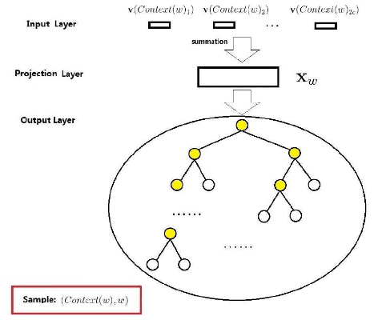
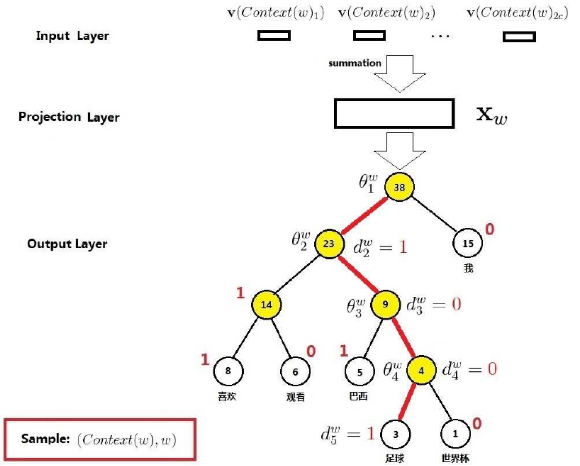
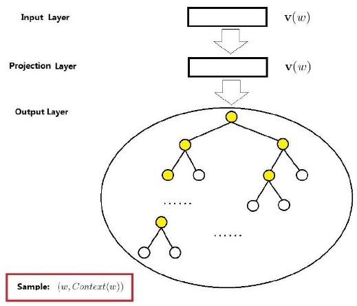

# 词向量之word2vec(二)

在word2vec中的CBOW和Skip-gram模型中，针对神经网络模型的存在的一些问题进行了有两种改进方法，一是基于Hierarchical Softmax的，另一种是基于Negative Sampling的。这里总结了基于Hierarchical Softmax的改进方法。

## CBOW 模型

word2vec的CBOW模型中，包括了三层：输入层、投影层和输出层。样本点为$(Context(w),w)$为例，对这三层进行简要说明。

输入层：包含$Context(w)$中$2c$个词的词向量$\mathbf{v}(Context(w)_1),\mathbf{v}(Context(w)_2),...,\mathbf{v}(Context(w)_{2c})\in \mathbb{R}^m$。这里的$m$表示词向量的长度。

投影层：将输入层的$2c$个向量做求和累加，即$x_w=\sum_{i=1}^{2c}v(Context(w)_i)\in \mathbb{R}^m$。

输出层：输出层对应一颗二叉树，是以语料中出现过的词当叶子节点，以各词在语料中出现的次数当权值构造Huffman树，叶子节点共$N$(等于$|\mathcal{D}|$个)分别对应词典$\mathcal{D}$中的词，非叶子节点$N-1$个。

上面word2vec中CBOW模型和神经网络概率语言模型对比，不同点主要有：

①从输入层到投影层的操作，神经网络是通过拼接，在CBOW中通过累加求和；

②在神经网络中有隐藏层，在CBOW中无隐藏层；

③在输出层中神经网络是线性结构，在CBOW中是树形结构；

在神经网络中大部分的计算集中在隐藏层和输出层之间的矩阵向量计算，以及输出层上的softmax归一化运算。在CBOW模型中对这些计算复杂度高的地方有针对性地进行了改变：首先，去掉了隐藏层。其次，输出层改用了Huffman树，从而为利用Hierarchical softmax技术奠定了基础。

## 梯度计算

Hierarchical Softmax是word2vec中用于提高性能的一项关键技术。首先引入若干相关的符号，考虑Huffman树中的某个叶子节点，对应词典$\mathcal{D}$中的词$w$，记：

| 符号                                                         | 说明                                                         |
| ------------------------------------------------------------ | ------------------------------------------------------------ |
| $p^w$                                                        | 从根节点出发到达$w$对应叶子节点的路径                        |
| $l^w$                                                        | 路径$p^w$中包含结点的个数                                    |
| $d_2^w,d_3^w,...,d_{l^w}^w\in \{0,1\}$                       | 路径$p^w$中的$l^w$个节点，其中$p_1^w$表示根节点$p^w_{l^w}$表示词$w$对应的节点 |
| $\theta_1^w,\theta_2^w,...,\theta_{l^{w}-1}^w \in \mathbb{R}^m$ | 路径$p^w$中非叶子节点对应的向量，$\theta_j^w$表示路径$p^w$中第$j$个非叶子节点对应向量 |

若考虑词$w=$"足球"的情形，下图有4条红色边穿起来的5个节点就构成了路径$p^w$，其长度$l^w=5$。$p_1^w,p_2^w,p_3^w,p_4^w,p_5^w$为路径$p^w$上的5个结点，其中$p_1^w$对应根结点，$d_2^w,d_3^w,d_4^w,d_5^w$分别为$1,0,0,1$。所以"足球"的Huffman编码为1001，此外$\theta_1^w,\theta_2^w,\theta_3^w,\theta_4^w$分别表示路径$p^w$上4个非叶子节点对应的向量。

从根节点出发到达"足球"这个叶子节点，中间共经历了4次分支(每条红色的边对应一次分支)，而每一次分支都可视为进行了一次二分类。在word2vec中约定：**将一个节点进行分类时，分到左边的就是负类，分到右边的就是正类。** 在二分类逻辑回归中，一个点被分为正类的概率是：

$$
\sigma(x_w^T \theta)=\frac{1}{1+e^{-x_w^T \theta}} \notag
$$

被分为负类的概率就等于$1-\sigma(x_w^T \theta)$。式中的$\theta$是待定的参数向量。回到上面的问题，那么从根结点出发到达"足球"这个叶子结点所经历的4次二分类，将每次分类结果的概率写出来就是：

第一次：$p(d_2^w|x_w,\theta_1^w)=1-\sigma(x_w^T \theta_1^w)$

第二次：$p(d_3^w|x_w,\theta_2^w)=\sigma(x_w^T \theta_2^w)$

第三次：$p(d_4^w|x_w,\theta_3^w)=\sigma(x_w^T \theta_3^w)$

第四次：$p(d_5^w|x_w,\theta_4^w)=1-\sigma(x_w^T \theta_4^w)$

于是要求的是$p(足球|Context(足球))$可以表达为：

$$
p(足球|Context(足球))=\prod_{j=1}^5 p(d_j^w| x_w,\theta_{j-1}^w) \notag
$$

综上可以看到Hierarchical Sotfmax的基本思想就是：对于词典$\mathcal{D}$中的任意词$w$，Huffman树中必存在一条从根节点到词$w$对应的路劲$p^w$且这条路径是唯一的，路径$p^w$上存在$l^w-1$个分支，每个分支可看成一次二分类，每一次分类就产生一个概率，将这些概率乘起来，就是所需的$p(w|Context(w))$。

条件概率$p(w|Context(w))$的一般公式可写成：

$$
p(w|Context(w))= \prod_{j=2}^{l^w}p(d_j^w | x_w,\theta_{j-1}^w)
$$

其中

$$
p(d_j^w | x_w, \theta_{j-1}^w)=\left \{
\begin{array}{}
\sigma(x_w^T \theta_{j-1}^w)  &\quad d_j^w=0
\\
1-\sigma(x_w^T \theta_{j-1}^w)  &\quad d_j^w=1
\end{array}
\right.
$$

上式(2)可以写成整体表达式

$$
p(d_j^w | x_w,\theta_{j-1}^w)=[ \sigma(x_w^T \theta_{j-1}^w)]^{1-d_j^w}\cdot [ 1-\sigma(x_w^T \theta_{j-1}^w ]^{d_j^w}
$$

将式(3)带入到式(1)取对数得到对数似然函数为

$$
\begin{align}
\mathcal{L}
&=\sum_{w\in \mathcal{C}} \log \prod_{j=2}^{l^w} \bigg( [ \sigma(x_w^T \theta_{j-1}^w)]^{1-d_j^w}\cdot [ 1-\sigma(x_w^T \theta_{j-1}^w ]^{d_j^w}    \bigg)
\\
&=\sum_{c\in \mathcal{C}} \sum_{j=2}^{l^w}\bigg[ (1-d_j^w)\cdot\log \sigma(x_w^T \theta_{j-1}^w)+d_j^w\cdot (1-\sigma(x_w^T\theta_{j-1}^w))\bigg]
\end{align}
$$

word2vec中采用的是随机梯度法，目标函数为$\mathcal{L}$，参数向量有$x_w,\theta_{j-1}^w,w\in \mathcal{C},j=2,3,...,l^w$ 。首先计算$\mathcal{L}(x_w,\theta_{j-1}^w)$关于参数$\theta_{j-1}^w$的表达式

$$
\begin{align}
\frac{\partial \mathcal{L}(x_w,\theta_{j-1}^w)}{\partial \theta_{j-1}^w}
&=\frac{\partial}{\partial \theta_{j-1}^w} \bigg [ (1-d_j^w)\cdot\log \sigma(x_w^T \theta_{j-1}^w)+d_j^w\cdot (1-\sigma(x_w^T\theta_{j-1}^w)) \bigg ]
\\
&=(1-d_j^w)\frac{\sigma(x_w^T\theta_{j-1}^w)(1-\sigma(x_w^T\theta_{j-1}^w))}{\sigma(x_w^T\theta_{j-1}^w)}x_w
- d_j^w\frac{\sigma(x_w^T\theta_{j-1}^w)(1-\sigma(x_w^T\theta_{j-1}^w))}{1-\sigma(x_w^T\theta_{j-1}^w)}x_w
\\
&=(1-d_j^w)(1-\sigma(x_w^T\theta_{j-1}^w))x_w - d_j^w\sigma(x_w^T\theta_{j-1}^w)x_w
\\
&=(1-d_j^w-\sigma(x_w^T \theta_{j-1}^w))x_w
\end{align}
$$

式(6)~(7)主要利用了$\sigma'(x)=\sigma(x)(1-\sigma(x))$ ，式(7)~(9)主要是合并同类项。于是，$\theta_{j-1}^w$的更新公式为

$$
\theta_{j-1}^w  = \theta_{j-1}^w + \eta [1- d_j^w-\sigma(x_w^T \theta_{j-1}^w)]
$$

$\mathcal{L}(x_w,\theta_{j-1}^w)$关于参数$x_w$的表达式

$$
\begin{align}
\frac{\partial \mathcal{L}(x_w,\theta_{j-1}^w)}{\partial x_w}
&=\frac{\partial}{\partial x_w} \bigg [ (1-d_j^w)\cdot\log \sigma(x_w^T \theta_{j-1}^w)+d_j^w\cdot (1-\sigma(x_w^T\theta_{j-1}^w)) \bigg ]
\\
&=(1-d_j^w)\frac{\sigma(x_w^T\theta_{j-1}^w)(1-\sigma(x_w^T\theta_{j-1}^w))}{\sigma(x_w^T\theta_{j-1}^w)}\theta_{j-1}^w
- d_j^w\frac{\sigma(x_w^T\theta_{j-1}^w)(1-\sigma(x_w^T\theta_{j-1}^w))}{1-\sigma(x_w^T\theta_{j-1}^w)}\theta_{j-1}^w
\\
&=(1-d_j^w)(1-\sigma(x_w^T\theta_{j-1}^w))\theta_{j-1}^w - d_j^w\sigma(x_w^T\theta_{j-1}^w)\theta_{j-1}^w
\\
&=(1-d_j^w-\sigma(x_w^T \theta_{j-1}^w))\theta_{j-1}^w
\end{align}
$$

这里需要注意的是：现在的最终目的是要求词典$\mathcal{D}$中每个词的词向量，而这里的$x_w$表示的是$Context(w)$中各词词向量的累加，的处理方式是

$$
\mathbf{v}(\widetilde{w})=\mathbf{v}(\widetilde{w}) + \eta \cdot \frac{\partial \mathcal{L}(x_w,\theta_{j-1}^w)}{\partial x_w}\quad \widetilde{w} \in Context(w)
$$

基于Hierarchical Softmax的CBOW模型算法流程，使用随机梯度上升算法流程如下：

> 输入：基本CBOW语料训练样本，词向量维度$M$，CBOW上下文大小$2c$，步长$\eta$
>
> 输出：Huffman树内部节点模型参数，所有的词向量$w$
>
> （1）基于预料训练样本建立Huffman树
>
> （2）随机初始化所有的模型参数$\theta$,所有的词向量$w$
>
> （3）进行梯度上升迭代过程，对于训练集中每一个样本$(Context(w),w)$做如下处理：
>
> ​	①$e=0$，计算$x_w=\frac{1}{2c}\sum_{i=1}^{2c}x_i$
>
> ​	②for j=2 to $l^w$ 计算：
>
> $$
> \begin{aligned}
> f &=\sigma(x_w^T \theta_{j-1}^w)
> \\
> g &= \eta(1-d_j^w-f)
> \\
> e &= e+ g\theta_{j-1}^w
> \\
> \theta_{j-1}^w &= \theta_{j-1}^w+ gx_w
> \end{aligned}
> $$
>
> ​	③对于$Context(w)$中的每一个词向量$x_i$（共$2c$个）进行更新：
>
> $$
> x_i = x_i +e \notag
> $$
>
> （4）如果梯度收敛，则结束梯度迭代；否则回到步骤（3）继续迭代

## Skip-gram模型

Skip-gram模型的网络结构同CBOW模型的网络结构一样，也包括了三层：输入层，投影层和输出层。

输入层：只含当前样本的中心词$w$的词向量$\mathbf{v}(w) \in \mathbb{R}^m$；

投影层：把$\mathbf{v}(w)$投影到$\mathbf{v}(w)$，在Skip-gram模型中这个投影层其实是多余。这里之所有保留投影层主要是方便和CBOW模型作对比；

输出层：和CBOW模型一样，输出层也是一颗Huffman树，输出的是$2c$个词向量$Context(w)$ ；

通过梯度上升法来更新$\theta_{j-1}^w$和$x_w$，由于$x_w$的周围有$2c$个词向量，此时希望$p(x_i|x_w),i=1,2,...,2c$最大。此时由于上下文是互相的，在期望$p(x_i|x_w),i=1,2,...,2c$最大化的同时，反过来也期望$p(x_w|x_i),i=1,2,...,2c$最大。所以现在的评判标准就有两个：$p(x_i|x_w)$和$p(x_w|x_i)$ 。在word2vec中选择了后者即$p(x_w|x_i)$，这样做的好处就是在一次迭代时，不是更新$x_w$一个词，而是$x_i,i=1,2,...,2c$个词，保证了整个迭代更加的均衡。由于这个原因Skip-gram模型并没有和CBOW模型一样对输入进行迭代更新，而是对$2c$个输出进行迭代更新。

基于Hierarchical Softmax的Skip-gram模型算法流程，使用随机梯度上升算法流程如下：

> 输入：基本CBOW语料训练样本，词向量维度$M$，CBOW上下文大小$2c$，步长$\eta$
>
> 输出：Huffman树内部节点模型参数$\theta$，所有的词向量$w$
>
> （1）基于预料训练样本建立Huffman树
>
> （2）随机初始化所有的模型参数$\theta$,所有的词向量$w$
>
> （3）进行梯度上升迭代过程，对于训练集中每一个样本$(w,Context(w))$做如下处理：
>
> ​	① for i = 1 to 2c:
>
> ​		(a) e=0
>
> ​		(b) for j=2 to $l^w$ 计算：
> $$
> \begin{aligned}
> f &=\sigma(x_w^T \theta_{j-1}^w)
> \\
> g &= \eta(1-d_j^w-f)
> \\
> e &= e+ g\theta_{j-1}^w
> \\
> \theta_{j-1}^w &= \theta_{j-1}^w+ gx_w
> \end{aligned}
> $$
> ​	(c)$x_i = x_i +e$	
>
> （4）如果梯度收敛，则结束梯度迭代；否则回到步骤（3）继续迭代

