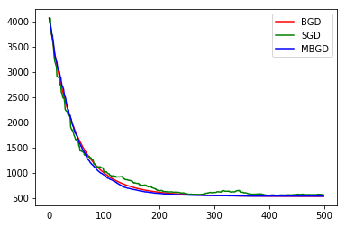

# 梯度下降算法

在求解机器学习算法的模型参数中即无约束优化问题，梯度下降（Gradient Descent）是最常用的方法之一。这里对梯度下降算法做一个总结。

## 基本概念

==方向导数== ：是一个数，反映的是$f(x,y)$在一点$P_0$沿着某一方向$l$的变化率，记做$\frac{\partial f}{\partial l}$。

> 例：求函数$z=xe^{ey}$在点$P(1,0)$处沿从点$P(1,0)$到点$Q(2,-1)$的方向的方向导数。
>
> 解：这里方向$\vec{l}$即为：$\vec{PQ} = (1,-1)$ 
>
> $cos\alpha=\frac{1}{\sqrt{1^2+1^2}}=\frac{\sqrt{2}}{2}$       $cos\beta=\frac{-1}{\sqrt{1^2+1^2}}=-\frac{\sqrt{2}}{2}$
>
> $\frac{\partial z}{\partial x}|_{(1,0)}=e^{2y}  |_{(1,0)}=1$;    $\frac{\partial z}{\partial y}|_{(1,0)}=2xe^{2y}  |_{(1,0)}=2$
>
> 所以方向导数$\frac{\partial z}{\partial \vec{l}}=cos\alpha+2cos\beta=-\frac{\sqrt{2}}{2}$

==偏导数== 是指多元函数沿坐标轴方向的方向导数，因此$n$元函数就有$n$个偏导数。

==梯度== 是一个向量，既有大小又有方向。梯度的每个元素是函数对一元变量的偏导数。记做$gradf$或者$\nabla f$

梯度的几何意义：设$\vec{v}={(v_1,v_2)}(|\vec{v}|=1)$是任一给定的方向，则对$\nabla f$和$\vec{v}$的夹角$\theta$有：

$$
\begin{align}
\frac{\partial f}{\partial \vec{v}}
&=f'_x(x_0,y_0)v_1+f'_y(x_0,y_0)v_2\\
&=\{f'_x(x_0,y_0),f'_y(x_0,y_0) \}\cdot \{ v_1,v_2 \}\\
&=\nabla f |_{p_0}\cdot \vec{v}\\
&=|\nabla f|_{p_0}cos\theta
\end{align}
$$

函数$f$在$p_0$处的梯度方式是函数变化率最大的方向。因此，梯度的方向就是函数$f$ 在这点增长最快的方向，梯度的模为方向导数的最大值。

## 梯度上升和梯度下降

在机器学习算法中，当最小化损失函数时，可以通过梯度下降来一步步的迭代求解，最终得到最小化损失函数和模型的参数值。反过来，如果我们需要求解损失函数的最大值，这时就需要用梯度上升法来求解了。

梯度下降法和梯度上升法是可以互相转化的。比如我们需要求解损失函数$f(\theta)$的最小值，这时我们需要用梯度下降法来迭代求解。但是实际上，我们可以反过来求解损失函数$-f(\theta)$的最大值，这时梯度上升法就可以派上用场了。

## 梯度下降算法详解

### 直观解释

假设现在我们在一座大山上的某处位置，由于我们不知道怎么下山，于是只能走一步算一步，也就是每走到一个位置的时候，求解当前位置的梯度，沿着梯度的负方向即当前最陡峭的位置向下走一步，然后继续求解当前位置梯度，向这一步所在的位置沿着最陡峭最快的位置走一步。这样一步步的走下去，一直走到我们觉得已经到了山脚的位置。当然这样走下去，也有可能我们不能走到山脚，而是到了某一个局部的山峰低处。

从上面的解释可以看出，梯度下降算法不一定能找到全局的最优解，有可能是一个局部最优解。当然，如果损失函数是一个凸函数，梯度下降算法得到的一定是全局最优解。


### 代数解释

对于线性回归，假设函数为$h_\theta(x_1,x_2,...,x_n)=\theta_0+\theta_1x_1+\theta_2 x_2+...+\theta_nx_n$的矩阵表达形式为：

$$
h_\theta(X)=X\theta
$$

其中函数$h_\theta(X)\in \mathbb{R}^m$的向量，$\theta\in \mathbb{R}^n$的向量，$\theta$向量中每个元素表示模型的参数。$X\in\mathbb{R}^{m×n}$的矩阵，$m$代表样本的个数，$n$代表样本的特征数。

损失函数的表达式为：

$$
J(\theta)=\frac{1}{2}(X\theta-Y)^T(X\theta-Y)
$$

其中$Y\in \mathbb{R}^m$是样本的输出向量。

算法过程：

1. 算法输入：$\theta$向量初始化为默认值或者调优后的值，$\epsilon$ 算法的终止距离，$\alpha$ 步长（或学习率）

2. 确定当前位置的损失函数梯度，对于$\theta$向量，梯度表达式为：

   $$
   \frac{\partial}{\partial \theta}J(\theta)=X^T(X\theta-Y)
   $$

3. 用步长乘以损失函数的梯度，得到当前位置下降的距离即$\alpha \frac{\partial}{\partial \theta}J(\theta)$

4. 确定$\theta$向量里面每个值，梯度下降的距离都小于$\epsilon$ ，如果下于$\epsilon$则算法终止，当前$\theta$向量即为最终结果。否则进入步骤5

5. 更新$\theta$向量，更新表达式如下：

   $$
   \theta = \theta - \alpha \frac{\partial}{\partial \theta}J(\theta)
   $$

### 算法调优
在使用梯度下降算法时候，有以下几点需要注意的：

+ 步长的选择：步长太大会导致迭代过快，甚至有可能错过最优解。步长太小，迭代速度太慢，很长时间算法都不能结束。所以算法的步长需要多次运行后才能得到一个较为优的值。

+ 初始值选择：初始值不同获得的最小值也有可能不同，因此梯度下降求得的只是局部最小值；当然如果损失函数是凸函数则一定是最优解。由于有局部最优解的风险，需要多次用不同初始值运行算法，选择损失函数最小化的初值。

+ 归一化：由于样本不同特征的取值范围不一样，可能导致迭代很慢，为了减少特征取值的影响，需要对特征数据进行归一化处理。常用的有$Min-Max$标准化和$Z-score$标准化。


## 梯度下降算法对比

常用的梯度下降算法具体包含了三种不同的形式，它们各自具有不同的优缺点。

### 批量梯度下降法BGD

BGD是梯度下降算的最原始形式，其特点是每次更新参数$\theta$时，都需要使用整个训练集数据。

我们上面所推导的就是批量梯度下降算法。

$$
\theta_i=\theta_i-\alpha\sum_{j=0}^{m}(h_\theta(x_0^{(j)},x_1^{(j)},...,x_n^{(j)})-y^{(j)})x_i^{(j)}
$$

由于有$m$个样本，这里求梯度的时候就使用了所有$m$个样本的梯度数据。

```python
def bgd(alpha,x,y,iterations):
    m,n=x.shape
    theta = np.ones(n)
    
    x_transpose = x.T
    for iter in range(0,iterations):
        hypothesis = np.dot(x,theta)
        loss= hypothesis-y
      
        gradient = np.dot(x_transpose,loss)/m
        theta =theta - alpha*gradient
        
    return theta
```


### 随机梯度下降法SGD

随机梯度下降法和批量梯度下降法的原理类似，区别在于求梯度时没有使用所有$m$个样本数据，而是仅仅选取了一个样本$j$来求梯度。

$$
\theta_i= \theta_i-\alpha(h_\theta(x_0^{(j)},x_1^{(j)},...,x_n^{(j)})-y^{(j)})x_i^{(j)}
$$

随机梯度下降法和批量梯度下降法是两个极端，一个采用了所有数据来梯度下降，一个只用一个样本来梯度下降，各自的优缺点都很明显。于是出现了小批量梯度下降法来综合两种方法的优缺点。

```python
def sgd(alpha,x,y,iterations):
    m,n=x.shape
    theta = np.ones(n)
    
    x_transpose = x.T
    for iter in range(0,iterations):
        hypothesis = np.dot(x,theta)
        loss= hypothesis-y
        
        idx = random.sample(range(0,m),1)
        gradient = np.dot(loss[idx],x[idx])
        theta =theta - alpha*gradient
        
    return theta
```


### 小批量梯度下降法MBGD

小批量梯度下降法是批量梯度下降法和随机梯度下降法的折中，对于$m$个样本，采用$x（1<x<m）$个样本来迭代，一般可以取$x=10$，当然也可以根据样本的数据，调整这个$x$的值。

$$
\theta_i=\theta_i-\alpha\sum_{j=t}^{t+x-1}(h_\theta(x_0^{(j)},x_1^{(j)},...,x_n^{(j)})x_i^{(j)}
$$

```python
def mbgd(alpha,x,y,iterations,k):
    m,n=x.shape
    theta =np.ones(n)
    
    x_transpose = x.T
    for itr in range(iterations):
        hypothesis = np.dot(x,theta)
        loss= hypothesis-y
        
        idx = random.sample(range(0,m),k)
        gradient = np.dot(loss[idx],x[idx])/k
        theta =theta - alpha*gradient      
        
    return theta
```

三种梯度下降算法的比较：



红色曲线是BGD算法，是一条光滑的曲线，因为BGD每一次迭代都是求的全局最优。

绿色曲线是SGD算法，有比较明显的抖动，会出现局部最小解。

蓝色曲线是MBGD算法，相对比较平滑，但是还有会有微小的抖动。

完整的代码如下：

```python
import numpy as np
import scipy as sp
import matplotlib.pyplot as plt
import matplotlib.pylab as  pylab
import random
%matplotlib inline

def bgd(alpha,x,y,iterations):
    m,n=x.shape
    theta = np.ones(n)
    J_list=[]
    
    x_transpose = x.T
    for iter in range(0,iterations):
        hypothesis = np.dot(x,theta)
        loss= hypothesis-y
        
        J=np.sum(loss**2)/(2*m)
        J_list.append(J)
        
        gradient = np.dot(x_transpose,loss)/m
        theta -= alpha*gradient
    pylab.plot(range(iterations), J_list, "r-",label="BGD")
    return theta

def sgd(alpha,x,y,iterations):
    m,n=x.shape
    theta = np.ones(n)
    J_list=[]
    
    x_transpose = x.T
    for iter in range(0,iterations):
        hypothesis = np.dot(x,theta)
        loss= hypothesis-y
        
        J=np.sum(loss**2)/(2*m)
        J_list.append(J)
        
        idx = random.sample(range(0,m),1)
        gradient = np.dot(loss[idx],x[idx])
        theta -= alpha*gradient
    pylab.plot(range(iterations), J_list, "g-",label="SGD")
    return theta

def mbgd(alpha,x,y,iterations,k):
    m,n=x.shape
    theta =np.ones(n)
    J_list=[]
    
    x_transpose = x.T
    for itr in range(iterations):
        hypothesis = np.dot(x,theta)
        loss= hypothesis-y
        
        J=np.sum(loss**2)/(2*m)
        J_list.append(J)
        
        idx = random.sample(range(0,m),k)
        gradient = np.dot(loss[idx],x[idx])/k
        theta -= alpha*gradient      
        
    pylab.plot(range(iterations), J_list, "b-",label="MBGD")
    return theta

if __name__ == '__main__':

    x, y = make_regression(n_samples=100, n_features=10, n_informative=1,
                           random_state=0, noise=35)
    m, n = np.shape(x)
    x = np.c_[np.ones(m), x]  # insert column, bias
    alpha = 0.01  # learning rate

#     pylab.plot(x[:, 1], y, 'o')

    print("\n#***BGD***#\n")
    theta_bgd = bgd(alpha, x, y, 500)
    for i in range(x.shape[1]):
        y_bgd_predict = theta_bgd * x
#     pylab.plot(x, y_bgd_predict, 'r--')

    print("\n#***SGD***#\n")
    theta_sgd = sgd(alpha, x, y, 500)
    for i in range(x.shape[1]):
        y_sgd_predict = theta_sgd * x
#     pylab.plot(x, y_sgd_predict, 'g--')

    print("\n#***MBGD***#\n")
    theta_mbgd = mbgd(alpha, x, y, 500, 10)
    for i in range(x.shape[1]):
        y_mbgd_predict = theta_mbgd * x
#     pylab.plot(x, y_mbgd_predict, 'b--')
    
    pylab.legend()
    pylab.show()
    print("Done!")
```


