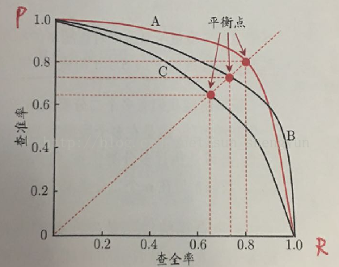

# 模型评估

不同的机器学习任务有着不同的评价指标，同时同一种机器学习任务也有着不同的评价指标，每一个指标的侧重点都不一样。常见的机器学习任务有`分类(classification)`、`回归(regression)`、`排序(ranking)` 、`聚类(clustering)` 、`主题模型(topic modeling)`、`推荐(recommendation)` 等等。

## 分类评价指标

分类是指对给定的数据记录预测该记录所属的类别，且类别空间是已知的。包括了二分类和多分类，二分类是指类别空间只有两种类别，比如常见的垃圾邮件分类就是一个二分类问题，因为我们只需要判别出垃圾邮件和非垃圾邮件，可以称为“正(positive)”与“负(negative)”两种类别，一般在实际计算中，将其映射为“0-1”。多分类是指类别数超过两种。下面主要介绍二分类的评估指标，同时他们也是可以扩展到多分类任务中。

对于二分类模型，常见的评价指标有：精确率(Precision)、召回率(Recall)、F1值(F1-Meassure)、ROC曲线(Receiver Operation Characterstic)、PR曲线(Precision and Recall)、AUC、混淆矩阵(Confusion Matrix)等等。

对于多分类模型，常见的评价指标有：准确率(Accuracy)、各类别精准率(Precision By Label)、各类别召回率(Recall By Label)、各类别F1值(F1-Measure By Label)、混淆矩阵(Confusion Matrix)等等。

### 准确率(Accuracy)

准确率是值在分类中，使用模型对测试集进行分类，分类正确的记录个数占总记录数的比例：

$$
accuracy = \frac{n_{correct}}{n_{total}}
$$

准确率的公式很简单，准确率评价指标没有对不同类别进行区分，即平等对待每个类别。但是这种评价有时是不够的，比如需要分析类别0和类别1各自分类错误的个数，因为 **不同类别下分类错误的代价不同的**，即对不同类别的偏向不同。例如在病患诊断的时候，诊断患有癌症但却为患有癌症(False Positive) 和 诊断为患有癌症但却实际未患有癌症(False Negative) 这两种情况的重要性不一样。另一个原因是，**数据分布可能是不均衡的**，即有的类别样本过多，有的类别样本过少，两类的样本个数相差较大。这样样本占大部分的类别住到了准确率的计算。为了解决这个问题，需要对上面的准确率进行改进，所以就出现了平均准确率。

### 平均准确率(Average Per-class Accuracy)

为了应对每个类别下样本的个数不一样的情况，对准确率进行变种，计算每个类别下的准确率，然后在计算它们的平均值。比如，类别0的准确率是$80\%$，类别1的准确率是$97.5\%$，那么平均准确率为$(80\%+97.5\%)/2=88.75\%$。因为每个类别下样本个数不一样，即计算每个类别的准确率时，分母是不一样的，则平均准确率一般不等于准确率。但是如果各个类别下样本数一样，那么平均准确率与准确率相等。

平均准确率也有自己的缺点，比如，如果存在某个类别的样本数很少，那么使用测试集进行测试时(如K-Fold Cross-Validation)，就可能造成该类别准确率的方差过大，意味着该类别的准确率是不可靠的。

### 对数损失函数(Log-loss)

在分类输出中，若输出的不是0-1，而是实数值即属于每个类别的概率，这个输出的概率值表示该记录所属的其对应类别的置信度，那么可以使用Log-loss对分类结果进行评价。比如样本是属于类别0的，但是分类器将其判别为属于1的概率0.51，如果分类器的分类边界概率为0.5，那么这种情况下分类器将会认为该样本属于类别1，这时分类器就会出错了。

Log-loss是一个软分类准确率度量方法，使用概率来表示其所属的类别的置信度。Log-loss具体的数学表达式为：

$$
log\_loss=-\frac{1}{N}\sum_{i=1}^{N}\{{y_i log p_i}+(1-y_i)log(1-p_i)\}
$$

其中，$y_i$是指第$i$个样本所属的真实类别0或者1，$p_i$表示第$i$个样本属于类别1的概率，这样上式中的两个部分对于每个样本只会选择其一且当预测与真实类别完全一致时，两部分都是0。

### 混淆矩阵

混淆矩阵是对分类结果进行详细描述的表格，记录了不同类别的正确分类和错误分类数。混淆矩阵是一个$N×N$矩阵，其中$N$是类别的个数。对于二分类问题$N=2$，那么混淆矩阵就是一个$2×2$矩阵。

| 真实情况 | 预测结果为正 | 预测结果为负 |
| -------- | ------------ | ------------ |
| 正例     | TP           | FN           |
| 负例     | FP           | TN           |

这几个单词的记忆方法：Positive/Negative表示模型预测的结果，如果这个预测是正确的，那么前面就加一个True，如果预测是错误的，那就是False。

**真正(True Positive)**：预测正确，预测结果为正例，即将正例预测为正例。

**假负(False Negative)**:预测错误，预测结果为负例，即将正例预测为负例。

**假正(False Positive)**：预测错误，预测结果为正例，即将负例预测为正例。

**真负(True Negative)**：预测正确，预测结果为负例，即将负例预测为负例。


由混淆矩阵可以推出一些上面介绍的指标：

**准确率(Accuracy)** ：分类正确的样本个数占所有样本个数的比例，即：
$$
accuracy = \frac{TP+TN}{TP+FN+FP+TN}
$$
**平均正确率(Average Per-class Accuracy)**：每个类别下准确率的算术平均，即：
$$
average\_accuracy = \frac{{\frac{TP}{TP+FN}}+{\frac{TN}{TN+FP}}}{2}
$$
**精确率(Precision)和召回率(Recall)**：

精确率和召回率是两个不同的评价指标，通常他们都是同时使用的，通常这两个指标也叫作查准率和查全率。

精确率(也叫查准率)是指分类正确的正样本个数占该分类器所有分类为正样本个数的比例。即：
$$
Precision = \frac{TP}{TP+FP}
$$
召回率(也叫查全率)是指分类器分类正确的正样本个数占所有的正样本个数的比例。即：
$$
Recall = \frac{TP}{TP+FN}
$$

不同的问题中，判别标准不同。对于推荐系统，更侧重与精确率(即推荐的结果总，用户真正感兴趣的比例)；对于医学诊断系统，更侧重于召回率(即疾病被发现的比例)。精确率和召回率是一对矛盾的度量，通常精确率高时，召回率往往比较低；而召回率高时，精确率往往比较低。

F1-score为精确率和召回率的调和平均值，它的值更接近与Precision和Recall中较小的值，公式如下：
$$
F1=\frac{2*precision*recall}{precision+recall}
$$
**P-R曲线**

根据分类器的预测结果将预测样例进行排序：排在最前面的是分类器认为“最可能”是正例的样本，排在最后面的是分类器认为“最不可能”是正例的样本。假设排序后的样本集合为$(X_1,y_1),(X_2,y_2),...,(X_n,y_n)$。根据此顺序，从前到后依次将样本作为正例负例的分界来进行预测。假设第$i$轮，挑选得到了样本$(X_i,y_i)$，直接将$X_i$记做正例，然后统计$X_1,X_2,...,X_i$全部判定为正例，$X_{i+1},X_{i+2},...,X_n$全部判定为负例时的查全率$R_i$和查准率$P_i$。

以查准率为纵轴，查全率为横轴作图，就得到查准率-查全率曲线(该曲线是由点$(P_1,R_1),(P_2,R_2),...,(P_n,R_n)$组成)，简称P-R曲线，显示该曲线的图称为P-R图。



开始时第一个样本(最可能为正例的)预测为正例，其他样本都预测为负例。此时查准率很高(几乎为1)，查全率很低(几乎为0，大量的正例都没有找到)。结束时所有的样本都预测为正例，此时的查全率很高(正例全部都找到了，查全率为1)，查准率很低(大量的负样例被预测为正例了)。

P-R图可以用于比较两个分类器的优劣，在比较时：

+ 如果一个分类器C的P-R曲线被另一个分类器A的P-R曲线完全包围，则A的性能好于C；
+ 如果一个分类器A的P-R曲线与另一个分类器B的曲线发生交叉，则只能在具体的查准率和查全率下进行比较。然而在很多情况下，仍然希望把分类器A和B比出一个高低。

"平衡点"(Break-Event Point，简称BEP)就是这样的一个度量，它是"查准率=查全率"时的取值，此时学习器C的BEP是$0.64=0.8×0.8$，而基于BEP的比较，可认为学习器A优于B。此外，还有一个更加常用的指标F1,在上面已有涉及。

**ROC曲线**

根据分类器的预测结果将预测样例进行排序：排在最前面的是分类器认为“最可能”是正例的样本，排在最后面的是分类器认为“最不可能”是正例的样本。假设排序后的样本集合为$(X_1,y_1),(X_2,y_2),...,(X_n,y_n)$。根据此顺序，从前到后依次将样本作为正例负例的分界来进行预测。假设第$i$轮，挑选得到了样本$(X_i,y_i)$，直接将$X_i$记做正例，然后统计$X_1,X_2,...,X_i$全部判定为正例，$X_{i+1},X_{i+2},...,X_n$全部判定为负例时的真正例率(True Positive Rate, TPR)，假正例率(False Positive Rate, FPR)。

TPR也就是查全率：
$$
TPR = \frac{TP}{TP+FN}
$$
FPR是分类器认为正例的负实例所占有负实例的比例
$$
FPR = \frac{FP}{TN+FP}
$$
以真正例率(TPR)为纵轴，假正例率(FPR)为横轴作图，就得到了ROC曲线(该曲线由点$\{(TPR_1,FPR_1),(TPR_2,FPR_2),...,(TPR_n,FPR_n)\}$组成)，简称ROC曲线，显示该曲线的图称为ROC图。


当第一个样本为正例，其他样本都为负例，查全率很低(几乎为0，因为大部分的正例未检测到TP=1)；FPR为0(因为此时几乎没有错认的正例FP=0)。

当所有样本为正例时，查全率很高(为1，因为所有样例都被预测为了正例FN=0)，FPR很高(为1，因为错认的正例就是所有的负例，这是由于没有预测为负例导致TN=0)。

在ROC图中，对角线对应于随机猜想模型，点$(0,1)$对应于理想模型，通常ROC曲线越靠近$(0,1)$越好。

+ 如果一个分类器A的ROC曲线被另一个分类器B的曲线完全包住，那么B的性能好于A；
+ 如果一个分类器A的ROC曲线与另一个分类器B的曲线发生了交叉，此时可以比较ROC曲线下的面积大小，这个面积称为AUC(Area Under Curve)。

==ROC曲线有个很好的特性：当测试集中的正负样本分布发生变化的时候，ROC曲线能够保持不变。== 

AUC的计算方法：

1. AUC曲线必然是一个阶梯状，因此计算AUC值就是计算这些阶梯下面的面积之和。
2. AUC和`Wilcoxon-Mann-Witney Test`是等价的，就是测试任意一个正例样本和一个负例样本，正例样本的score有多大的概率大于负例样本的score。于是我们将计算AUC等价于计算这个概率。具体来说就是统计一下所有的$(M+N)$($M$是正例的数目，$N$是负例的个数)个正负样例中，有多少组正例的score大于负例的score。该方法的时间复杂度为$\mathcal{O}((M+N)^2)$。
3. 第三种方法和第二种方法是一样的思路，但是复杂度小了。首先对score从到小排序，令最大score对应的样例rank为$M+N$，第二大score对应的样例rank为$M+N-1$，以此类推，把所有的正例样本的rank相加，再减去$M-1$种两个正例组合的情况。就得到了所有样例中有多少对正样本的score大于负样本的score。然后再除以$M×N$。时间复杂度为$\mathcal{O}(M+N)$，公式如下：

$$
AUC=\frac{\sum_{i \in positive}{rank_{i}}-\frac{M(M-1)}{2}}{M\times N}
$$

代码实现如下：

```python
def FPR(y_true,y_pred):
    return ((y_true==0)*(y_pred==1)).sum()*1.0/(y_true==0).sum()

def TPR(y_true,y_pred):
    return ((y_true==1)*(y_pred==1)).sum()*1.0/(y_true==1).sum()

def plot_roc(y_true,y_prob):
    threshs = sorted(y_prob,reverse=True)
    tprs,fprs = [],[]
    auc=0.0
    pre_fpr=0.0
    for thresh in threshs:
        y_pred = np.where(y_prob<thresh,0,1)
        tpr = TPR(y_true,y_pred)
        fpr = FPR(y_true,y_pred)
        tprs.append(tpr)
        fprs.append(fpr)
        if(fpr>pre_fpr):
            auc += tpr*(fpr-pre_fpr)
            pre_fpr = fpr
    
    plt.title("AUC="+str(round(auc,2)))
    plt.plot(fprs,tprs,'k--')
    plt.scatter(fprs,tprs,c='k',marker='x')
    plt.plot(np.arange(-.05, 1.05, .01), np.arange(-.05, 1.05, .01), '--', color='lightgray')
    plt.xlabel('False positive rate')
    plt.ylabel('True positive rate')
    plt.xlim([0-.05, 1+.05])
    plt.ylim([0-.05, 1+.05])
    plt.show()
    
```

绘制的ROC曲线如图所示：


对比实现了sklearn和利用第三种方法实现求解AUC值：

```python
from sklearn.metrics import roc_auc_score

y_true = np.array([1, 1, 0, 1, 1, 1, 0, 0, 1, 0, 
                       1, 0, 1, 0, 0, 0, 1, 0, 1, 0])
y_prob = np.array([.9, .8, .7, .6, .55, .54, .53, .52, .51, .505,
                      .4, .39, .38, .37, .36, .35, .34, .33, .30, .22])

def AUC(y_true, scores):
    M = (y_true==1).sum()
    N = (y_true==0).sum()
    I = np.argsort(scores)
    rank = 0
    for i in range(1, 1+len(I)):
        if y_true[I[-i]] == 1:
            rank += len(I)-i+1
    return (rank-M*(M+1)/2.0)*1.0/(M*N)

print roc_auc_score(y_true,y_prob)  #0.68
print AUC(y_true,y_prob)  #0.68 两者是一致的
```


## 回归评价指标

针对回归问题常见的评价指标有：

以下公式中$f$表示预测值，$y$表示实际值，$\bar{y}$表示真实数据的平均值。

**平均绝对误差(MAE)**
$$
MAE=\frac{1}{n}\sum_{i=1}^{m}|f_i-y_i|
$$
**均方误差(MSE)**
$$
MSE = \frac{1}{n}\sum_{i=1}^{m}(f_i-y_i)^2
$$
**方均根误差(RMSE)**
$$
RMSE = \sqrt{MSE}=\sqrt{\frac{1}{n}{\sum_{i=1}^{m}{(f_i-y_i)^2}}}
$$
这三个指标都使用了平均误差，所以对异常点比较敏感。如果回归器对某个点的回归值很不合理，那么它的误差比较大，从而对MAE、MSE、RMSE的值有较大影响。

**R平方**
$$
R^2=1-\frac{\sum(y_i-f_i)^2}{\sum(y_i-\bar{y})^2}
$$
$R^2$是度量多元回归方程中拟合程度的一个统计量。$R^2$越接近1，表明回归平方和占总平方和的比例就越大，回归的拟合程度就越好。

