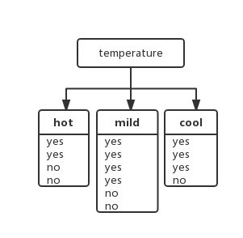
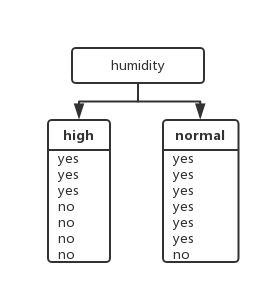

# 决策树算法原理(一)

决策树算法是机器学习中一个重要的算法系列，是一种基本的分类与回归方法。决策树由节点和有向边组成，节点有两种类型：内部节点和叶节点。内部节点表示一个特征属性上的测试，每个分支代表这个特征属性在某个值域上的输出，叶节点存放一个类别。

### 信息论基础

在信息论和概率统计中，熵(entropy)度量了事物的不确定性，越不确定的事物，它的熵值就越大。

### 信息熵

设$X$是一个取有限个值的离散随机变量，其概率分布为：

$$
P(X=x_i)=p_i,i=1,2,3,...,n
$$

则随机变量$X$的熵定义为：

$$
H(X)=-\sum_{i=1}^{n}p_ilog p_i
$$

若$p_i=0$，则定义$0log0=0$。$log$以$2$或者$e$为底的对数。

### 条件熵

设随机变量$(X,Y)$，其联合概率分布为：

$$
P(X=x_i,Y=y_i)=p_{ij},i=1,2,3,...,n;j=1,2,3,...,m
$$

条件熵$H(X|Y)$表示在已知随机变量$Y$的条件下随机变量$X$的不确定性。其定义为$Y$在给定条件下$X$的条件概率分布熵对$Y$的数学期望：

$$
H(X|Y)=\sum_{j=1}^{m}p(y_j)H(X|Y=y_j)=-\sum_{j=1}^{m}p(y_j)\sum_{i=1}^{n}p(x_i|y_j)\log p(x_i|y_j)
$$

### 信息增益

条件熵$H(X|Y)$度量了我们在知道$Y$以后$X$剩下的不确定性，那么$H(X)-H(X|Y)$度量了$X$在知道$Y$以后不确定性减少程度，称为互信息，记作$I(X,Y)$。在决策树ID3算法中叫做**信息增益**。

$$
I(X,Y)=H(X)-Y(X|Y)
$$

ID3算法就是利用信息增益来判断当前节点应该使用哪个特征来构建决策树。信息增益越大，则越适合用来分类。

### 信息增益比

以信息增益作为划分数据集的特征，存在==偏向于选择取值较多的特征==的问题，使用信息增益比(Information Gain Ratio)可以对这一问题进行校正。这是特征选择的另一个准则，表达式如下：

$$
IGR(D,A)=\frac{I(A,D)}{H_A(D)}
$$

其中$D$为样本特征输出的集合，$A$为样本特征，对于特征熵$H_A(D)$，表达式如下：

$$
H_A(D)=-\sum_{i=1}^{n}\frac{|D_i|}{|D|}log_2\frac{|D_i|}{|D|}
$$

其中$n$为特征$A$的类别数，$|D_i|$为特征$A$的第$i$个取值对应的样本数，$|D|$为样本数。

下面的数据集中有4个特征属性，$A=\{Outlook,Temperature,Humidity,Wind\}$，而分类标签有2个，即$C=\{Yes,No\}$，分别表示是否适合外出运动。这是一个二分类问题。

| Day  | Outlook  | Temperature | Humidity | Wind   | PlayTennis |
| ---- | -------- | ----------- | -------- | ------ | ---------- |
| D1   | Sunny    | Hot         | High     | Weak   | No         |
| D2   | Sunny    | Hot         | High     | Strong | No         |
| D3   | Overcast | Hot         | High     | Weak   | Yes        |
| D4   | Rain     | Mild        | High     | Weak   | Yes        |
| D5   | Rain     | Cool        | Normal   | Weak   | Yes        |
| D6   | Rain     | Cool        | Normal   | Strong | No         |
| D7   | Overcast | Cool        | Normal   | Strong | Yes        |
| D8   | Sunny    | Mild        | High     | Weak   | No         |
| D9   | Sunny    | Cool        | Normal   | Weak   | Yes        |
| D10  | Rain     | Mild        | Normal   | Weak   | Yes        |
| D11  | Sunny    | Mild        | Normal   | Strong | Yes        |
| D12  | Overcast | Mild        | High     | Strong | Yes        |
| D13  | Overcast | Hot         | Normal   | Weak   | Yes        |
| D14  | Rain     | Mild        | High     | Strong | No         |

数据集中有14个样本，其中类属于"Yes"的有9个，类属于"No"的有5个，那么其信息熵为:

$$
H(D)=-\frac{9}{14}*log_2(\frac{9}{14})-\frac{5}{14}*log_2(\frac{9}{14})=0.94
$$

基于天气的划分：

$$
H(D|Outlook)
=\frac{5}{14} * [- \frac{2}{5} * log_2(\frac{2}{5}) – \frac{3}{5} * log_2(\frac{3}{5})] \\
+\frac{4}{14} * [ - \frac{4}{4} * log_2(\frac{4}{4}) - \frac{0}{4}* log_2(\frac{0}{4})] \\
+ \frac{5}{14} * [ - \frac{3}{5} * log_2(\frac{3}{5}) – \frac{2}{5} * log_2(\frac{2}{5})]\\
= 0.694
$$

信息增益为：
$$
I(D,Outlook)=H(D)-H(D|Outlook)=0.94-0.694=0.246
$$
信息增益比为：
$$
H(Outlook)=-\frac{5}{14}*log_2{\frac{5}{14}}-\frac{4}{14}*log_2{\frac{4}{14}}-\frac{5}{14}*log_2{\frac{5}{14}}=1.577406282852345
$$

$$
IGR(D,Outlook)=\frac{H(D)-H(D|Outlook)}{H(Outlook)}=\frac{0.246}{1.577406282852345}=0.15595
$$

基于温度的划分：

$$
H(D|Temperature)=\frac{4}{14} * [-\frac{2}{4} * log_2(\frac{2}{4}) – \frac{2}{4} * log_2(\frac{2}{4})] \\
+ \frac{6}{14} * [ -\frac{4}{6} * log_2(\frac{4}{6}) - \frac{2}{6} * log_2(\frac{2}{6})] \\
+ \frac{4}{14} * [ - \frac{3}{4} * log_2(\frac{3}{4}) – \frac{1}{4} * log_2(\frac{1}{4})] \\
= 0.911
$$
信息增益为：
$$
I(D,Temperature)=H(D)-H(D|Temperature)=0.940 - 0.911 =0.029
$$
信息增益比为：
$$
H(Temperature)= - \frac{4}{14} * log_2(\frac{4}{14}) - \frac{6}{14} * log_2(\frac{6}{14}) -\frac{4}{14} * log_2(\frac{4}{14}) = 1.5566567074628228
$$

$$
IGR(D,Temperature)=\frac{H(D)-H(D|Temperature)}{H(Temperature)}=\frac{0.029}{1.5566567074628228}=0.01862
$$

基于湿度的划分:

$$
H(D|Humidity)=\frac{7}{14}(-\frac{4}{7}log_2\frac{4}{7}-\frac{3}{7}log_2\frac{3}{7})+\frac{7}{14}(-\frac{6}{7}log_2\frac{6}{7}-\frac{1}{7}log_2\frac{1}{7})=0.789
$$
信息增益为：
$$
I(D,Humidity)=H(D)-H(D|Humidity)= 0.940 - 0.789 = 0.151
$$
信息增益比为：
$$
H(Humidity)=-\frac{7}{14}log_2\frac{7}{14}-\frac{7}{14}log_2\frac{7}{14}=1.0
$$

$$
IGR(D,Humidity)=\frac{H(D)-H(D|Humidity)}{H(Humidity)}=\frac{0.151}{1.0}=0.151
$$

现在分别计算四种特征的信息增益和信息增益比如下：

| 评价标准   | Outlook | Temperature | Humidity |  Wind   | Day     |
| :--------- | :-----: | :---------: | :------: | :-----: | ------- |
| 信息增益   |  0.246  |    0.029    |  0.151   |  0.048  | 0.94    |
| 信息增益比 | 0.15595 |   0.01862   |  0.151   | 0.04871 | 0.01763 |

可以发现对于特征较多的$Day$其信息增益是最大的，然而$Day$对我们选择特征实际上是没有意义的。因此选择信息增益比这个标准更加合理些。

