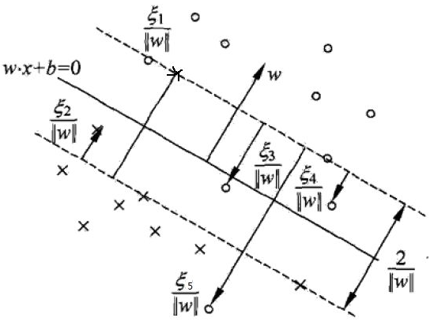

# 支持向量机算法原理(二)

线性可分问题的支持向量机学习算法，对线性不可分的训练数据是不适用的。通常情况下，训练数据中如果存在一些特异点，会严重影响分类模型的效果。

## 软间隔最大化

为了解决这个问题，可以对每个样本$(x^{(1)},y^{(1)})$ 引进一个松弛变量$\xi_i\ge 0$ ，使函数间隔加上松弛变量大于等于1，这样，约束条件变为：
$$
y^{(i)}(w^T \cdot x^{(i)}+b)\ge 1-\xi_i
$$
这时样本到超平面的函数距离的要求就放松了，之前一定要大于等于1，现在只需要加上一个$\xi_i$ 大于等于1就可以了。同时，对于每个松弛变量$\xi_i$，都需要支付一个代价$\xi_i$。因此线性不可分的支持向量机学习问题变为：
$$
\begin{align}
\min_{w,b,\xi}&\quad \frac{1}{2}||w||^2_2+C\sum_{i=1}^m\xi_i \notag \\
s.t.\quad &  y^{(i)}(w^T x^{(i)}+b)\ge 1-\xi_i\\
& \xi_i\ge 0 \qquad (i=1,2,...,m) \notag
\end{align}
$$
这里最小化目标函数既希望$\frac{1}{2}||w||^2_2$尽量小即间隔尽量大，同事使误分类点尽可能少。$C$为惩罚参数，用来调和两者关系的，当$C$越大对误分类的惩罚越大，$C$越小对误分类的惩罚越小。在实际应用中需要调参选择。

## 软间隔支持向量机优化

首先将软间隔最大化的约束问题(2)转化为无约束问题，拉格朗日函数为：
$$
L(w,b,\alpha,u)=\frac{1}{2}||w||^2_2+C\sum_{i=1}^m\xi_i-\sum_{i=1}^m\alpha_i[y^{(i)}(w^Tx^{(i)}+b)-1+\xi_i]-\sum_{i=1}^m\mu_i\xi_i
$$
其中$\alpha_i\ge0,\mu_i\ge0$，均为拉格朗日乘子。

现在的优化目标是：
$$
\min_{w,b,\xi}\,\max_{\alpha\ge0,\mu\ge0}L(w,b,\alpha,\mu)
$$
由于优化目标满足KKT条件，可以通过拉格朗日对偶将原始优化问题转化为等价的对偶问题：
$$
\max_{\alpha\ge0,\mu\ge0}\,\min_{w,b,\xi}L(w,b,\alpha,\mu)
$$
首先我们可以求优化函数对于$w,b,\xi$的极小值，接着再求拉格朗日乘子$\alpha,\mu$的极大值。

(1)求$L(w,b,\alpha,\mu)$关于$w,b,\xi$的极小值
$$
\begin{align}
\frac{\partial L}{\partial w}&=w-\sum_{i=1}^m\alpha_iy^{(i)}x^{(i)}=0\quad \Longrightarrow \quad  w=\sum_{i=1}^m\alpha_iy^{(i)}x^{(i)}\\
\frac{\partial L}{\partial b}&=-\sum_{i=1}^m\alpha_iy^{(i)}=0\quad \Longrightarrow \quad  \sum_{i=1}^m\alpha_iy^{(i)}=0\\
\frac{\partial L}{\partial \xi}&=C-\alpha_i-\mu_i=0\quad \Longrightarrow \quad  C=\mu_i+\alpha_i
\end{align}
$$
将式(6)(7)(8)带入式(2)可以消去$w$和$b$，得到：
$$
\begin{align}
L(w,b,\xi,\alpha,\xi)
&=\frac{1}{2}||w||^2_2+C\sum_{i=1}^m\xi_i-\sum_{i=1}^m\alpha_i[y^{(i)}(w^Tx^{(i)}+b)-1+\xi_i]-\sum_{i=1}^m\mu_i\xi_i\\
&=\frac{1}{2}||w||^2_2-\sum_{i=1}^m\alpha_i[y^{(i)}(w^Tx^{(i)}+b)-1]+\sum_{i=1}^mC\xi_i-\sum_{i=1}^m\alpha_i\xi_i-\sum_{i=1}^m\mu_i\xi_i\\
&=\frac{1}{2}||w||^2_2-\sum_{i=1}^m\alpha_i[y^{(i)}(w^Tx^{(i)}+b)-1]+\sum_{i=1}^m\xi_i(C-\alpha_i-\mu_i)\\
&=\frac{1}{2}||w||^2_2-\sum_{i=1}^m\alpha_i[y^{(i)}(w^Tx^{(i)}+b)-1]\\
&=\frac{1}{2}w^Tw-\sum_{i=1}^m\alpha_iy^{(i)}w^Tx^{(i)}-\sum_{i=1}^m\alpha_iy^{(i)}b+\sum_{i=1}^m\alpha_i\\
&=\frac{1}{2}w^T\sum_{i=1}^m\alpha_iy^{(i)}x^{(i)}-w^T\sum_{i=1}^m\alpha_iy^{(i)}x^{(i)}-\sum_{i=1}^m\alpha_iy^{(i)}b+\sum_{i=1}^m\alpha_i\\
&=-\frac{1}{2}w^T\sum_{i=1}^m\alpha_iy^{(i)}x^{(i)}-\sum_{i=1}^m\alpha_iy^{(i)}b+\sum_{i=1}^m\alpha_i\\
&=-\frac{1}{2}(\sum_{i=1}^m\alpha_iy^{(i)}x^{(i)})^T(\sum_{i=1}^m\alpha_iy^{(i)}x^{(i)})-b\sum_{i=1}^m\alpha_iy^{(i)}+\sum_{i=1}^m\alpha_i\\
&=-\frac{1}{2}\sum_{i=1}^m\alpha_iy^{(i)}(x^{(i)})^T\sum_{i=1}^m\alpha_iy^{(i)}x^{(i)}-b\sum_{i=1}^m\alpha_iy^{(i)}+\sum_{i=1}^m\alpha_i\\

&=-\frac{1}{2}\sum_{i=1}^m\alpha_iy^{(i)}(x^{(i)})^T\sum_{i=1}^m\alpha_iy^{(i)}x^{(i)}+\sum_{i=1}^m\alpha_i\\
&=-\frac{1}{2}\sum_{i=1}^m\sum_{j=1}^m\alpha_iy^{(i)}(x^{(i)})^T\alpha_jy^{(j)}x^{(j)}+\sum_{i=1}^m\alpha_i\\
&=\sum_{i=1}^m\alpha_i-\frac{1}{2}\sum_{i=1,j=1}^m\alpha_i\alpha_j y^{(i)}y^{(j)}(x^{(i)})^Tx^{(j)}\\
\end{align}
$$
等式(9)-(12)合并同类项利用$C=\alpha_i+\mu_i$进行化简；等式(12)~(13)利用$||w||^2_2=w^T w$，并展开括号；等式(14)~(15)合并同类项；等式(15)-(17)利用$w=\sum_{i=1}^m\alpha_iy^{(i)}x^{(i)}$ 且常量的转置就是其本身，只有$x^{(i)}$被转置；等式(17)~(18)使用了$ \sum_{i=1}^m\alpha_iy^{(i)}=0$ ；等式(18)~(20)互换位置，进行整理。

式(20)的形式和线性SVM是一样的，软间隔支持向量机不同的地方在于约束条件。最终优化目标的数学形式：
$$
\begin{align}
\max_{\alpha} \; \sum_{i=1}^m\alpha_i&-\frac{1}{2}\sum_{i=1}^m\sum_{j=1}^m\alpha_i\alpha_j y^{(i)}y^{(j)}(x^{(i)})^Tx^{(j)}\\
s.t. \qquad &\sum_{i=1}^m \alpha_i y^{(i)}=0 \notag\\
&C-\alpha_i-\mu_i=0\notag\\
&\alpha_i\ge 0 \notag\\
&\mu_i\ge 0 \qquad i=1,2,...,m \notag
\end{align}
$$
利用$C-\alpha_i-\mu_i=0,\alpha_i\gt0,\mu_i\gt0$这3个式子，可以消去$\mu_i$，只留下$\alpha_i$，也就是$C\ge\alpha_i\ge0$。将(24)可以转变为：
$$
\begin{align}
\min_{\alpha} \quad &\frac{1}{2}\sum_{i=1}^m\sum_{j=1}^m\alpha_i\alpha_j y^{(i)}y^{(j)}(x^{(i)})^Tx^{(j)}- \sum_{i=1}^m\alpha_i\\
s.t. \qquad &\sum_{i=1}^m \alpha_i y^{(i)}=0 \notag\\
&0\le \alpha_i\le C \qquad i=1,2,...,m\notag\\

\end{align}
$$
式(22)就是软间隔最大化的支持向量机模型，同线性可分支持向量机相比仅仅只是多了一个约束条件$0\le\alpha_i\le C$同样地依然可以使用SMO算法求上式极小化时对应的$\alpha$向量就可以求出$w$和$b$。

 ## 支持向量

在线性可分的支持向量机中，最优解$\alpha=(\alpha_1^*,\alpha_2^*,..,\alpha_m^*)^T$ 中对应于$\alpha_i^*\gt0$的样本$(x^{(i)},y^{(i)})$的实例点$x^{(i)}$被称为支持向量。对于软间隔支持向量机的支持向量此时就比较复杂。

对软间隔支持向量机，KKT条件要求：
$$
\left \{
\begin{array}
\ \alpha_i\ge0,\qquad\mu_i\ge0\\
y^{(i)}(w^T x^{(i)}+b) -1+\xi_i\ge 0\\
\alpha_i(y^{(i)}(w^T x^{(i)}+b) -1+\xi_i)=0\\
\xi_i\ge0 ,\quad \mu_i\xi_i=0
\end{array}
\right.
$$
于是对于任意的样本$(x^{(i)},y^{(i)})$，总有$\alpha_i=0$或者$y^{(i)}(w^Tx^{(i)}+b)=1-\xi_i$。可以得：

1. 若$\alpha_i=0$ 则该样本不会对分离超平面有任何影响，这些点被正确分类
2. 若$0\lt \alpha_i\lt C$，根据$C=\alpha_i+\mu_i$得$\mu_i>0$，则$\xi_i=0,y^{(i)}(w^T x^{(i)}+b) -1=0$即点是支持向量。
3. 若$\alpha_i=C$，说明该点可能是一个异常点，此时需要进一步检查$\xi_i$：
   + 如果$0\lt \xi_i \lt  1 $，那么点正确分类，落在了超平面和子集类别的支持向量之间；
   + 如果$\xi_i=1$，那么点落在了分离超平面上；
   + 如果$\xi_i>1$，那么点在超平面的另一侧，则该样本被错误分类。

## 软间隔支持向量机学习算法

> 输入：训练数据$D=\{(x^{(1)},y^{(1)}),(x^{(2)},y^{(2)}),...,(x^{(m)},y^{(m)}),\}$，其中$x^{(i)}\in\mathbb{R}^n,y\in\{+1,-1\}$
>
> 输出：分离超平面和分类决策函数
>
> (1)选择惩罚系数$C>0$，构造约束优化问题
> $$
> \begin{aligned}
> \min_{\alpha}&\sum_{i=1,j=1}^m \alpha_i\alpha_jy^{(i)}y^{(j)}(x^{(i)})^Tx^{(j)}-\sum_{i=1}^m\alpha_i\\
> s.t.&\quad \sum_{i=1}^m \alpha_i y^{(i)}=0\\
> &\quad 0\le \alpha_i \le C
> \end{aligned}
> $$
> (2)用SMO算法求出上式最小时对应的$\alpha$向量值$\alpha^*$
>
> (3)计算$w^*=\sum_{i=1}^m \alpha_i^*y^{(i)}x^{(i)}$
>
> (4)找出所有的$S$个支持向量即满足$0\lt \alpha_s\lt C$对应的样本$(x_s,y_s)$，通过$y_s(\sum_{i=1}^S \alpha_i y^{(i)}(x^{(i)})^Tx^s+b)=1$，计算出每个支持向量$(x^{s},y^{s})$对应的$b^*_s=y^{(s)}-\sum_{i=1}^S \alpha_i y^{(i)}(x^{(i)})^Tx^{s}$，所有的$b_s^*$对应的平均值即为最终的$b^*=\frac{1}{S}\sum_{i=1}^S b^*_s$
>
> (5)求得分离超平面$w^*x+b^*=0$，分类决策函数$f(x)=sign(w^*x+b^*)$ 

## 合页损失函数

线性支持向量机还有另一种解释，就是最小化以下目标函数：
$$
\sum_{i=1}^m[1-y^{(i)}(w\cdot x^{(i)}+b)]_+\lambda||w||^2_2
$$
其中第一项是经验损失或经验风险，函数$L(y(w\cdot x+b))=[1-y(w\cdot x+b)]_+$为合页损失函数(hinge loss function)。下标"+"表示以下取正值的函数
$$
[z]_+=\left \{
\begin{aligned}
z,\quad z>0\\
0,\quad z\le0
\end{aligned}
\right.
$$
可以证明最小化式(24)等价于式(2)。

