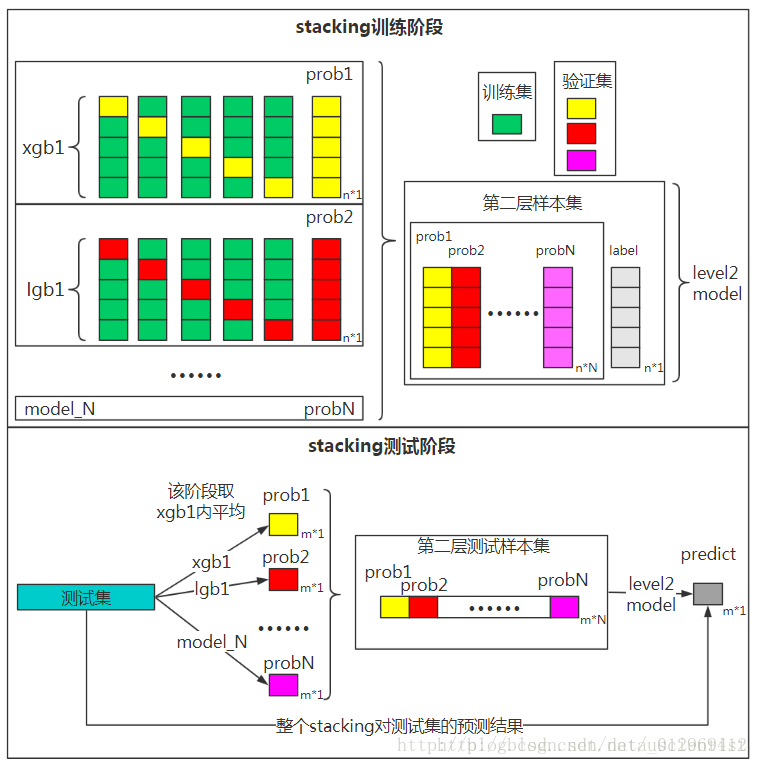

# 集成学习算法之综述

集成学习(ensemble learning)本身不是一个单独的机器学习算法，而是通过构建并结合多个机器学习器来完成学习任务。集成学习可以用于分类问题或回归问题集成，特征选择集成，异常点检测集成等等。

对于训练集数据，通过训练若干个个体学习器，通过一定的结合策略，就可以最终形成一个强学习器。因此集成学习的两个主要问题是：(1)如何得到若干个个体学习器；(2)如何选择一种结合策略，将这些个体学习器集合成一个强学习器。

## 个体学习器

集成学习的第一个问题就是如何得到若干个个体学习器，可以有两种选择。

第一种就是所有的个体学习器都是一个种类的，即同质的。比如都是决策树个体学习器，或者都是神经网络个体学习器。第二种就是所有的个体学习器不全是一个种类的，即异质的。比如有一个分类问题，对训练集采用支持向量机个体学习器，逻辑回归个体学习器和朴素贝叶斯个体学习器来学习，在通过某种结合策略确定最终的分类学习器。

目前，**同质个体学习器的应用是最广泛的**，一般常说的集成学习都是指的同质个体学习器。而同质个体学习器使用最多的模型是CART决策树和神经网络。

同质个体学习器按照个体学习器之间是否存在依赖关系可以分为两类：

(1)第一个是个体学习器之间存在强依赖关系，一系列个体学习器都需要串行生成，代表算法是boosting系列的Adaboost、GBDT、XGBOOST等；

(2)第二个是个体学习器之间不存在强依赖关系，一系列个体学习器可以并行生成，代表算法是bagging系列的RF等。

## Boosting

Boosting算法的工作机制是首先从训练集用初始权重训练出一个弱学习器1，根据弱学习器的学习误差率表现来更新训练样本的权重，使得之前弱学习器1学习误差率高的训练样本点的权重变高，使得这些误差率高的点在后面的弱学习器2中得到更多的重视。然后基于调整权重后的训练数据集来训练弱学习器2，如此重复进行，直到弱学习器数达到事先指定的数目T，最终将这T个弱学习器通过集合策略进行整合，得到最终的强学习器。

Boosting系列算法里最著名的算法有Adaboost算法和提升树(Boosting Tree)算法等。

## Bagging

Bagging的个体弱学习器的训练集是通过**随机采样**得到的。通过T次随机采样，可以得到T个采样集，对于这T个采样集，可以独立的训练出T个弱学习器，再对这T个弱学习器通过集合策略来得到最终的强学习器。

这里的随机采样一般采用的是自助采样法(Boostrap Sampling)，即对于$m$个样本的原始训练集，每次先随机采集一个样本放入采样集，接着把该样本放回，这样下次采样时该样本仍有可能被采集到，这样采集$m$次，最终可以得到$m$个样本的采样集，由于是随机采样，这样每次的采样集和原始训练集是不同的，和其他采样集也是不同的，这样得到多个不同的弱学习器。

Boosting系列算法里最著名的算法有Random Forest算法等。RF算法是bagging的一个特化进阶版，弱学习器采用的是决策树，但RF在样本随机采样的基础上又加上了特征的随机选择。

## 结合策略

学习器结合可能会从三方面带来好处：

+ 从统计方面，由于学习任务的假设空间往往很大，可能有很多假设在训练集上达到等同性能，此时若使用单学习器可能因误选而导致泛化性能不佳，结合多个学习器则会减小这一风险；
+ 从计算方面，学习算法往往会陷入局部极小，有的局部极小点所对应的泛化性能可能很糟糕，而通过多次运行之后进行结合，可降低陷入糟糕局部极小点的风险；
+ 从表示方面，某些学习任务的真实假设可能不在当前学习算法所考虑的假设空间中，此时若使用单学习器则肯定无效，而通过结合多个学习器，由于相应的假设空间有所扩大，有可能学得更好的近似。

假定集合包含$T$个基学习器$\{h_1,h_2,...,h_T\}$，其中$h_i$在示例$x\in \mathbb{R}^n$上的输出为$h_i(x)$，对$h_i(x)$进行结合的常见策略有：

### 平均法

对于数值型的回归预测问题$h_i(x)\in \mathbb{R}$ ，通常使用的结合策略是平均法，对若干个弱学习器的输出进行平均得到最终的预测输出。

+ 简单平均法

$$
H(x)=\frac{1}{T}\sum_{i=1}^Th_i(x)
$$

+ 加权平均法

$$
H(x)=\sum_{i=1}^T w_i h_i(x)
$$

其中$w_i$是个体学习器$h_i(x)$的权重，通常要求$w_i\ge0,\sum_{i=1}^T w_i =1$。

### 投票法

对于分类问题的预测，通常使用投票法。假设预测类别是$\{c_1,c_2,...,c_K\}$，对于任意一个预测样本$x$，T个弱学习器的预测结果分别是$\{ h_1(x),h_2(x),...,h_T(x)\}$。

相对多数投票法即少数服从多数，也就是T个弱学习器对样本$x$的预测结果中数量最多的类别$c_i$为最终的分类类别。如果不止一个类别获得最高票，则随机选择一个做为最终类别。

绝对多数投票法即要求票数过半数，在相对多数投票法的基础上，不仅仅要求最高票还要求票数过半数。否则会拒绝预测。

### 学习法

当训练数据很多时，一种更为强大的结合策略是使用"学习法"，即通过另一个学习器来进行结合。Stacking是学习法的典型代表，Stacking先从初始数据集训练出初级学习器，然后"生成"一个新数据集用于训练次级学习器。在这个新数据集中，初级学习器的输出被当做样例输入特征，而初始样本的标记仍被当做样本标记。通常在Stacking中初级学习器是使用不同学习算法产生的，即**初级集成是异质的**。（如果不严格区分的话，可认为堆叠Stacking、混合Blending、层叠泛化Stacked Generalization其实是同一个算法的不同名字）。

