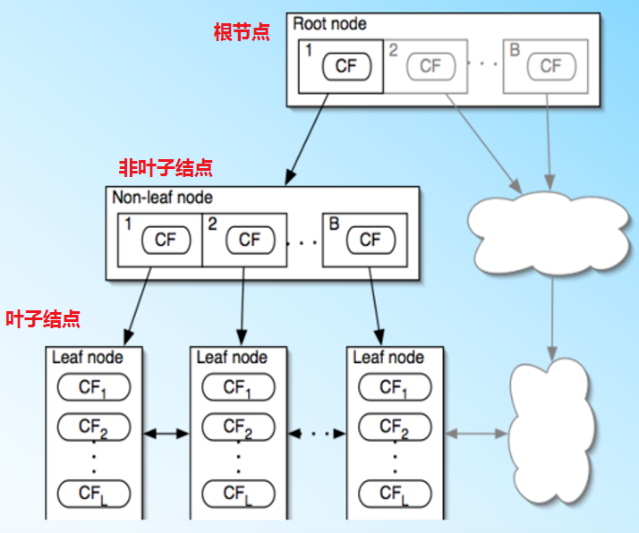
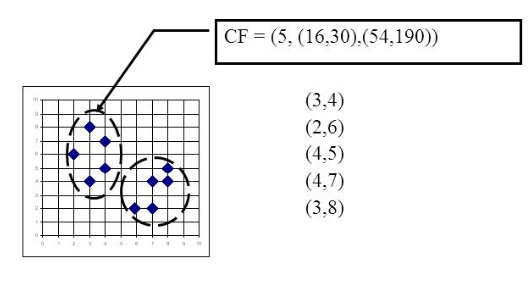

# 聚类算法之BIRCH

BIRCH全称是利用层次方法的平衡迭代规约和聚类(Balanced Iterative Reducing and Clustering Using Hierarchies)。BIRCH算法比较适合数据量大。类别数K比较多的情况，它运行的速度很快，只需要单遍扫描数据集就能进行聚类。

BIRCH算法利用一个类似与$B^+$树的结构实现快速聚类，通常称这个树结构为聚类特征树(Clustering Feature Tree，简称CF Tree)。这棵树的每一个节点都是由若干个聚类特征(Clustering Feature，简称CF)组成。

如图所示：聚类特征树的每个节点叶子节点都有若干个CF，而内部节点的CF有指向孩子节点的指针，所有的叶子节点用一个双向链表连接起来。

## 聚类特征

在聚类特征树中，聚类特征的定义为：每一个聚类特征CF是一个三元组，用$(N,LS,SS)$表示。其中$N$代表了这个CF中拥有的样本点数量。$LS$代表了这个CF中拥有的样本点各特征维度的向量和(这是一个向量)。$SS$代表了这个CF中拥有的样本点各特征维度的平方和(这是一个标量)。如下图，在CF Tree中的某一个节点的某个CF中，有下面5个样本$(3,4),(2,6),(4,5),(4,7),(3,8)$，则对应的

$$
\begin{align}
N=&5\\
LS=&(3+3+4+4+3,4+6+5+7+8)=(16,30)\\
SS=&(3^2+2^2+4^2 +4^2+3^2 + 4^2+6^2+5^2 +7^2+8^2) = (54 + 190) = 244\\
\end{align}
$$

CF满足线性关系，即CF1+CF2=(N1+N2,LS1+LS2,SS1+SS2)。也就是说在CF Tree中每个父节点的CF节点，它的(N,LS,SS)三元组的值等于这个CF节点所指向的所有子节点的三元组之和。

## 聚类特征树

聚类特征树(CF Tree)的几个重要参数：内部节点的最大CF数B，叶子节点的最大CF树L，叶子节点每个CF的最大样本半径阈值T。

(1)在最开始的时候，CFTree是空的，没有任何样本，从训练集读入第一个样本点，将其放入一个新的CF三元组A，这时候三元组的N=1，将这个新的CF放入根节点；

(2)继续读入第二个样本点，如果这个样本点和第一个样本点A，在半径为T的超球体范围内，则它们属于一个CF，将第二个点也加入CF A，同时更新A的三元组的值。此时CF A的三元组中N=2；

(3)继续读入第三个样本点，如果这个样本点不能融入前面节点形成的超球体内，这时需要一个新的CF三元组B，来容纳第三个样本点。则此时根节点就有两个CF三元组A和B；

(4)继续读入第四个样本点，如果该样本点在B形成的半径为T的超球体内，则把第四个样本点加入CF B；

现在聚类特征树的建立进行总结：

(1)从根节点向下寻找和这个样本点距离最近的叶子节点和叶子节点里最近的CF节点；

(2)如果新样本加入后，这个CF节点对应的超球体半径仍然小于阈值T，则更新路径上所有CF三元组，插入结束，否则转入(3)；

(3)如果当前叶子节点的CF节点个数小于等于阈值L，则创建一个新的CF节点，放入新样本，将新的CF节点放入这个叶子节点，更新路径上所有的CF三元组，插入结束。否则转入(4)；

(4)如果当前叶子节点的CF节点个数大于阈值L，将当前叶子节点划分为两个新叶子节点，选择旧叶子节点中所有CF元祖里超球体最远的两个CF元组，分别作为两个新的叶子节点的第一个CF节点，将其他元组和新的样本元组按照距离远近原则放入对应的叶子节点，然后依次检查父节点是否需要分裂；

## BIRCH算法

将所有的训练集样本建立CF Tree，一个基本的BIRCH算法就完成了，对应的输出就是若干个CF节点，每个节点里的样本点就是一个聚类的簇。完整的BIRCH算法除了建立CF Tree，还有一些可选的算法步骤：

(1)将所有的样本依次读入，在内存中建立一颗CF Tree，建立的方法如上；

(2)(可选)将第一步建立的CF Tree进行筛选，去除一些异常CF节点，这些节点一般里面的样本点很少。对于一些超球体距离非常近的元组进行合并；

(3)(可选)利用其它的一些聚类算法比如K-Means对所有的CF元组进行聚类，得到一颗比较好的CF Tree.这一步的主要目的是消除由于样本读入顺序导致的不合理的树结构，以及一些由于节点CF个数限制导致的树结构分裂。

(4)(可选)利用第三步生成的CF Tree的所有CF节点的质心，作为初始质心点，对所有的样本点按距离远近进行聚类。这样进一步减少了由于CF Tree的一些限制导致的聚类不合理的情况。

从上面可以看出，BIRCH算法的关键就是步骤(1)即CF Tree的生成，其他步骤都是为了优化最后的聚类结果。

## 算法小结

一般来说，BIRCH算法适用于样本量较大的情况，和Mini Batch K-Means类似，但是BIRCH算法适用于类别数较大的情况，而Mini Batch K-Means一般适用于类别数适中或者较少的时候，此外BIRCH还可以用于一些异常点的检测和数据初步按类别规约的操作。但是当数据特征的维度非常大，如大于20，则BIRCH不太合适。

对于调参，BIRCH要比K-Means复杂，需要对CF Tree的几个关键参数进行调节，这几个参数对最终结果有较大的影响。

BIRCH算法的优点有：

(1)节约内存，所有的样本都在磁盘上，CF Tree仅仅保存了CF节点和对应的指针；

(2)聚类速度快，只需要一遍扫描训练集就可以建立CF Tree；

(3)可以识别噪音点，对数据进行初步分类预处理

BIRCH算法的缺点有：

(1)由于CF Tree对每个节点的CF个数有限制，导致聚类的结果可能和真实类别分布不同；

(2)对于高维特征的数据聚类效果不好，此时可以选择Mini Batch K-Means；

(3)如果数据集的分布簇不是类似与超球体，或者说不是凸的，则聚类效果不好。

