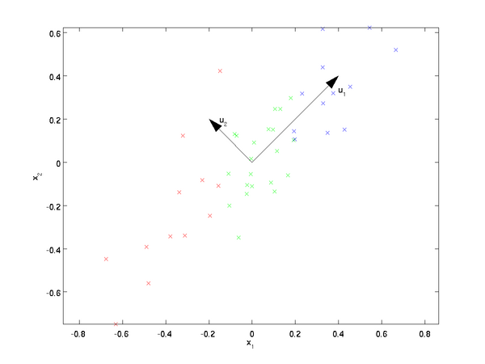

# 降维算法之PCA

主成分分析(Principal Component Analysis, PCA)是最常用的一种降维方法。在数据压缩消除冗余和数据噪音等领域都有广泛应用。

## PCA的思想

PCA基本思想就是找出数据里最主要的方面，用数据里最主要的方面来代替原始数据。假设现有$m$个$n$维数据$(x^{(1)},x^{(2)},...,x^{(m)})$，现在希望将这$m$个数据的维度从$n$维降到$d$维，且这$m$个$d$维的数据集尽可能的代表原始数据集，保证在降维的过程中损失尽可能的小。

如图，将2维数据降为1维，希望找到某一个维度方向，可以尽可能的代表这两个维度的数据。图中列出了两个方向向量$u_1$和$u_2$。

从直观上，$u_1$要比$u_2$好。有两种解释：①样本点到这个直线的距离足够近；②样本点在这个直线上的投影尽可能的分开。

基于以上两种标准，可以得到PCA的两种等价推导。

## PCA的推导：基于最大投影方差

假设有样本$(x^{(1)}),x^{(2)},...,x^{(m)})$，其中$x^{(i)}\in \mathbb{R}^n$。原始的坐标系为是由标准正交基向量

$$
(\vec{i}_1,\vec{i}_2,...,\vec{i}_n)
$$

其中$||\vec{i}_s||=1,\vec{i}_s\cdot\vec{i}_l=0\quad (s,l=1,2,...,n,s\ne l)$   

经过线性变换后的新坐标系有标准正交向量

$$
(\vec{j}_1,\vec{j}_2,...,\vec{j}_n)
$$

其中$||\vec{j}_s||=1,\vec{j}_s\cdot\vec{j}_l=0\quad (s,l=1,2,...,n,s\ne l)$

根据定义有：

$$
\vec{j}_s=(\vec{i}_1,\vec{i}_2,...,\vec{i}_n)\left(
    \begin{matrix}
    \vec{j}_s \cdot \vec{i}_1 \\
    \vec{j}_s \cdot \vec{i}_2 \\
    \vdots  \\
    \vec{j}_s \cdot \vec{i}_n \\
    \end{matrix}
\right)
$$

式(3)得到了将新的坐标和原始坐标系之间的联系，$\vec{j}_s \cdot \vec{i}_1$表示了向量$\vec{j}_s$在向量$\vec{i}_1$上的投影长度。

令坐标变换矩阵$W$为：

$$
W=(w_1,w_2,...,w_n)=\left(
\begin{matrix}
    \vec{j}_1 \cdot \vec{i}_1   &  \vec{j}_2 \cdot \vec{i}_1  &   \cdots   &  \vec{j}_n \cdot \vec{i}_1   \\
    \vec{j}_1 \cdot \vec{i}_2   &  \vec{j}_2 \cdot \vec{i}_2  &   \cdots   &  \vec{j}_n \cdot \vec{i}_2 \\
    \vdots   & \vdots  &   \vdots   &\vdots\\
    \vec{j}_1 \cdot \vec{i}_n  &  \vec{j}_2 \cdot \vec{i}_n  &   \cdots   &  \vec{j}_n \cdot \vec{i}_n \\
\end{matrix}
\right)
$$

满足$W=W^T,WW^T=I$，$W$的逆矩阵就是它的装置。

根据式(3)和式(4)可以得到：

$$
(\vec{j}_1,\vec{j}_2,...,\vec{j}_n)=(\vec{i}_1,\vec{i}_2,...,\vec{i}_n)(w_1,w_2,...,w_n)=(\vec{i}_1,\vec{i}_2,...,\vec{i}_n)W
$$

假设样本点$x^{(i)}$在原始坐标系中的表示为：

$$
x^{(i)}=(\vec{i}_1,\vec{i}_2,...,\vec{i}_n)\left(
\begin{matrix}
x^{(i)}_1\\
x^{(i)}_2\\
\vdots\\
x^{(i)}_n\\
\end{matrix}
\right)
$$

假设样本点$x^{(i)}$在新坐标系中的表示为：

$$
x^{(i)}=(\vec{j}_1,\vec{j}_2,...,\vec{j}_n)\left(
\begin{matrix}
z^{(i)}_1\\
z^{(i)}_2\\
\vdots\\
z^{(i)}_n\\
\end{matrix}
\right)
$$

式(6)和式(7)是相等的，可以得到

$$
(\vec{j}_1,\vec{j}_2,...,\vec{j}_n)z^{(i)}=(\vec{i}_1,\vec{i}_2,...,\vec{i}_n)W z^{(i)}=(\vec{i}_1,\vec{i}_2,...,\vec{i}_n)x^{(i)}
$$

于是可以得到：

$$
z^{(i)}=W^{-1}x^{(i)}=W^T x^{(i)}\\
z^{(i)}_s=W^T_s x^{(i)}
$$

若丢掉其中的部分坐标，将维度降低到$d\lt n$，则样本点$x^{(i)}$在低维坐标系中的坐标为$z^{(i)}=(z^{(i)}_1,z^{(i)}_2,...,z^{(i)}_d)$。

$$
\begin{align}
z^{(i)} & = (\vec{j}_1,\vec{j}_2,...,\vec{j}_d)
\left(
    \begin{matrix}
    z^{(i)}_1 \\
    z^{(i)}_2 \\
    \vdots\\
    z^{(i)}_d \\
    \end{matrix}
\right)\\ & = (\vec{i}_1,\vec{i}_2,...,\vec{i}_d)(w_1,w_2,...,w_d)
\left(
    \begin{matrix}
    z^{(i)}_1 \\
    z^{(i)}_2 \\
    \vdots\\
    z^{(i)}_d \\
    \end{matrix}
\right)\\ & = (\vec{i}_1,\vec{i}_2,...,\vec{i}_d)(w_1,w_2,...,w_d)
\left(
    \begin{matrix}
    w^T_1 x^{(i)} \\
    w^T_2 x^{(i)} \\
    \vdots\\
    w^T_d x^{(i)}\\
    \end{matrix}
\right)\\ & = (\vec{i}_1,\vec{i}_2,...,\vec{i}_d)(w_1,w_2,...,w_d)
\left(
    \begin{matrix}
    w^T_1  \\
    w^T_2  \\
    \vdots\\
    w^T_d\\
    \end{matrix}
\right) x^{(i)}\\ & = (\vec{i}_1,\vec{i}_2,...,\vec{i}_d)W_d W_d^T x^{(i)}
\end{align}
$$

考虑整个训练集，原样本点$x^{(i)}$和基于投影重构的样本点$z^{(i)}$之间的距离即为优化目标：

$$
\begin{align}
&\sum_{i=1}^m|| x^{(i)}-z^{(i)} ||_2^2\\
=&\sum_{i=1}^m|| x^{(i)}- W_dW_d^T x^{(i)} ||_2^2\\
=&  || X^T - X^T W_dW_d^T ||_F^2\\
=&tr[ (X^T- X^T W_dW_d^T)^T(X^T- X^T W_dW_d^T)]\\
=&tr[ (X-  W_dW_d^TX)(X^T- X^T W_dW_d^T)]\\
=&tr[ XX^T-XX^TW_dW_d^T-W_dW_d^TXX^T+W_dW_d^TXX^TW_dW_d^T]\\
=&tr(XX^T)-tr(XX^TW_dW_d^T)-tr(W_dW_d^TXX^T)+tr(W_dW_d^TXX^TW_dW_d^T)\\
=&tr(XX^T)-2tr(XX^TW_dW_d^T)+tr(XX^TW_dW_d^TW_dW_d^T)\\
=&tr(XX^T)-2tr(XX^TW_dW_d^T)+tr(XX^TW_dW_d^T)\\
=&tr(XX^T)-tr(XX^TW_dW_d^T)\\
\end{align}
$$

最优化等价于：

$$
\arg \min_{W} -tr(XX^TW_d W_d^T)=\arg \min_{W} -tr(W_d^TXX^TW_d) 
\\s.t.\quad W_d^T W =I
$$

## PCA的推导：基于最大投影方差

对于任意一个样本$x^{(i)}$，在新的坐标系中投影为$W^Tx^{(i)}$，在新坐标系中的投影方差为$W_d^Tx^{(i)}x^{(i)T}W_d$，要使所有的样本的投影方差和最大，即最大化$\sum_{i=1}^m{W_d^TXX^T}W_d$，即：

$$
\arg \min_{W} -tr(W_d^TXX^TW_d) 
\\s.t.\quad W_d^T W =I
$$

## PCA算法求解

现在优化目标变为：

$$
\arg \min_{W} -tr(W_d^TXX^TW_d) 
\\s.t.\quad W_d^T W =I
$$

利用拉格朗日函数可以得到：

$$
J(W_d)= -tr(W_d^TXX^TW_d) +\lambda(W_d^TW-I)
$$

对$J(W_d)$求导可以得到：

$$
\frac{\partial }{\partial W_d}J(W_d)=-2XX^TW_d+2\lambda W_d=0
$$

整理得到：

$$
XX^T W_d = \lambda W_d
$$

和上面一样可以看出，$W_d$为$XX^T$的$d$个特征向量组成的矩阵，而$\lambda$为$XX^T$的特征值。将数据集从$n$维降到$d$维时，需要找到最大的$d$个特征值对应的特征向量。这$d$个特征向量组成的矩阵$W_d$即所求的矩阵。

## PCA算法总结

作为一个非监督学习的降维方法，它只需要特征值分解，就可以对数据进行压缩，去噪。因此在实际场景应用很广泛。为了克服PCA的一些缺点，出现了很多PCA的变种，比如为解决非线性降维的KPCA，还有解决内存限制的增量PCA方法Incremental PCA，以及解决稀疏数据降维的Sparse PCA等。

PCA算法的主要优点有：

（1）仅仅需要以方差衡量信息量，不受数据集以外的因素影响。　

（2）各主成分之间正交，可消除原始数据成分间的相互影响的因素。

（3）计算方法简单，主要运算是特征值分解，易于实现。

PCA算法的主要缺点有：

（1）主成分各个特征维度的含义具有一定的模糊性，不如原始样本特征的解释性强。

（2）方差小的非主成分也可能含有对样本差异的重要信息，因降维丢弃可能对后续数据处理有影响。