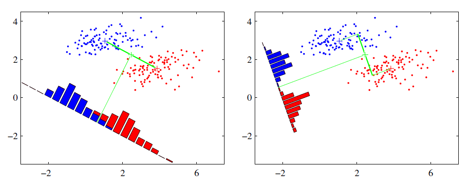

# 降维算法之LDA

线性判别分析(Linear Discriminant Analysis，简称LDA)是一种经典的分类和降维算法。注意这里需要和自然语言处理领域的LDA分区开，在自然语言处理领域，LDA是隐含狄利克雷分布(Latent Dirichlet Allocation，简称LDA)是一种处理文档的主题模型。

## LDA算法思想

LDA是一种监督学习的降维技术，每个样本都是有类别信息的。而PCA不同，PCA是不考虑样本类别信息的无监督降维技术。LDA的基本思想就是：投影后类内方差最小，类间方差最大。也就是保证数据在低维度上进行投影，投影后每一种类别的投影点尽可能的接近，而不同类别的数据的类别中心之间的距离尽可能的大。

如图所示，有两类二维数据，分别标记为红色和蓝色，现在将数据投影到一维的一条直线，让每个类别数据的投影尽可能的接近，而红色和蓝色数据中心之间的距离尽可能的大。

从直观上认为，右图比左图的投影效果好，因为右图中的红色数据和蓝色数据较为集中，且类别之间的距离明显。而左图的数据在交界处混杂。

## 瑞利商和广义瑞利商

瑞利商(Rayleigh Quotient)的定义函数$R(A,x)$表达式为：
$$
R(A,x)=\frac{x^H A x}{x^H x}
$$
其中$x$是非零向量，$A$是$n\times n$的Hermitan矩阵(厄米特矩阵)。所谓的Hermitan矩阵是指满足共轭转置矩阵和原始矩阵相等的矩阵，即$A^H = A$。如果矩阵$A$是实矩阵，则满足$A^T=A$的矩阵即为Hermitan矩阵。

瑞利商$R(A,x)$的一个重要性质：它的最大值等于矩阵$A$的最大特征值，而最小值等于矩阵$A$的最小特征值，也就是满足
$$
\lambda_{min} \le \frac{x^H A x}{x^H x} \le \lambda_{max}
$$
当向量$x$是标准正交基时，即满足$x^H x=1$时，瑞利商$R(A,x)=x^H A x$ （注意这个形式在谱聚类和PCA都有出现）

广义瑞利商(Genralized Rayleigh Quotient)的定义函数$R(A,B,x)$表达式为：
$$
R(A,B,x)=\frac{x^H A x}{x^H B x}
$$
其中$x$是非零向量，$A,B$为$n\times n$的Hermitan矩阵，$B$为正定矩阵。

令$x=B^{-1/2} x^{'}$，则分子分母转化为：
$$
\begin{align}
&x^H B x = (B^{-1/2}x^{'})^H B (B^{-1/2}x^{'})=x^{'H}B^{-1/2H}B B^{-1/2} x^{'}=x^{'H}B^{-1/2}B B^{-1/2} x^{'}=x^{'H}x^{'}\\
&x^H A x = (B^{-1/2}x^{'})^H A (B^{-1/2}x^{'})=x^{'H}B^{-1/2H}A B^{-1/2} x^{'}=x^{'H}B^{-1/2}A B^{-1/2} x^{'}
\end{align}
$$
根据式(4)和式(5)，广义瑞利商可以写成：
$$
R(A,B,x)=\frac{x^H A x}{x^H B x}=\frac{x^{'H}B^{-1/2}A B^{-1/2} x^{'}}{x^{'H}x^{'}}
$$
利用前面瑞利商的性质，可知$R(A,B,x)$的最大值为矩阵$B^{-1/2}AB^{-1/2}$的最大特征值，或者说矩阵$B^{-1}A$的最大特征值，而最小值为矩阵$B^{-1}A$的最小特征值。

## 二类LDA原理

假设数据集$D=\{(x^{(1)},y^{(1)}),(x^{(2)},y^{(2)}),...,(x^{(m)},y^{(m)})  \}$，其中$x^{(i)} \in \mathbb{R}^n,y^{(i)} \in \{-1,+1\}$。现在定义$N_j(j=0,1)$为第$j$个样本的个数，$X_j(j=0,1)$为第$j$类样本的集合，$\mu_j(j=0,1)$为第$j$类样本的均值向量，$\Sigma_j(j=1,2)$为第$j$类样本的协方差矩阵（准确说是缺少分母部分的协方差矩阵）。
$$
\begin{align}
\mu_j &= \frac{1}{N_j}\sum_{x \in X_j}x \qquad j=0,1\\
\Sigma_j &= \sum_{x\in X_j}(x-\mu_j)(x-\mu_j)^T \qquad j=0,1
\end{align}
$$
由于是两类数据，因此只需要将数据投影到一条直线即可。假设投影直线是向量$w$，则对任意一个样本$x^{(i)}$在直线$w$的投影为$w^T x^{(i)}$。对于两个类别的中心点$\mu_0,\mu_1$，在直线$w$的投影为$w^T \mu_0$和$w^T \mu_1$。由于LDA需要让不同类别的数据的类别中心之间的距离尽可能的大，即最大化$||w^T \mu_0-w^T \mu_1||_2^2$，同时需要让同一种类别数据的投影尽可能的接近，即最小化协方差$(w^T \Sigma_0 w$+$w^T \Sigma_1 w)$尽可能的小。综上优化目标为：
$$
\arg \max_{w} J(w)=\frac{||w^T \mu_0 - w^T \mu_1||_2^2}{w^T \Sigma_0 w+w^T \Sigma_1 w}=\frac{w^T(\mu_0-\mu_1)(\mu_0 - \mu_1)^Tw}{w^T \Sigma_0 w+w^T \Sigma_1 w}
$$
一般定义类内散度矩阵$S_w$为：
$$
S_w=\Sigma_0+\Sigma_1=\sum_{x\in X_0}(x-\mu_0)(x-\mu_0)^T+\sum_{x\in X_1}(x-\mu_1)(x-\mu_1)^T
$$
定义类间散度矩阵$S_b$为：
$$
S_b = (\mu_0-\mu_1)(\mu_0-\mu_1)^T
$$
最终优化目标可以写成：
$$
\arg \max_{w} J(w)=\frac{w^T S_b w}{w^T S_w w}
$$
可以发现式(12)就是广义瑞利商。利用广义瑞利商的性质可知，$J(w)$的最大值为矩阵$S^{-1}_w S_b$的最大特征值，而对应的$w$为$S^{-1}_wS_b$的最大特征值对应的特征向量。

## 多类LDA原理

假设数据集$D=\{ (x^{(1)},y^{(1)}), (x^{(2)},y^{(2)}),..., (x^{(m)},y^{(m)}) \}$，其中$x^{(i)} \in \mathbb{R}^n,y^{(i)} \in \{C_1,C_2,...,C_k\}，定义$$N_j(j=1,2,...,k)$为第$j$类样本的个数，$X_j(j=1,2,...,k)$为第$j$类样本的集合，$\mu_j(j=1,2,...,k)$为第$j$类样本的均值向量，$\Sigma_j(j=1,2,..,k)$为第$j$类样本的协方差矩阵。

由于多类向低维投影，此时投影到的低维空间就不是一条直线，而是一个超平面。假设投影到的低维空间的维度为$d$，对应的向量为$(w_1,w_2,...,w_d)$，基向量组成的矩阵为$W$，是一个$n\times d$的矩阵。

此时的优化目标可以变成：
$$
\frac{W^T S_b W}{W^T S_w W}
$$
其中，$S_b=\sum_{j=1}^kN_j(\mu_j - \mu)(\mu_j-\mu)^T,S_w=\sum_{j=1}^k S_{wj}=\sum_{j=1}^k\sum_{x\in X_j}(x-\mu_j)(x-\mu_j)^T$，$\mu$为所有样本均值向量。

由于式(13)中的分子和分母都是矩阵，不是标量，无法直接作为一个标量函数来优化。因此无法直接使用二类LDA的优化方法。一般来说，可以用其他的一些替代优化目标来实现，比如常见的一个LDA多类优化目标函数定义为：
$$
\begin{align}
\arg \max_{W} J(W)
&=\frac{\prod_\limits{diag} W^T S_b W}{\prod_\limits{diag} W^T S_w W}\\
&=\frac{\prod_\limits{i=1}^d w_i^T S_b w_i}{\prod_\limits{i=1}^d w_i^T S_w w_i}\\
&=\prod_\limits{i=1}^d \frac{w_i^T S_b w_i}{ w_i^T S_w w_i}\\
\end{align}
$$
观察式(16)就是广义瑞利商。根据瑞利商的性质可知，最大值是矩阵$S^{-1}_w S_b$的最大特征值，最大的$d$个值的乘积就是矩阵$S_w^{-1}S_b$的最大的$d$个特征值乘积，此时对应的矩阵$W$为对应最大的$d$个特征值对应的特征向量张成的矩阵。

## LDA算法流程

LDA算法流程：

> 输入：数据集$D=\{ (x^{(1)},y^{(1))}),  (x^{(2)},y^{(2))}),..., (x^{(m)},y^{(m))})\},x^{(i)}\in \mathbb{R}^n,y\in \{C_1,C_2,...,C_k \}$和降维$d$
>
> 输出：$x^{(i)}\in \mathbb{R}^d$
>
> （1）计算类内散度矩阵$S_w$
>
> （2）计算类间散度矩阵$S_b$
>
> （3）计算矩阵$S^{-1}_wS_b$最大的$d$个特征值和对应的$d$个特征向量$(w_1,w_2,...,w_d)$得到投影矩阵$W$
>
> （4）对样本中的每一个样本$x^{(i)}$，转化为新的样本$z^{(i)}=W^T x^{(i)}$
>
> （5）输出降维后的样本集 $D^{'}=(z^{(1)},y^{(1))}),  (z^{(2)},y^{(2))}),..., (z^{(m)},y^{(m)})$  

LDA除了可以用于降维以外，还可以用于分类。一个常见的LDA分类基本思想是假设各个类别的样本数据符合高斯分布，这样利用LDA进行投影后，可以利用极大似然估计计算各个类别投影数据的均值和方差，进而得到该类别高斯分布的概率密度函数。当一个新的样本到来后，我们可以将它投影，然后将投影后的样本特征分别带入各个类别的高斯分布概率密度函数，计算它属于这个类别的概率，最大的概率对应的类别即为预测类别。

## LDA算法小结

LDA算法既可以用来降维，又可以用来分类，但是目前来说，主要还是用于降维。在我们进行图像识别图像识别相关的数据分析时，LDA是一个有力的工具。

LDA算法的主要优点有：

（1）在降维过程中可以使用类别的先验知识经验，而像PCA这样的无监督学习则无法使用类别先验知识。

（2）LDA在样本分类信息依赖均值而不是方差的时候，比PCA之类的算法较优。

LDA算法的主要缺点有：

（1）LDA不适合对非高斯分布样本进行降维，PCA也有这个问题。

（2）LDA降维最多降到类别数k-1的维数，如果我们降维的维度大于k-1，则不能使用LDA。当然目前有一些LDA的进化版算法可以绕过这个问题。

（3）LDA在样本分类信息依赖方差而不是均值的时候，降维效果不好。

（4）LDA可能过度拟合数据。