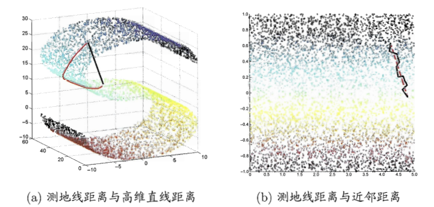

# 降维算法之Isomap

Isomap通过改造一种原本试用于欧式空间的算法MDS，达到降维的目的。MDS算法的目的是使降维后的点，两两之间的距离不变，即降维空间和原始空间中对应的两点之间距离要差不多，但MDS是针对欧式空间用欧氏距离计算的，如果一个数据分布在一个流形上欧氏距离则不适用了。

## 流形学习 ##

流形学习是一类借鉴拓扑流形概念的降维方法。"流形"是在局部与欧式空间同胚的空间。换言之，它在局部具有欧式空间的性质，能用欧氏距离来进行距离计算。这给降维方法的带来了很大的启发：若低维流行嵌入到高维空间中，则数据样本在高维空间的分布虽然看上去很复杂，但在局部仍具有欧式空间的性质。因此，可以容易地在局部建立降维映射关系，然后在设法将局部映射关系推广到全局。

## MDS算法原理

假定$m$个样本在原始空间的距离矩阵为$D\in \mathbb{R}^{m\times m}$，其第$i$行和第$j$列的元素$dist_{ij}$为样本$x^{(i)}$和样本$x^{(j)}$的距离。现在目标是获得样本在$d^{'}$维空间的表示$Z \in \mathbb{R}^{d^{'} \times m}$ ，且$d^{'}\le d$ 任意两个样本在$d^{'}$维空间中的欧式距离等于原始空间的距离，即$||z_i-z_j||=dist_{ij}$。

令$B=Z^T Z\in \mathbb{R}^{m\times m}$，其中$B$为降维后样本的内积矩阵，$b_{ij}=z_i^T z_j$，则有

$$
dist_{ij}^2=||z_i-z_j||^2=||z_i||^2+||z_j||^2-2z_i^T z_j=b_{ii}+b_{jj}-2b_{ij}
$$

由式(1)可以得到：

$$
b_{ij}=\frac{1}{2}(b_{ii}+b_{jj}-dist_{ij})
$$

为了计算方便，首先会对数据进行中性化，即$\sum_{i=1}^m z_i = 0$，即

$$
\sum_{i=1}^m z_{ik}=0 \qquad (k=1,2,...,d)
$$

于是有

$$
\sum_{i=1}^m b_{ij}=\sum_{i=1}^m z_i^T z_j=\sum_{i=1}^m \sum_{k=1}^{d^{'}}z_{ik}z_{jk}=\sum_{k=1}^{d^{'}}(\sum_{i=1}^m z_{ik})z_{jk}=0
$$

同理可以得到$\sum_{j=1}^m b_{ij}=0$，则有：

$$
\begin{align}
\sum_{i=1}^m dist_{ij}^2&=\sum_{i=1}^m (b_{ii}+b_{jj}-2b_{ij})=\sum_{i=1}^m b_{ii}+\sum_{i=1}^m b_{jj}-2\sum_{i=1}^m b_{ij}=tr(B)+mb_{jj}\\
\sum_{j=1}^m dist_{ij}^2&=\sum_{j=1}^m (b_{ii}+b_{jj}-2b_{ij})=\sum_{j=1}^m b_{ii}+\sum_{j=1}^m b_{jj}-2\sum_{j=1}^m b_{ij}=mb_{ii}+tr(B)\\
\sum_{i=1}^m\sum_{j=1}^m dist_{ij}^2&=\sum_{i=1}^m\sum_{j=1}^m(b_{ii}+b_{jj}-2b_{ij})=\sum_{i=1}^m(tr(B)+mb_{ii})=2m \cdot tr(B)
\end{align}
$$

其中$tr(B)=\sum_{i=1}^{d^{'}}b_{ii}$则式(7)可以得到

$$
tr(B)= \frac{1}{2m}\sum_{i=1}^m\sum_{j=1}^mdist_{ij}^2
$$

下面定义几个符号：

$$
\begin{align}
dist_{i\cdot}^2&=\frac{1}{m}\sum_{j=1}^m dist_{ij}^2\\
dist_{\cdot j}^2&=\frac{1}{m}\sum_{i=1}^m dist_{ij}^2\\
dist_{\cdot \cdot}^2&=\frac{1}{m^2}\sum_{i=1}^m\sum_{j=1}^m  dist_{ij}^2\\
\end{align}
$$

利用式(9)和式(11)得到

$$
tr(B)=\frac{m}{2}dist_{\cdot \cdot}^2
$$

进一步，对式(5)和式(6)

$$
\begin{align}
b_{ii}=\frac{1}{m}(\sum_{j=1}^m dist_{ij}^2-tr(B))=\frac{1}{m}(m\cdot dist_{i\cdot}^2-\frac{m}{2}dist_{\cdot\cdot}^2)\\
b_{jj}=\frac{1}{m}(\sum_{i=1}^m dist_{ij}^2-tr(B))=\frac{1}{m}(m\cdot dist_{\cdot j}^2-\frac{m}{2}dist_{\cdot\cdot}^2)\\
\end{align}
$$

将式(13)(14)带入式(2)可以得到：

$$
b_{ij}=\frac{1}{2}(dist_{i\cdot}^2+dist_{\cdot j}^2-dist_{\cdot \cdot}^2-dist_{ij}^2)
$$

通过式(15)就可以得到降维后的矩阵$B$的各元素。

对矩阵$B$做特征值分解，$B=V\Lambda V^T$，其中$\Lambda=diag(\lambda_1,\lambda_2,...,\lambda_d)$为特征值构成的对角矩阵$\lambda_1\ge \lambda_2\ge...\ge \lambda_d$，$V$为特征向量矩阵。假定其中有$d^*$个非零特征值，构成对角矩阵$\Lambda_*=diag(\lambda_1,\lambda_2,...,\lambda_d)$ 令$V_*$表示相应的特征向量矩阵，则$Z$可表达为

$$
Z=\Lambda_*^{1/2}V_*^T  \in \mathbb{R}^{d^* \times m}
$$

在实际应用中为了有效降维，往往仅需降维后的距离和原始空间中的距离尽可能接近，而不必严格相等。此时可取$d^{'}\le d$个最大特征值构成对角矩阵$\hat{\Lambda}=diag(\lambda_1,\lambda_2,...,\lambda_{d^{'}})$，令$\hat{V}$ 表示相应的特征向量矩阵，则$Z$表达为

$$
Z=\hat{\Lambda}^{1/2}\hat{V}^T \in \mathbb{R}^{d^{'}\times m}
$$

MDS算法流程如下：

> 输入：距离矩阵$D\in \mathbb{R}^{m\times m}$，低维空间维数$d^{'}$
>
> 输出：降维后的矩阵
>
> (1)计算
> 
> $$
> \begin{aligned}
> dist_{i\cdot}^2&=\frac{1}{m}\sum_{j=1}^m dist_{ij}^2\\
> dist_{\cdot j}^2&=\frac{1}{m}\sum_{i=1}^m dist_{ij}^2\\
> dist_{\cdot \cdot}^2&=\frac{1}{m^2}\sum_{i=1}^m\sum_{j=1}^m  dist_{ij}^2\\
> \end{aligned}
> $$
>
> (2)计算矩阵$B$，矩阵中每个元素$b_{ij}$
>
> $$
> b_{ij}=\frac{1}{2}(dist_{i\cdot}^2+dist_{\cdot j}^2-dist_{\cdot \cdot}^2-dist_{ij}^2)\notag
> $$
>
> (3)对矩阵$B$做特征值分解$B=V\Lambda V^T$，取$\hat{\Lambda}$为$d^{'}$个最大特征值所构成的对角矩阵，$\hat{V}$为对应的特征向量矩阵
>
> (4)矩阵$\hat{V}\hat{\Lambda}^{1/2} \in \mathbb{R}^{m \times d^{'}}$，每行是一个样本的降为坐标

## Isomap算法原理

等度量映射(Isometric Mapping，简称Isomap)的基本出发点，是认为低维流形嵌入到高维空间之后，直接在高维空间中计算直线距离具有误导性，因为高维空间中的直线距离在低维嵌入流形上是不可达的，直接在高维空间中计算直线距离是不恰当的。

可利用流形在局部上与欧式空间同胚的这个性质，对每个点基于欧式距离找出其紧邻点，然后建立一个近邻连接图，图中近邻点之间存在连接，而非近邻点之间不存在连接。于是计算两点之间的距离，就可以转变为计算近邻连接图上两点之间的最短距离问题。

在近邻连接图上计算两点之间的最短距离，可采用Dijkstra算法或Floyd算法，在得到任意两点的距离之后，就可以直接采用MDS方法来获得样本点在低维空间中的坐标。所以Isomap算法的流程：

> 输入：样本集$D=\{x^{(1)},x^{(2)},..,x^{(m)}\}$，近邻参数$k$，低维空间维数$d^{'}$
>
> 输出：样本集$D$在低维空间的投影$Z=\{z_1,z_2,...,z_m\}$
>
> (1)对$i=1,2,...,m$有：
>
> ​	①确定$x^{(i)}$的$k$近邻；
>
> ​	②$x^{(i)}$与$k$近邻点之间的距离设置为欧氏距离，与其他点的距离设置为无穷大
>
> (2)调用最短路算法计算任意两个样本之间的距离$dist_{ij}$
>
> (3)将$dist_{ij}$作为MDS算法的输入
>
> (4)返回MDS算法的输出

