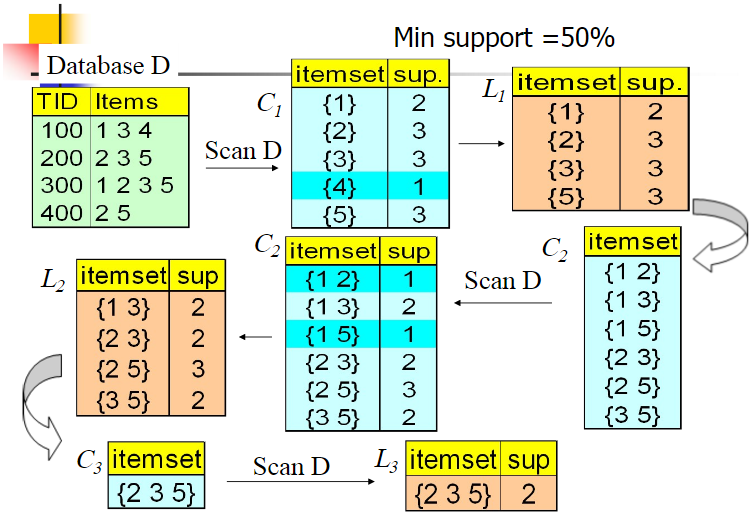

# 关联算法之Apriori

Apriori算法是常用的用于挖掘数据关联规则的算法，可以找出数据之中频繁出现的数据集合，找出这些集合的模式有助于决策。

## 频繁项集的评估标准

常用的频繁项集的评估标准有支持度、置信度和提升度三个。

**支持度**

支持度是几个关联的数据在数据集中出现的次数占总数据集的比重，或者几个数据关联出现的概率。对于数据$X,Y$和$Z$，对应的支持度有：
$$
\begin{align}
Support(X,Y)=P(XY)=\frac{count(XY)}{count(Samples)}\\
Support(X,Y,Z)=P(XYZ)=\frac{count(XYZ)}{count(Samples)}
\end{align}
$$
一般而言，支持度高的数据不一定构成频繁项集，但是支持度太低的数据肯定不构成频繁项集。

**置信度**

置信度体现了一个数据出现后，另一个数据出现的概率，或者数据的条件概率。对于数据$X,Y$和$Z$，对应的置信度有：
$$
\begin{align}
Confidence(X \Leftarrow Y)=P(X|Y)=\frac{P(XY)}{P(Y)}\\
Confidence(X \Leftarrow YZ)=P(X|YZ)=\frac{P(XYZ)}{P(YZ)}\\
\end{align}
$$

**提升度**

提升度表示包含$Y$的条件下，同时含有$X$的概率，与$X$总体发生的概率之比，即：
$$
Lift(X\Leftarrow Y)=P(X|Y)/P(X)=Confidence(X\Leftarrow Y)/P(X)
$$
提升度体现了$X$和$Y$之间的关联关系，提升度大于1则$X\Leftarrow Y$有较强的关联规则，提升度小于等于1则$X\Leftarrow Y$是无效的强关联规则。

## Apriori算法思想

Apriori算法采用了迭代的方法，先搜索出候选1项集及对应的支持度，剪枝去掉低于支持度的1项集，得到频繁1项集。然后对剩下的频繁1项集进行连接，得到候选的频繁2项集，帅选去掉低于支持度的候选频繁2项集，得到正真的频繁二项集，依次类推，迭代下去，直到无法找到频繁$k+1$项集为止，对应的频繁$k$项集的集合即为算法的输出结果。

数据集D有4条记录，分别是134,235,1235和25。现在我们用Apriori算法来寻找频繁k项集，最小支持度设置为50%。首先我们生成候选频繁1项集，包括我们所有的5个数据并计算5个数据的支持度，计算完毕后我们进行剪枝，数据4由于支持度只有25%被剪掉。我们最终的频繁1项集为1235，现在我们链接生成候选频繁2项集，包括12,13,15,23,25,35共6组。此时我们的第一轮迭代结束。

进入第二轮迭代，我们扫描数据集计算候选频繁2项集的支持度，接着进行剪枝，由于12和15的支持度只有25%而被筛除，得到真正的频繁2项集，包括13,23,25,35。现在我们链接生成候选频繁3项集,123, 125，135和235共4组，这部分图中没有画出。通过计算候选频繁3项集的支持度，我们发现123,125和135的支持度均为25%，因此接着被剪枝，最终得到的真正频繁3项集为235一组。由于此时我们无法再进行数据连接，进而得到候选频繁4项集，最终的结果即为频繁3三项集235。

Aprior算法流程：

>输入：数据集合$D$，支持度阈值$\alpha$
>
>输出：最大的频繁$k$项集
>
>(1)扫描整个数据集，得到所有出现过的数据，作为候选频繁集。$k=1$，频繁0项集为空集
>
>(2)挖掘频繁$k$项集
>
>​	①扫描数据计算候选频繁$k$项集的支持度
>
>​	②去除候选频繁$k$项集中支持度低于阈值的数据集，得到频繁$k$项集。如果得到的频繁$k$项集为空，则直接返回频繁$k-1$项集的集合作为算法结果，算法结束。如果得到的频繁$k$项集只有一项，则直接返回频繁$k$项集的结果作为算法结果，算法结束。
>
>​	③基于频繁$k$项集，连接生成候选频繁$k+1$项集
>
>(3)令$k=k+1$，转入步骤2

从算法的步骤可以看出，Aprior算法每轮迭代都要扫描数据集，因此在数据集很大，数据种类很多的时候，算法效率很低。

