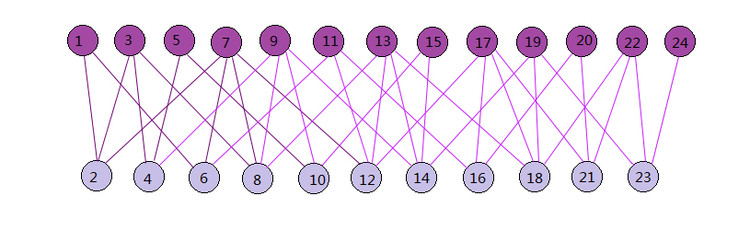

# 推荐算法之SimRank

SimRank是基于图论的，假设用户和物品在空间中形成一张图，而这张图是一个二部图。所谓二部图就是图中的节点可以分为两个子集，图中任意一条边的两个端点分别来自这两个子集且子集内部没有边连接。

二部图中的两个子集分别表示用户和物品，用户和物品之间的评分数据则构成了二部图的边。

## SimRank算法原理

SimRank算法思想是，如果两个用户相似，则与这两个用户向关联的物品也类似；如果两个物品相似，则与这两个物品向关联的用户也类似。

二部图$G(V,E)$其中$V$是节点集合，$E$是边集合。某一个子集内两个点的相似度$s(a,b)$可以用和相关联的另一个子集节点之间的相似度表示，即：

$$
s(a,b)=\frac{C}{|I(a)||I(b)|}\sum_{i=1}^{|I(a)|}\sum_{j=1}^{|I(b)|}s(I_i(a),I_j( b))
$$

其中$C$是一个常数，而$I(a),I(b)$分别代表和$a,b$相连的二部图另一个子集的节点集合。$s(I_i(a),I_i(b))$即为相连的二部图另一个子集节点之间的相似度。

此时还需考虑两种特殊情形：①自己和自己的相似度，即$s(a,a)=1$；②$I(a),I(b)$有一个为空，即$a,b$中某一个点没有相连的另一个子集中的点，即$s(a,b)=0$。综上二部图一个子集内两个点的相似度$s(a,b)$可以表示为：

$$
s(a,b)=\left \{
    \begin{matrix}
   1 & a=b\\
   \frac{C}{|I(a)||I(b)|}\sum_{i=1}^{|I(a)|}\sum_{j=1}^{|I(b)|}s(I_i(a),I_j( b))& a\ne b ,I(a)\ne \emptyset , I(b)=\emptyset\\
   0 & otherwise
    \end{matrix}
\right.
$$

利用上式(2)直接计算两个物品或两个用户之间的相似度较为困难，一般采用迭代方式计算。对于$a\ne b , I(a)\ne \emptyset, I(b)\ne \emptyset$时，有：

$$
\begin{align}
s(a,b)
&=\frac{C}{|I(a)||I(b)|}\sum_{i=1}^{|I(a)|}\sum_{j=1}^{|I(b)|}s(I_i(a),I_j( b))\\
&=\frac{C}{|I(a)||I(b)|}\sum_{i=1}^{N}\sum_{j=1}^{N}p_{ia}s(a,b)p_{jb}\\
&=C\sum_{i=1}^{N}\sum_{j=1}^{N}(\frac{p_{ia}}{\sum_{i=1}^N p_{ia}})\cdot s(a,b) \cdot (\frac{p_{jb}}{\sum_{j=1}^N p_{jb}}) \\
\end{align}
$$

其中$p$为二部图关联边的权重，$N$为二部图节点数。式(5)如果用矩阵表示，可以写成矩阵$S=CW^T SW$，其中$W$是将权重值$p$构成的矩阵$P$归一化后的矩阵。

由于节点和自己的相似度为1，所以矩阵$S$对角线上的值都应该是1，所以这里需要针对矩阵$S$做一个修正：首先去掉对角线上的值再加上单位矩阵，就可以得到对角线为1的相似度矩阵。即：

$$
S=CW^TSW+I-Diag(diag(CW^TSW))
$$

其中$diag(CW^TSW)$是矩阵$CW^TSW$的对角线元素构成的向量，$Diag(diag(CW^T SW))$将这个向量构成对角矩阵。

现在只需要对$S$矩阵按照上式进行若干轮迭代，当$S$矩阵的值基本稳定后就得到了二部图的相似度矩阵，进而可以利用用户与用户的相似度度量，物品与物品的相似度度量进行有针对性的推荐。

SimRank算法流程：

> 输入：二部图转移矩阵$W$，阻尼常数$C$，迭代次数$k$
>
> 输出：子集相似度矩阵$S$
>
> (1)将相似度矩阵$S$的初始值设置为单位矩阵$I$
>
> (2)对于$i=1,2,...,k$
>
> ​	①$temp = CW^T S W$
>
> ​	②$S= temp +I- Diag(diag(temp))$
>
> (3)返回相似度矩阵$S$

以上基于普通的SimRank算法流程。当然，SimRank算法有很多变种，所以你可能看到其他地方的SimRank算法描述或者迭代的过程和上面的有些不同，但是算法思想基本和上面相同。

## SimRank++算法原理

SimRank++算法对SimRank算法主要做了两点改进。第一是考虑边的权值；第二是考虑子集节点相似度的证据。

关于边的权值，在SimRank算法中，对于边的归一化权重，用比较简单的关联的边数分之一来度量，并没有考虑不同边可能有不同的权重度量，而SimRank++算法则在构建转移矩阵$W$会考虑不同边的不同权重值。

关于节点相似度的证据，在SimRank算法中，任务有边相连则为相似，却没有考虑到如果共同连接的边越多则意味着两个节点的相似度会越高。而SimRank++算法利用共同连接的边数作为证据，在每一轮迭代过程中，对SimRank算法计算出来的节点相似度进行修正——乘以对应的证据值得到当前迭代的最终相似度值。

## SimRank算法的求解

由于SimRank算法设计到矩阵运算，如果用户和物品量非常大，则对应的计算量是很大的。如果直接采用上面的迭代方法求解，耗时较多。对于这个问题，通常可采取的加快计算方法有：

+ 利用大数据平台并行化，如Hadoop的MapReduce或Spark将矩阵运算并行化；
+ 利用蒙特卡罗模拟(Monte Carlo, MC)，将两结点间SimRank的相似度分别表示为两个随机游走者分别从结点$a$和结点$b$出发到最后相遇的总时间的期望函数。这种方法的时间复杂度大大降低，但是由于MC带有一定的随机性，因此最终结果精度可能不高。

