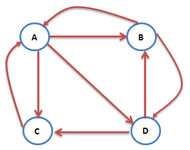

# 推荐算法之PersonalRank

用户物品数据可以转化为二部图的存储形式，图中的两个子集$V_1$和$V_2$分别为用户结点集合和商品结点的集合。PersonalRank算法是计算图中结点相对于某个结点的重要性的算法。利用Personal算法可以计算所以其他结点相对于用户(user)结点的重要性，从而实现为用户(user)推荐。

## PageRank算法原理

PageRank算法，即网页排名算法，是用来标识网页的等级、重要性的一种方法，是衡量一个网页的重要指标。PageRank算法在谷歌的搜索引擎中对网页质量的评价起到了重要作用，通过组合人链数量和网页质量两个因素指标，使得网页重要性的评价更加准确。

对于某个网页的PageRank值计算是基于以下两个假设：

+ 数量假设。链接到网页A的链接数越多，网页A就越重要
+ 质量假设。链接到网页A的原网页越重要，则网页A也会越重要

PageRank算法预先给每个网页一个PR值(PageRank值的简称)，PR值可以理解为一个网页被访问的概率，一般为$1/N$，其中$N$为网页总数。

一个用户在浏览网页B之后，打开网页A和网页D在统计上应该是相同的概率，所以A网页的PR值为：
$$
PR(A)=\frac{PR(B)}{2}+\frac{PR(C)}{1}
$$
若某些网页只对自己有出链，或者几个网页的出链形成一个循环圈，那么在不断迭代计算过程中，这一个或者几个网页的PR值将只增不见，显然不合理。

为了解决这个问题，想象一个随机浏览网页的人，在浏览完网页C以后，显然不会一直停留在网页C。而是以一定的概率输入新的网址直接跳转到一个新的页面，这是跳转到每个网页的概率是一样的。所以此时节点A的PR计算为：
$$
PR(A)=\alpha \cdot \frac{PR(B)}{2}+(1-\alpha)\cdot \frac{1}{4}
$$
在一般情况下，PageRank值的计算公式可以写成：
$$
PR(i)=\alpha\cdot \sum_{j\in in(i)}\frac{PR(j)}{|out(j)|}+(1-\alpha)\cdot\frac{1}{N}
$$
其中$PR(i)$表示图中$i$节点的PageRank值，$\alpha$表示转移概率，$N$表示网页的总数，$in(i)$表示指向网页$i$的网页集合，$out(j)$表示网页$j$指向的网页集合。

可以用矩阵的形式描述PageRank计算，$S\in \mathbb{R}^{n\times n}$表示网页出入连的关系，$e$是所有分量都是1的列向量，那么可以定义矩阵：
$$
A = \alpha \cdot S + (1-\alpha)\cdot \frac{1}{N} \; ee^T
$$
其中$ee^T\in \mathbb{R}^{n\times n}$ ，设$P_n$为第$n$次迭代时各网页PR值组成的列向量：
$$
P_{n+1}=A P_{n}
$$

## PersonalRank算法原理

在PageRank算法中，计算得到的PR值是每个节点相对于全局的重要性程度，而在推荐问题中，求解的是所有的商品节点对于某个用户节点的重要性程度。

PersonalRank算法是PageRank算法的变形形式，用于计算所有商品节点$D_j$相对于某个用户节点$U$的重要性程度。现假设用户为$U_1$，则从节点$U_1$开始在用户-商品二部图中游走，游走到任意一个节点时，与PageRank算法一样，会按照一定的概率选择游走或者继续游走。假设继续游走，则以当前节点作为新的出发点重复以上的游走过程，直到每个节点的访问概率不在变化为止。

计算公式可以总结为：
$$
PR(j)=\left \{
    \begin{matrix}
   	\alpha \cdot \sum_{i\in in(j)}\frac{PR(i)}{|out(i)|} & j \ne u\\
   	(1-\alpha)+\alpha \cdot \sum_{i\in in(j)}\frac{PR(i)}{|out(i)|} &  j=u\\
    \end{matrix}
\right.
$$
其中$u$是待推荐的用户节点。

虽然PersonalRank算法通过随机游走有较好的理论解释，但该算法在时间复杂度上有明显的缺点。因为在为每个用户进行推荐时，都需要在整个用户物品二分图上进行迭代，知道整个图上的每个顶点PR值收敛，这一过程的往往非常耗时。

为了解决PersonalRank算法的这一问题，常用的解决方案有两种：①减少迭代次数，在收敛之前就停止。虽然这样会影响最终的精度，但一般来说影响不大；②从矩阵论出发，重新设计算法。

公式(6)可以写成矩阵形式：
$$
r=(1-\alpha)r_0+\alpha M ^T
$$
现在需要对第$i$个节点进行推荐，$r$是个$n$维向量，每个元素代表一个节点PR重要度，$r_0$也是$n$维向量，第$i$个位置上是0，其余元素均为0。$M$是$n$阶转移矩阵
$$
M_{ij}=\left\{
\begin{matrix}
\frac{1}{|out(i)|}& j\in out(i)\\
0 & j\notin out(i)
\end{matrix}
\right.
$$
利用式(7)和式(8)可以得到：
$$
\begin{align}
& (I-\alpha M^T) r= (1-\alpha)r_0\\
\Rightarrow \quad & r=(I -\alpha M^T)^{-1}(1-\alpha)r_0
\end{align}
$$
解一次线性方程组就可以得到$r$，对$r$中各元素降序排列取出前$k$个就得到了节点$i$的推荐列表。

