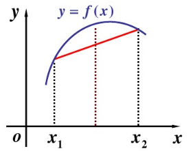

# EM算法原理

期望最大化(Expectation-Maximum,简称EM)算法，是一个算法框架，是很多机器学习领域算法的基础。比如隐马尔可夫模型算法(HMM)，LDA主题模型的变分推断等等。

概率模型有时既含有观测变量(observable variable)，又含有隐变量或潜在变量(latent variable)。如果概率模型的变量都是观测变量，那么给定数据，可以直接采用极大似然估计法或贝叶斯估计法估计模型参数。但是当模型含有隐变量时，就不能直接采用这些估计方法。

EM算法解决这个问题的思路是使用启发式的迭代方法，既然无法直接求出模型分布参数，那么就先猜测隐含数据(EM算法的E步)，接着基于观察数据和猜测的隐含数据一起进行极大化对数似然，求解模型的参数(EM算法的M步)。由于之前的E步隐含数据是猜测的，所以此时得到的模型参数并不是最终需要的结果，但是基于当前的模型参数，可以继续猜测隐含数据，然后继续极大似然估计，... 依次类推不断迭代下去，直到算法收敛，模型分布参数基本无变化，就可以找到合适的模型参数。

## EM算法推导

假设有$m$个样本的观察数据$x=(x^{(1)},x^{(2)},...,x^{(m)})$中，找到样本的模型参数$\theta$，极大化模型分布的对数似然函数如下：
$$
\theta = \arg \max_{\theta}\sum_{i=1}^m logP(x^{(i)}|\theta)
$$
数据中含有未观察到的隐藏数据$z=(z^{(1)},z^{(2)},...,z^{(n)})$，此时极大化模型分布的对数似然函数式(1)可以写成：
$$
\theta = \arg \max_{\theta}\sum_{i=1}^mlog P(x^{(i)}|\theta)=\arg \max_{\theta}\sum_{i=1}^m log \sum_{z^{(i)}}P(x^{(i)},z^{(i)}|\theta)
$$
式(2)是无法直接求出参数$\theta$的。现在对式(2)进行缩放如下：
$$
\begin{align}
&\sum_{i=1}^m \log \sum_{z^{(i)}}P(x^{(i)},z^{(i)}|\theta)\\
=&\sum_{i=1}^m \log \sum_{z^{(i)}}Q_i(z^{(i)})\frac{P(x^{(i)},z^{(i)}|\theta)}{Q_i(z^{(i)})}\\
\ge &  \sum_{i=1}^m  \sum_{z^{(i)}}Q_i(z^{(i)}) \log \frac{P(x^{(i)},z^{(i)}|\theta)}{Q_i(z^{(i)})}\\
\end{align}
$$
式(3)(4)在分子和分母同时引入一个新的分布$Q_i(z^{i})$，等号成立；式(4)~(5)利用Jensen不等式：
$$
\log\sum_j \lambda_j  y_j \ge \sum_{j}\lambda_j\log y_j \quad ( \lambda_j \ge 0  \quad and \quad \sum_j \lambda_j=1 )
$$

不等式(6)所表达是几何含义如图

要满足不等式中的等号，当且仅当
$$
\frac{P(x^{(i)},z^{(i)}|\theta)}{Q_i(z^{(i)})}=C   \quad  （C 为常数）
$$

由于$Q_i(z^{(i)})$是一个分布，所以满足概率和为1，即
$$
\sum_{z^{(i)}}Q_i(z^{(i)})=1
$$
根据式(7)和(8)，对式(7)左边分子分母分别求和有：
$$
\begin{align}
&\frac{P(x^{(i)},z^{(i)}|\theta)}{Q_i(z^{(i)})}=\frac{\sum_{z^{(i)}}P(x^{(i)},z^{(i)}|\theta)}{\sum_{z^{(i)}}Q_i(z^{(i)})}=\frac{\sum_{z^{(i)}}P(x^{(i)},z^{(i)}|\theta)}{1}=C\\
\notag \\ 
\Rightarrow &\quad C= \sum_{z^{(i)}}P(x^{(i)},z^{(i)}|\theta) =P(x^{(i)}|\theta)
\end{align}
$$
根据式(7)和(10)可以得到$Q_i(z^{(i)})$的表达式如下：
$$
Q_i(z^{(i)})=\frac{P(x^{(i)},z^{(i)}|\theta)}{C}=\frac{P(x^{(i)},z^{(i)}|\theta)}{P(x^{(i)}|\theta)}=P(z^{(i)}|x^{(i)},\theta)
$$
可以看到这里的**$Q(\cdot)$函数实际上就是根据参数$\theta$求每个样本$x^{(i)}$属于$z^{(i)}$的概率**。

如果$Q_i(z^{(i)})=P(z^{(i)}|x^{(i)},\theta)$则式(5)是包含隐藏数据的对数似然的一个下界。那么极大化这个下界，也是极大化对数似然式(2)，即：
$$
\begin{align}
\theta 
&= \arg \max_{\theta}\sum_{i=1}^mlog P(x^{(i)}|\theta)\\
&=\arg \max_{\theta}\sum_{i=1}^m log \sum_{z^{(i)}}P(x^{(i)},z^{(i)}|\theta)\\
&=\arg \max_{\theta} \sum_{i=1}^m  \sum_{z^{(i)}}Q_i(z^{(i)}) \log \frac{P(x^{(i)},z^{(i)}|\theta)}{Q_i(z^{(i)})}\\
&=\arg \max_{\theta}\sum_{i=1}^m  \sum_{z^{(i)}}Q_i(z^{(i)}) \log P(x^{(i)},z^{(i)}|\theta)\\
&=\arg \max_{\theta}\sum_{i=1}^m  \sum_{z^{(i)}}P(z^{(i)}|x^{(i)},\theta) \log P(x^{(i)},z^{(i)}|\theta)\\
\end{align}
$$
式(12)-(13)引入隐变量；式(13)-(14)引入$Q(\cdot)$函数；式(14)-(16)去掉常量部分，$Q_i(z^{(i)})\log Q_i(z^{(i)})$是与$\theta$无关的常量；由于上式中$Q_i(z^{(i)})$是一个分布，那么可以理解为——**最大化$\log P(x^{(i)},z^{(i)}|\theta)$基于条件概率分布$Q_i(z^{(i)})=P(x^{(i)}|x^{(i)},\theta)$的期望。**

现在可以总结EM算法的流程如下：

> 输入：训练数据$D=\{ x^{(1)},x^{(2)},...,x^{(m)} \}$，联合分布$p(x,z|\theta)$，条件分布$p(z|x,\theta)$和最大迭代次数$J$
>
> 输出：模型参数$\theta$
>
> (1)初始化随机模型参数$\theta$的初值$\theta^0$
>
> (2)对于$j=1,2,...,J$有EM算法迭代：
>
> ​	①E步：计算联合分布的条件概率期望：
> $$
> \begin{aligned}
> Q_i(z^{(i)}) &= P(z^{(i)}|x^{(i)},\theta^j)   \\
> L(\theta,\theta^j) &= \sum_{i=1}^m \sum_{z^{(i)}}Q_i(z^{(i)})\log P(x^{(i)},z^{(i)}|\theta)
> \end{aligned}
> $$
> ​	②M步：极大化$L(\theta, \theta^j)$，得到$\theta^{j+1}$：
> $$
> \theta^{j+1}=\arg \max_\theta L(\theta, \theta^j)
> $$
> ​	③如果$\theta^{j+1}$已手链，则算法结束；否则继续回到步骤①进行迭代
>
> (3)输出模型参数$\theta$

## EM算法收敛性

EM算法提供了一种近似计算含有因变量概率模型的极大似然估计的方法，EM算法的最大优点是简单性和适普性。但还有两个问题需要解决：

（1）EM算法是否能够保证收敛？

（2）EM算法如果收敛，那么是否能保证收敛到全局最大值？

针对第一个问题，要证明EM算法收敛，则需要证明对数似然函数的值在迭代过程中一直咋增长，即
$$
\sum_{i=1}^m \log P(x^{(i)}|\theta^{j+1}) \ge \sum_{j=1}^m \log P(x^{(i)}|\theta^j)
$$
证明： 由于有
$$
L(\theta,\theta^j) = \sum_{i=1}^m \sum_{z^{(i)}}P(z^{(i)}|x^{(i)},\theta^j)\log P(z^{(i)}|x^{(i)},\theta)
$$
令:
$$
H(\theta, \theta^j)=\sum_{i=1}^m \sum_{z^{(i)}}P(z^{(i)}|x^{(i)},\theta^j)\log P(z^{(i)},x^{(i)}|\theta^j)
$$
那么式(19)-(20)可以得到：
$$
\begin{align}
L(\theta,\theta^j)-H(\theta,\theta^j)
&=\sum_{i=1}^m \sum_{z^{(i)}}P(z^{(i)}|x^{(i)},\theta^j)\log P(z^{(i)}|x^{(i)},\theta)\\
&\quad -\sum_{i=1}^m \sum_{z^{(i)}}P(z^{(i)}|x^{(i)},\theta^j)\log P(z^{(i)},x^{(i)}|\theta^j)  \notag \\
&=\sum_{i=1}^m \sum_{z^{(i)}} P(z^{(i)}|x^{(i)},\theta) \log \frac{P(z^{(i)}|x^{(i)},\theta)}{P(z^{(i)},x^{(i)}|\theta)}\\
&=\sum_{i=1}^m \sum_{z^{(i)}} P(z^{(i)}|x^{(i)},\theta) \log P(x^{(i)}|\theta)\\
&=\sum_{i=1}^m  \log P(x^{(i)}|\theta)
\end{align}
$$
式(21)-(22)利用$\log(\cdot)$函数的定义，式(22)-(23)利用条件概率定义，式(23)-(24)利用$\sum_{z^{(i)}}P(z^{(i)}|x^{(i)},\theta)=1$

得到了
$$
\sum_{i=1}^m  \log P(x^{(i)}|\theta)=L(\theta,\theta^j)-H(\theta,\theta^j)
$$
令式(25)中的$\theta$分别取值$\theta^{j+1}$和$\theta^j$得到：
$$
\begin{align}
&\sum_{i=1}^m  \log P(x^{(i)}|\theta^{j+1})-\sum_{i=1}^m  \log P(x^{(i)}|\theta^j)\\
=&\{ L(\theta^{j+1},\theta^{j})-H(\theta^{j+1},\theta^j)  \} - \{ L(\theta^j,\theta^j)-H(\theta^j,\theta^j) \}\\
=&\{ L(\theta^{j+1},\theta^{j})-L(\theta^{j},\theta^j)  \} - \{ H(\theta^{j+1},\theta^j)-H(\theta^j,\theta^j) \}\\
\end{align}
$$
对于$L(\theta^{j+1},\theta^{j})-L(\theta^{j},\theta^j)$，由于在EM算法中M步有$\theta^{j+1}=\arg \max_\limits\theta L(\theta, \theta^j)$，因此有：
$$
L(\theta^{j+1},\theta^{j})   \ge  L(\theta^{j},\theta^j)
$$
对于$H(\theta^{j+1},\theta^j)-H(\theta^j,\theta^j)$，有：
$$
\begin{align}
&H(\theta^{j+1},\theta^j)-H(\theta^j,\theta^j)\\
=&\sum_{i=1}^m \sum_{z^{(i)}} P(z^{(i)}|x^{(i)},\theta^j)\log \frac{P(z^{(i)}|x^{(i)},\theta^{j+1})}{P(z^{(i)}|x^{(i)},\theta^{j})}\\
\le &  \sum_{i=1}^m \log \sum_{z^{(i)}} P(z^{(i)}|x^{(i)},\theta^j)\frac{P(z^{(i)}|x^{(i)},\theta^{j+1})}{P(z^{(i)}|x^{(i)},\theta^{j})}\\
=&\sum_{i=1}^m \log  ( \sum_{z^{(i)}}P(z^{(i)}| x^{(i)},\theta^{j+1}))\\
=& 0
\end{align}
$$
式(30)-(31)利用$\log(\cdot)$函数定义；式(31)-(32)利用Jensen不等式；式(32)-(34)利用概率和为1。

由式(29)和式(34)可以判断式(26)的正负，有：
$$
\sum_{i=1}^m  \log P(x^{(i)}|\theta^{j+1})  \ge  \sum_{i=1}^m  \log P(x^{(i)}|\theta^j)
$$
从而证明了EM算法的递增的，可以保证收敛到一个稳定点，但是却不能保证收敛到全局的极大值点。因此，EM是一个局部最优算法，当然如果优化目标$L(\theta,\theta^j)$是凸的，则EM算法可以保证收敛到全局最大值。

## EM算法小结

EM算法中已知的是观察数据，未知的是隐含数据和模型参数，在E步中固定模型参数的值，优化隐含数据的分布，而在M步固定隐含数据分布，优化模型参数的值。这和很多算法类似，如SMO算法、坐标下降法等等都是用了类似的思想来求解问题。

