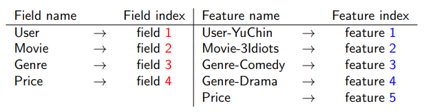
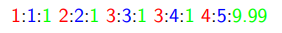
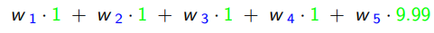
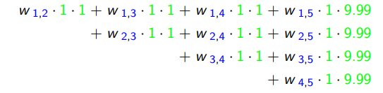
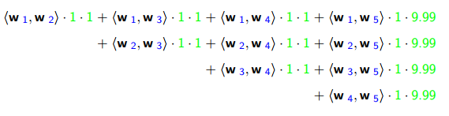
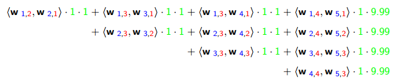

# 分解机算法原理

常见的线性模型，如线性回归、逻辑回归等，只考虑了每个特征对结果的单独影响，而没有考虑特征间的组合对结果的影响。如常见的$n$维特征模型，线性回归模型如下
$$
\hat{y}= w_0+w_1 x_1+w_2x_2+...+w_n x_n= \sum_{i=0}^nw_i x_i  \qquad (x_0=1) 
$$
其中$(w_0,w_1,...,w_n)$是模型参数，$(x_1,x_2,...,x_n)$为特征。模型的最终结果是各个特征的独立计算结果，并没有考虑特征之间的互相关系。

但是在实际应用中特征之间的组合可能是很有作用的，这种组合特征是线性模型无法表示的。为了不错过任何一个这种可能有用的组合特征，可以穷举所有的$i,j$组合，把$x_i,x_j, 1\le i \le n,i\lt j \le n$都加到特征里面去，得到模型
$$
\hat{y}=w_0 +\sum_{i=1}^nw_ix_i+\sum_{i=1}^{n}\sum_{j=i+1}^n w_{ij}x_i x_j
$$
式(2)考虑了任意2个特征之间的关系，模型涉及的参数个数为$\bigg(1+n+\frac{n(n-1)}{2}\bigg)$ 。但是并未考虑更加高阶的关系，如任意三个特征、四个特征等等，随着阶数的提高，样本会非常稀疏，且引入的参数呈指数增长。

## FM算法原理

所有的二次项参数$w_{ij}$可以组成一个**对称**矩阵$W\in \mathbb{R}^{n\times n}$，这个矩阵可以分解为$W=V^T V$，$V \in \mathbb{R}^{k \times n}$的第$j$列就是第$j$维特征的隐向量，即$w_{ij}=\langle v_i,v_j \rangle $ ，其中$k\ll n$。原本的训练参数有从$\bigg(1+n+\frac{n(n-1)}{2}\bigg)$减少到了$\bigg(1+n+nk \bigg)$ 。现在模型可以写成
$$
\begin{align}
\hat{y}=w_0 +&\sum_{i=1}^n w_i x_i +\sum_{i=1}^n \sum_{j=i+1}^n \langle v_i,v_j \rangle  x_i x_j
\\
\langle v_i,v_j \rangle  &=\sum_{f=1}^k v_{if}v_{jf}
\end{align}
$$
利用式(1)(2)由$x$计算$\hat{y}$的时间复杂度是$\mathcal{O}(kn^2)$。
$$
\begin{align}
& \sum_{i=1}^n \sum_{j=i+1}^n \langle v_i,v_j \rangle x_i x_j
\\
=& \frac{1}{2}\sum_{i=1}^n \sum_{j=1}^n \langle v_i,v_j \rangle x_i x_j -\sum_{i=1}^n \langle v_i,v_i \rangle x_i x_i
\\
=& \frac{1}{2}\bigg( \sum_{i=1}^n\sum_{j=1}^n\sum_{f=1}^k v_{if}v_{jf}x_ix_j-  \sum_{i=1}^n\sum_{f=1}^k v_{if}v_{if}x_ix_i  \bigg)
\\
=&\frac{1}{2}\sum_{f=1}^k \bigg( (\sum_{i=1}^nv_{if}x_i)\cdot(\sum_{j=1}^n v_{jf}x_j) -\sum_{i=1}^n v_{if}^2 x_{i}^2  \bigg)
\\
=& \frac{1}{2}\bigg( (\sum_{i=1}^n v_{if}x_i)^2-\sum_{i=1}^nv_{if}^2x_i^2  \bigg)
\end{align}
$$
利用式(3)由$x$计算$\hat{y}$的时间复杂度是$\mathcal{O}(kn)$。

利用梯度下降法进行训练需要对参数$(w_0,w_i,v_{if})$分别求导有
$$
\begin{align}
\frac{\partial }{\partial \theta} \hat{y}=
 \left\{
\begin{array}{c.c}
1,   \quad \; \theta = w_0\\
x_i, \quad \; \theta = w_i\\
x_i\sum_{j=1}^n v_{jf}x_j -v_{if}x_i^2, \quad  \; \theta = w_{ij}
\end{array}
\right.
\end{align}
$$

## FFM算法原理

在FM算法的基础上，进一步提出field的概念。同一个ID类特征进行One-hot编码而产生的所有特征都是可以归为同一个field。在FFM中，对每一个特征$x_i$，每一个field $f_j$，学习一个隐向量$v_{i,f_j}$ ，不同特征跟同一个field进行关联时使用不同的隐向量。

设现有$n$个特征，属于$f$个field，若每个特征都用$f$个隐向量来描述，则总共有$(n\times f)$个隐向量。FFM模型可以写成
$$
\hat{y}=w_0 +\sum_{i=1}^n w_i x_i + \sum_{i=1}^n \sum_{j=i+1}^n\langle v_{i,f_j} v_{j,f_i} \rangle x_i x_j
$$
其中$\langle v_{i,f_j,},v_{j,f_i} \rangle$ 表示特征$i$与特征$j$的field关联，同时让特征$j$与特征$i$的field关联。而在FM中，一个特征只有一个隐向量，所以FM可以看成是FFM中所有特征都属于同一个field的特例。

若设隐向量的长度为$k$，那么FFM的二次参数有$(n\times f \times k)$个 。由于隐向量与field相关，FFM二次项无法进一步化简，所以其预测复杂度为$\mathcal{O}(k n^2)$。

以一个简单的例子说明(1)(2)(3)(11)的特征组合方式，现有样本如下：

| User   | Movie   | Genre        | Price |
| ------ | ------- | ------------ | ----- |
| YuChin | 3Idiots | Comedy,Drama | $9.99 |

将所有的特征和对应的field映射成整数编号，得到

上面的样本可以整理成LIBFFM格式，其中红色字体为field序号，蓝色字体是feature序号，绿色字体是特征值。

对于线性模型(1)有：

对于二项式模型(2)有：

对于FM模型(3)有：

对于FFM模型(11)有：

