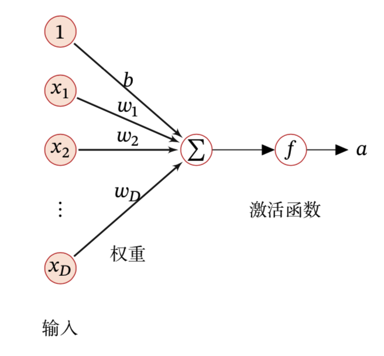

# 神经网络基础

## 神经元

人工神经元（Artifical Neuron）简称神经元（Neuron），是构成神经网络的基本单元，其主要是模拟生物神经元的结构和特性，接收一组输入信号并产生输出。

假设一个神经元接收$D$个输入$x_1,x_2,…,x_D$，令向量$\boldsymbol{x}=[x_1;x_2;\dots;x_D]$来表示这组输入，并用==净输入==$z\in \mathbb{R}$表示表示一个神经元所获得的净输入信号$\textbf{x}$的加权和。
$$
z=\sum_{d=1}^{D}w_d x_d+b
=\boldsymbol{w}^{\top} \boldsymbol{x}+b
$$
其中$\boldsymbol{w}=[w_1;w_2,w_3;\cdots;w_D]\in \mathbb{R}^D$是$D$维的权重向量，$b\in\mathbb{R}$是偏置。净输入$z$在经过一个非线性函数$f(\cdot)$后，得到神经元的活性值$a$，即
$$
a=f(z)
$$
其中非线性函数$f(\cdot)$称为==激活函数==。如图所示：

## 激活函数

激活函数在神经网络中非常重要，为了增强网络的表示能力和学习能力，激活函数需要具备以下几点性质：

1. 连续并可导（允许少数点上不可导）的非线性函数，可导的激活函数可以直接利用数值优化的方法来学习参数；
2. 激活函数及其导函数要尽量的简单，有利于提高网络计算效率；
3. 激活函数的导函数的值域要在一个合适的区间内，不能太大也不能太小，否则会影响训练的效率和稳定性。

比较常见的激活函数有：
### （1）Sigmoid型函数
Sigmoid型函数是指一类S型曲线函数，为两端饱和函数。常用的Sigmoid型函数有Logistic和Tanh函数。

> 对于函数$𝑓(𝑥)$，若$𝑥 → −∞$ 时，其导数$f\prime(𝑥) → 0$，则称其为左饱和．若$𝑥 → +∞$ 时，其导数$𝑓′(𝑥) → 0$，则称其为右饱和．当同时满足左、右饱和时，就称为两端饱和．

如图给出了两者的形状。

#### ① Logistic函数

Logistic函数的定义为
$$
\sigma(x)=\frac{1}{1+\operatorname{exp}(x)}
$$
该函数可以看成是一个“挤压”函数，把一个实数域的输入“挤压”到(0, 1)．当输入值在0 附近时，Sigmoid 型函数近似为线性函数；当输入值靠近两端时，对输入进行抑制．输入越小，越接近于0；输入越大，越接近于1.

这样的特点也和生物神经元类似，对一些输入会产生兴奋（如输出为1），对另一些输入产生抑制（输出为0）。

优点：
1. Logistic函数是连续可导的，具有良好的数学性质，导数为$\sigma^{\prime}(x)=\sigma(x)(1-\sigma(x))$
2. Logistic函数的输出映射在(0,1)之间，单调连续，可以直接看作概率分布，使得神经网络更好地和统计学习模型进行结合。

缺点：
Logistic函数的输出是恒大于0，非零中心化的输出会使得其后一层的神经元的输入发生偏执转移，并进一步使得梯度下降的收敛速度变慢。

#### ② Tanh函数
Tanh函数也是一种Sigmoid型函数，其定义为
$$
tanh(x)=\frac{\operatorname{exp}(x)-\operatorname{exp}{-x}}{\operatorname{exp}(x)+\operatorname{exp}{-x}}
=2\sigma(2x)-1
$$
Tanh函数可以看作放大并平移的Logistic函数，其值域为(-1,1)。

优点：
1. Tanh函数对比Sigmoid函数收敛速度更快；
2. Tanh函数的输出是零中心化的。

缺点：
Tanh函数并没有改变Sigmoid型函数由于饱和性而带来的梯度消失。

### （2）ReLU函数
ReLU函数是目前深度神经网络中经常使用的激活函数，ReLU函数实际上是一个斜坡函数，定义为
$$
\begin{aligned}
\operatorname{ReLU}(x)
&=
 \left\{
    \begin{aligned}
    x & & x \ge 0 \\
    0 & & x \lt 0 
    \end{aligned}
\right.
\\
&= \operatorname{max}(0,x)
\end{aligned}
$$

优点：
1. ReLU函数只需要进行简单的加、乘和比较运算，计算上更加高效；
2. Sigmoid型函数会导致一个非稀疏的神经网络，而ReLU却具有很好的稀疏性，大约50%的神经元会处于激活状态；
3. ReLU函数为左饱和函数，且在$x \gt 0$时导数为1，在一定程度上缓解了神经网络的梯度消失问题，加速梯度下降的收敛速度

缺点：
1. ReLU函数的输出是非零中心化的，给后一层的神经网络引入偏置转移，会影响梯度下降的效率；
2. ReLU函数元在训练过程中比较容易出现神经元“死亡”
> 在训练时，如果参数在一次不恰当的更新后，第一个隐藏层中的某个ReLU 神经元在所有的训练数据上都不能被激活，
> 那么这个神经元自身参数的梯度永远都会是0，在以后的训练过程中永远不能被激活．
> 这种现象称为死亡ReLU问题，并且也有可能会发生在其他隐藏层．

在实际使用中，为了避免上述情况，有几种ReLU的变种也会被广泛使用。

#### ① LReLU函数
带泄露的ReLU（Leaky ReLU）在输入$x<0$时，保持一个很小的梯度$\gamma$，这样当神经元非激活时也能有一个非零的梯度可以更新参数，避免永远不能被激活。

带泄露的定义如下
$$
\begin{aligned}
\operatorname{LeakyReLU}(x)
&=
 \left\{
    \begin{aligned}
    x & & x \ge 0 \\
    \gamma x & & x \lt 0 
    \end{aligned}
\right.
\\
&= \operatorname{max}(0,x) + \gamma \operatorname{min}(0,x)
\end{aligned}
$$
其中$\gamma$是一个很小的常数，如0.01。当$\gamma < 1$时，带泄露的ReLU也可以写为
$$
\operatorname{LeakyReLU}(x)=\operatorname{max}(x,\gamma x)
$$
相当于一个比较简单的maxout单元。

#### ② PReLU函数
带参数的ReLU引入一个可学习的参数，不同神经元可以有不同的参数，对于第$i$个神经元，其PReLU的定义为
$$
\begin{aligned}
\operatorname{PReLU}_i(x)
&=
 \left\{
    \begin{aligned}
    x & & x \ge 0 \\
    \gamma_i x & & x \lt 0 
    \end{aligned}
\right.
\\
&= \operatorname{max}(0,x) + \gamma_i \operatorname{min}(0,x)
\end{aligned}
$$
其中$\gamma_i$为$x\le 0$时函数的斜率。因此，PReLU是非饱和函数，．如果$\gamma_i =0$，那么
PReLU 就退化为ReLU．如果$\gamma_i$为一个很小的常数，则PReLU 可以看作带泄露的
ReLU．PReLU 可以允许不同神经元具有不同的参数，也可以一组神经元共享一
个参数．

#### ③ ELU函数
ELU函数是一个近似的零中心化的非线性函数，其定义为
$$
\begin{aligned}
\operatorname{ELU}(x)
&=
 \left\{
    \begin{aligned}
    x & & x \ge 0 \\
    \gamma(\operatorname{exp}(x)-1) & & x \lt 0 
    \end{aligned}
\right.
\\
&= \operatorname{max}(0,x) + \operatorname{min}(0,\gamma (\operatorname{exp}(x)-1))
\end{aligned}
$$
其中$\gamma \ge 0$是一个超参数，决定$x \le  0$ 时的饱和曲线，并调整输出均值在0 附近

#### ④ Softplus函数
Softplus函数可以看作Rectifier 函数的平滑版本，其定义为
$$
\operatorname{Softplus}(x)=\operatorname{log}(1+\operatorname{exp}(x))
$$
Softplus函数其导数刚好是Logistic函数，Softplus函数虽然也具有单侧抑制、宽兴奋边界的特性，却没有稀疏激活性．

图中显示了ReLU、LeakyReLU、ELU以及Softplus函数的示例

### (3) Maxout单元
Maxout单元也是一种分段线性函数，Sigmoid型函数、ReLU等激活函数的输入时神经元的净输入$z$，是一个标量。
而Maxout单元的输入时上一层神经元的全部原始输出。是一个向量$\boldsymbol{x}=[x_1;x_2;\cdots;x_D]$.

每个Maxout单元有$K$个权重向量$\boldsymbol{w}_k \in \mathbb{R}^D$和偏置$b_k(1\le k \le K)$.对于输入$\boldsymbol{x}$，
可以得到$K$个净输入$z_k(1\le k \le K)$.
$$
z_k = \boldsymbol{w}_k^\top \boldsymbol{x}+b_k
$$
其中$\boldsymbol{w}_k=[w_{k,1},w_{k,2},\cdots,w_{k,D}]^\top$为第$k$个权重向量。
Maxout单元的非线性函数定义为
$$
\operatorname{maxout}(\boldsymbol{x}) = \operatorname{max}_{ k \in [1,K] }(z_k)
$$

Maxout单元不单是净输入到输出之间的非线性映射，而是整体学习输入到输出之间的非线性映射关系．
Maxout激活函数可以看作任意凸函数的分段线性近似，并且在有限的点上是不可微的．