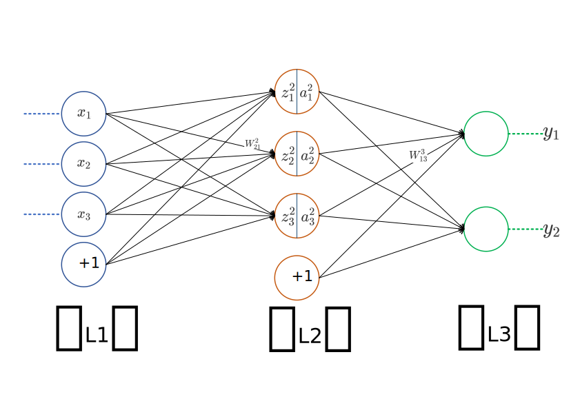
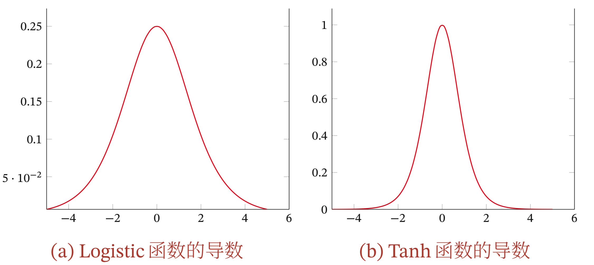

# DNN前馈神经网络
神经网络一般可以看做一个非线性模型，其基本组成单元为具有非线性激活函数的神经元，通过大量神经元之间的连接，使得神经网络称为一种高度非线性的模型。给定一组神经元，可以将神经元作为节点来构建一个网络。不同的网络网络有着不同网络连接的拓扑结构，一种比较直接的拓扑结构就是前馈神经网络。

## DNN前向传播算法

首先给出下描述前馈神经网络的相关记号。

| 记号                                                | 含义                                               |
| --------------------------------------------------- | -------------------------------------------------- |
| $L$                                                 | 神经网络的层数                                     |
| $M_l$                                               | 第$l$层神经元的个数                                |
| $\sigma(\cdot)$                                     | 第$l$层神经元的激活函数，以`Sigmoid`函数为例                            |
| $\boldsymbol{W}^l\in\mathbb{R}^{M_l\times M_{l-1}}$ | 第$l-1$层到第$l$层的权重矩阵                       |
| $\boldsymbol{W}^l_{jk}\in\mathbb{R}$                | 第$l-1$层的第$k$个结点到第$l$层的第$j$个结点的权重 |
| $\boldsymbol{b}^l\in \mathbb{R}^{M_l}$              | 第$l-1$层到第$l$层的偏置                           |
| $\boldsymbol{b}^l_{j}\in \mathbb{R}$                | 第$l$层的第$j$层的偏置                             |
| $\boldsymbol{z}^l\in \mathbb{R}^{M_l}$              | 第$l$层神经元的净输入                              |
| $\boldsymbol{z}^l_{j}\in \mathbb{R}$                | 第$l$层的第$j$个神经元的净输入                     |
| $\boldsymbol{a}^l\in \mathbb{R}^{M_l}$              | 第$l$层神经元的输出                                |
| $\boldsymbol{a}^l_{j}\in \mathbb{R}$                | 第$l$层的第$j$个神经元的输出                       |

需要说明下这里$\boldsymbol{W}^l\in\mathbb{R}^{M_l\times M_{l-1}}$,没有将矩阵定义为$\mathbb{R}^{M_{l-1}\times M_{l}}$ 的形式是为了避免在矩阵运算过程中进行转置操作。

对于第二层的输出$\boldsymbol{a}^2_1,\boldsymbol{a}^2_2,\boldsymbol{a}^2_3$，有
$$
\begin{aligned}
\boldsymbol{a}_1^2=\sigma(\boldsymbol{z}_1^2) = \sigma(\boldsymbol{W}_{11}^2\boldsymbol{x}_1 + 
\boldsymbol{W}_{12}^2\boldsymbol{x}_2 + \boldsymbol{W}_{13}^2\boldsymbol{x}_3 + \boldsymbol{b}_1^{2})
\\
\boldsymbol{a}_2^2=\sigma(\boldsymbol{z}_2^2) = \sigma(\boldsymbol{W}_{21}^2\boldsymbol{x}_1 + \boldsymbol{W}_{22}^2\boldsymbol{x}_2 + \boldsymbol{W}_{23}^2\boldsymbol{x}_3 + \boldsymbol{b}_2^{2})
\\
\boldsymbol{a}_3^2=\sigma(\boldsymbol{z}_3^2) = \sigma(\boldsymbol{W}_{31}^2\boldsymbol{x}_1 + \boldsymbol{W}_{32}^2\boldsymbol{x}_2 + \boldsymbol{W}_{33}^2\boldsymbol{x}_3 + \boldsymbol{b}_3^{2})
\end{aligned}
$$

对于第三层的输出$\boldsymbol{a}^3_1$,有
$$
\boldsymbol{a}_1^3=\sigma(\boldsymbol{z}_1^3) = \sigma(\boldsymbol{W}_{11}^3\boldsymbol{x}_1 + 
\boldsymbol{W}_{12}^3\boldsymbol{x}_2 + \boldsymbol{W}_{13}^3\boldsymbol{x}_3 + \boldsymbol{b}_1^{3})
$$

将上面的式子一般化，第$l$层有$M_{l}$个神经元，那么对于第$l$层的第$j$个神经元的输入和输出可以表示为：
$$
\begin{aligned}
\boldsymbol{z}_j^l
&=\sum\limits_{k=1}^{M_l}\boldsymbol{W}_{jk}^l\boldsymbol{a}_k^{l-1} + \boldsymbol{b}_j^l  \\
\boldsymbol{a}_j^l  
&= \sigma(\boldsymbol{z}_j^l) = \sigma(\sum\limits_{k=1}^{M_l}\boldsymbol{W}_{jk}^l\boldsymbol{a}_k^{l-1} + \boldsymbol{b}_j^l) \tag{Forward-Formula}
\end{aligned}
$$
可以使用矩阵法进行表示，这样更加简洁漂亮，但是两者本质是一样的。
$$
\boldsymbol{a}^l = \sigma(\boldsymbol{z}^l) = \sigma(\boldsymbol{W}^l\boldsymbol{a}^{l-1} + \boldsymbol{b}^l)
$$

那么，所谓的DNN的前向传播算法也就是利用我们的若干个权重系数矩阵$\boldsymbol{W}$,偏倚向量$\boldsymbol{b}$来和输入值向量$\boldsymbol{x}$进行一系列线性运算和激活运算，从输入层开始，一层层的向后计算，一直到运算到输出层，得到输出结果为值。

> 输入：总层数$L$，所有隐藏层和输出层对应的矩阵$\boldsymbol{W}$,偏倚向量$\boldsymbol{b}$，输入值向量$\boldsymbol{x}$
　　　　输出：输出层的输出$\boldsymbol{a}^L$
　　　　1) 初始化 $\boldsymbol{a}^1=\boldsymbol{x}$
　　　　2) 对于 $l=2 \quad \operatorname{to} \quad L$, 计算：
                $$
                 \boldsymbol{a}^l=σ(\boldsymbol{z}^l)=σ(\boldsymbol{W}^l\boldsymbol{a}^{l−1}+\boldsymbol{b}^l)
                $$
　　　　最后的结果即为输出$\boldsymbol{a}^L$

## DNN反向传播算法
在进行DNN反向传播前，需要选择一个损失函数，来度量训练样本计算出的输出和真实的训练样本输出之间的损失。
那么通过模型度量得到的输出为
$$
\hat{\boldsymbol{y}}=\boldsymbol{a}^L = \sigma(\boldsymbol{W}^{L}\boldsymbol{a}^{L-1}+\boldsymbol{b}^L)
$$

在回归任务中，常用的损失函数为均方差损失函数，其定义为
$$
C=\frac{1}{2}||\hat{\boldsymbol{y}}-\boldsymbol{y}||_2^2 \quad \in \mathbb{R}
$$
在分类任务中，通常使用交叉熵损失函数，其定义为
$$
C=-\boldsymbol{y}\operatorname{log}\hat{\boldsymbol{y}} \quad \in \mathbb{R}
$$

在损失函数确定的情况下，现在可以使用梯度下降法迭代求解每一层的$\boldsymbol{W}$和$\boldsymbol{b}$。这里的推导证明可以直接使用矩阵的形式进行求导，也可以写成对矩阵中每个元素的求导。前者比较简洁但是过程中涉及矩阵微积分的知识，后者虽然有点繁琐但是过程比较清晰。 这里采用后者的证明方式，并会给出相应的矩阵形式作为对照。

现在需要求解$\frac{\partial C}{\partial \boldsymbol{W}}$ 和$\frac{\partial C}{\partial \boldsymbol{b}}$，为了便于理解首先计算参数中每个元素的偏导数。

$$
\begin{aligned}
\frac{\partial C}{\partial \boldsymbol{W}^l_{jk}}
&=\frac{\partial C}{\partial \boldsymbol{z}_j^l} \frac{\partial \boldsymbol{z}_j^l}{\partial \boldsymbol{W}^l_{jk}}
=\frac{\partial C}{\partial \boldsymbol{z}_j^l} \boldsymbol{a}_k^{l-1}
\\
\frac{\partial C}{\partial \boldsymbol{b}^l_{j}}
&=\frac{\partial C}{\partial \boldsymbol{z}_j^l} \frac{\partial \boldsymbol{z}_j^l}{\partial \boldsymbol{b}^l_{j}}
=\frac{\partial C}{\partial \boldsymbol{z}_j^l} \cdot 1
\end{aligned}
$$

这里的推导只用借助前面的`Forward-Formula`就可以得到，从推导的结果可以发现，现在只需要计算得到$\frac{\partial C}{\partial \boldsymbol{z}_j^l}$那么问题就解决了。

为了后面推导的方便以及避免重复计算，这里引入一个中间量$\delta^l_j$，其定义为
$$
\delta^l_j
\triangleq \frac{\partial C}{\partial \boldsymbol{z}_j^l} \in \mathbb{R}
$$
$\delta^l_j$所表示的含义是损失函数对于神经网络中第$l$层的第$j$个神经元的错误量。
于是有
$$
\begin{aligned}
\delta^l_j
&\triangleq \frac{\partial C}{\partial \boldsymbol{z}_j^l}   \\
& =\sum_{k=1}^{M_{l+1}} \frac{\partial C}{\partial \boldsymbol{z}_{k}^{l+1}}
\frac{\boldsymbol{z}_{k}^{l+1}}{\partial \boldsymbol{z}_{j}^l}\\
&= \sum_{k}\frac{\partial \boldsymbol{z}_{k}^{l+1}}{\partial \boldsymbol{z}_j^l} \delta^{l+1}_k \\
&=\sum_{k} \boldsymbol{W}_{kj}^{l+1} \delta^{l+1}_k \sigma^{\prime}(\boldsymbol{z}_j^l)
\tag{BP-2}
\end{aligned}
$$

> 这里的推导公式借助了一个结论
$$
\begin{aligned}
  \boldsymbol{z}^{l+1}_k = \sum_j \boldsymbol{W}^{l+1}_{kj} \boldsymbol{a}^l_j +\boldsymbol{b}^{l+1}_k = \sum_j \boldsymbol{W}^{l+1}_{kj} \sigma(\boldsymbol{z}^l_j) +\boldsymbol{b}^{l+1}_k.
\end{aligned}
$$
所以有
$$
\frac{\partial \boldsymbol{z}_{k}^{l+1}}{\partial \boldsymbol{z}_j^l}
=\boldsymbol{W}_{kj}^{l+1} \sigma^{\prime}(\boldsymbol{z}_j^l)
$$

这时，已经得到了$\delta^{l}$和$\delta^{l+1}$的关系，如果能够计算出最后一层的误差$\delta^L$,那么我们依次就可以求得$\delta^{L-1},\delta^{L-2},\cdots$直至最后的输入层。最后一层的误差推导
$$
\begin{aligned}
\delta^L_j 
&= \frac{\partial C}{\partial \boldsymbol{z}^L_j}\\
&=\sum_k \frac{\partial C}{\partial \boldsymbol{a}^L_k} \frac{\partial \boldsymbol{a}^L_k}{\partial \boldsymbol{z}^L_j} \\
&= \frac{\partial C}{\partial \boldsymbol{a}^L_j} \frac{\partial \boldsymbol{a}^L_j}{\partial \boldsymbol{z}^L_j} \\
&= \frac{\partial C}{\partial \boldsymbol{a}^L_j} \sigma^{\prime}(\boldsymbol{z}_j^L)
\tag{BP-1}
\end{aligned}
$$
公式里面可以将$\sum$去掉，因为在最后一层第$j$个神经元的误差只来自与它本身，和其他神经元无关。

在每一层的误差都能够计算出来的前提下，回到最开始的问题。对于参数$\boldsymbol{W}^l_{jk}$求偏导有
$$
\begin{aligned}
\frac{\partial C}{\partial \boldsymbol{W}^l_{jk}}
&=\frac{\partial C}{\partial \boldsymbol{z}_j^l} \frac{\partial \boldsymbol{z}_j^l}{\partial \boldsymbol{W}^l_{jk}}
=\frac{\partial C}{\partial \boldsymbol{z}_j^l} \boldsymbol{a}_k^{l-1}
=\boldsymbol{a}_k^{l-1} \delta^l_j
\tag{BP-3}
\end{aligned}
$$
对于参数$\boldsymbol{b}^l_{j}$求偏导有
$$
\begin{aligned}
\frac{\partial C}{\partial \boldsymbol{b}^l_{j}}
&=\frac{\partial C}{\partial \boldsymbol{z}_j^l} \frac{\partial \boldsymbol{z}_j^l}{\partial \boldsymbol{b}^l_{j}}
=\frac{\partial C}{\partial \boldsymbol{z}_j^l} \cdot 1
=\delta_j^l
\tag{BP-4}
\end{aligned}
$$

综上，DNN反向传播过程中四个重要公式`BP-1`,`BP-2`,`BP-3`,`BP-4`总结如下

| 公式 | 元素形式 | 矩阵形式 |
| :-----:| :---- | :----: |
| BP-1 | $\delta^L_j=\frac{\partial C}{\partial \boldsymbol{a}^L_j} \sigma^{\prime}(\boldsymbol{z}_j^L)$ | $\delta^L=\bigtriangledown_{\boldsymbol{a}^L}C \odot \sigma^{\prime}(\boldsymbol{z}^L)$ |
| BP-2 | $\delta^l_j=\sum_{k} \boldsymbol{W}_{kj}^{l+1} \delta^{l+1}_k \sigma^{\prime}(\boldsymbol{z}_j^l)$ | $\delta^l=((\boldsymbol{W}^{l+1})^\top \delta^{l+1}) \odot \sigma^{\prime}(\boldsymbol{z}^l)$ |
| BP-3 | $\frac{\partial C}{\partial \boldsymbol{W}^l_{jk}}=\boldsymbol{a}_k^{l-1} \delta^l_j$ | $\frac{\partial C}{\partial \boldsymbol{W}^l}= \delta^l (\boldsymbol{a}^{l-1})^\top$|
| BP-4 | $\frac{\partial C}{\partial \boldsymbol{b}^l_{j}}=\delta_j^l$ | $\frac{\partial C}{\partial \boldsymbol{b}^l}=\delta^l$ |

## 梯度消失
在神经网络中误差反向传播的迭代公式为
$$
\delta^l=((\boldsymbol{W}^{l+1})^\top \delta^{l+1}) \odot \sigma^{\prime}(\boldsymbol{z}^l)
$$
误差从输出层反向传播时，在每一层都要乘以该层的激活函数的导数.当我们使用`Sigmoid`型函数:`Logistic`函数或`Tanh`函数时，其导数为
$$
\begin{aligned}
\sigma^{\prime}(x) &=\sigma(x)(1-\sigma(x)) \qquad \in[0,0.25] \\
\tanh ^{\prime}(x) &=1-(\tanh (x))^{2} \qquad \in[0,1] 
\end{aligned}
$$
Sigmoid 型函数的导数的值域都小于或等于 1，如图所示

由于`Sigmoid`型函数的饱和性，饱和区的导数更是接近于0。这样，误差经过每一层传递都会不断衰减。当网络层数很深时，梯度就会不停衰减甚至消失，使得整个网络很难训练.这就是所谓的梯度消失问题，也称为梯度弥散问题。

在深度神经网络中，减轻梯度消失问题的方法有很多种。一种简单有效的方式是使用导数比较大的激活函数，比如 ReLU 等。