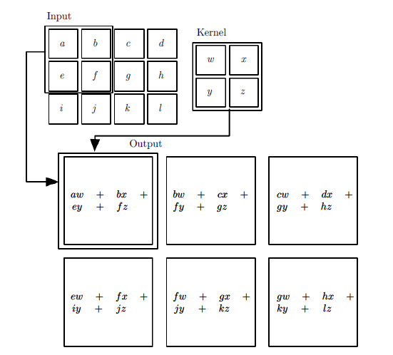

# CNN卷积神经网络
卷积神经网络(Convolutional Neural Network, CNN或ConvNet)是一种具有局部连接、权重共享等特性的深层前馈神经网络。卷积神经网络最早主要用来处理图像信息，在用全连接前馈网络来处理图像的时候，会存在以下两个问题：
（1）参数太多：全连接前馈网络随着隐藏层神经元数量的增多，参数的规模也会急剧增加．这会导致整个神经网络的训练效率非常低，也很容易出现过拟合．
（2）局部不变形特征：自然图像中的物体都具有局部不变性特征，比如尺度缩放、平移、旋转等操作不影响其语义信息．而全连接前馈网络很难提取这些局部不变性特征，一般需要进行数据增强来提高性能．卷积神经网络主要使用在图像和视频分析的各种任务（比如图像分类、人脸识别、物体识别、图像分割等）上，其准确率一般也远远超出了其他的神经网络模型.
卷积神经网络是受生物学上感受野机制的启发而提出来的。一个神经元的感受野是指视网膜上的特定区域，只有这个区域内的刺激才能够激活神经元。目前的卷积神经网络一般是卷积层、池化层和全连接层交叉堆叠而成的前馈神经网络。卷积层+池化层的组合可以在隐藏层出现多次，在若干卷积层+池化层后面是全连接层，即DNN层。

## CNN前向传播算法
卷积神经网络对比全连接神经网络，其保留了图像像素的空间排列信息。卷积操作将一个全连接层稀疏连接和共享参数。如图展示了全连接层到卷积层的转换过程。

在卷积神经网络的前向传播过程中，不同类型的网络层其前向传播方式不同。下面分别说明卷积层、池化层的前向传播过程。

### （1）卷积层的前向传播计算
卷积层的前向传播公式为
$$
\boldsymbol{a}_{ij}^l 
= \sigma(\boldsymbol{z}^l_{ij})
=\sigma(\sum_{a}\sum_{b} \boldsymbol{W}_{a,b}^l \boldsymbol{a}_{i+a,j+b}^{l-1}+\boldsymbol{b}^l)    
$$
其中$\boldsymbol{W}_{ab}^l$为卷积核的权重参数，$\boldsymbol{b}^l$为偏置参数，$\sigma(\cdot)$为卷积层节点的激活函数，$\boldsymbol{z}^l_{ij}$为卷积层节点的输入值，$\boldsymbol{a}^l_{ij}$为卷积层接点的激活值。卷积层前向传播计算的矩阵表达形式为：
$$
\boldsymbol{a}^l = \sigma(\boldsymbol{z}^l)
=\sigma(\boldsymbol{W}^l \ast \boldsymbol{a}^{l-1}+\boldsymbol{b}^l)
$$
其中$\ast$表示卷积运算。

> 在卷积神经网络中的卷积运算，并不是数学上"卷积"运算，而是"互相关"运算。由于卷积核的参数是通过模型数据训练得到，所以在卷积神经网络中这两者并没有明显的差异。后面涉及到的卷积都是按照以上公式定义的。

举例说明卷积的计算过程，图中输入是一个二维的`3×4`的矩阵，卷积核是一个`2×2`的矩阵，这里假设卷积是一次移动一个像素。在输出矩阵中第`00`位置的元素计算值为`aw+bx+ey+fz`。最终得到一个`2×3`的矩阵。这里有一个[动态图的链接](https://cs231n.github.io/assets/conv-demo/index.html)说明卷积的计算过程。

[CNN卷积层的计算细节](https://zhuanlan.zhihu.com/p/29119239)

### （2）池化层的前向传播计算
池化层是卷积神经网络中常用的组件之一，它最早见于`LeNet`网络中，被称之为`Subsample`.自从`AlexNet`之后采用`Pooling`命名。池化层是模仿人的视觉系统对数据进行降维，用更加高层次的特征表示图像。
池化层的作用：
1.  降低信息冗余；
2.  提升模型的尺度和旋转不变性；
3.  防止过拟合

最常见的两种池化操作为==最大值池化==和==平均值池化==等。
最大值池化的前向传播计算公式为
$$
\boldsymbol{a}_{ij}^l 
= \sigma(\boldsymbol{z}^l_{ij})
=\operatorname{max}(\{\boldsymbol{a}_{i+a,j+b}^{l-1}|a,b \})
$$
平均值池化的前向传播计算公式为
$$
\boldsymbol{a}_{ij}^l 
= \sigma(\boldsymbol{z}^l_{ij})
=\frac{1}{k \times k}\sum_{a}^{k1}\sum_{b}^{k2}\boldsymbol{a}_{i+a,j+b}
$$
其中$k$为池化区域的大小。从上面的公式可以看到池化层是没有激活函数的，也没有权重参数和偏置采纳数。下图中给出最大值池化层的例子

## 误差反向传播算法
在卷积神经网络的误差反向传播过程中，不同类型的网络层结构其反向传播方式也有所不同，首先回顾下DNN神经网络的反向传播公式.
关于第$i$层的第$j$个神经元错误量$\delta_j^l$定义为
$$
\delta_j^l =\frac{\partial C}{\partial \boldsymbol{z}^l_j} 
$$
最后一层关于错误量$\delta^L$的公式为
$$
\begin{aligned}
    \delta^L_j 
    &= \frac{\partial C}{\partial \boldsymbol{z}^L_j}\\
    &=\frac{\partial C}{\partial \boldsymbol{a}^L_j} \frac{\partial \boldsymbol{a}^L_j }{\partial \boldsymbol{z}^L_j}\\
    &=\frac{\partial C}{\partial \boldsymbol{a}^L_j} \sigma^\prime (\boldsymbol{z}^L_j)
    \tag{BP-1}
\end{aligned}
$$

已知第$l+1$层的$\delta^{l+1}_j$，求第$l$层的错误量$\delta^{l+1}_j$公式
$$
\begin{aligned}
    \delta^l_j 
        &=\frac{\partial C}{\partial \boldsymbol{z}_j^l}\\
        &=\sum_k \frac{\partial C}{\partial \boldsymbol{z}_k^{l+1}} \frac{\partial \boldsymbol{z}_k^{l+1}}{\partial \boldsymbol{a}^l_j} \frac{\boldsymbol{a}^l_j}{\boldsymbol{z}^l_j}\\
        &=\sum_k \delta_k^{l+1} \boldsymbol{W}_{kj}^{l+1} \sigma^\prime (\boldsymbol{z}_j^l)  \tag{BP-2}
\end{aligned}
$$

前馈神经网络中代价函数对于权重的改变速率公式
$$
\begin{aligned}
    \frac{\partial C}{\partial \boldsymbol{W}_{jk}^{l}}
        &=\frac{\partial C}{\partial \boldsymbol{z}_k^{l}} \frac{\partial \boldsymbol{z}_k^{l}}{\partial \boldsymbol{W}_{jk}^{l}}\\
        &=\delta^l_j \boldsymbol{a}^{l-1}_k \tag{BP-3}
\end{aligned}
$$
前馈神经网络中代价函数对于偏置的改变速率公式
$$
\begin{aligned}
    \frac{\partial C}{\partial \boldsymbol{b}_{j}^{l}}
        &=\frac{\partial C}{\partial \boldsymbol{z}_j^{l}} \frac{\partial \boldsymbol{z}_j^{l}}{\partial \boldsymbol{b}_{j}^{l}}\\
        &=\delta^l_j \cdot 1 \\
        &=\delta^l_j \tag{BP-4}
\end{aligned}
$$

### (1)已知池化层误差$\delta^l$,求$l-1$层误差$\delta^{l-1}$
根据前面的相关推导，易知
$$
\begin{aligned}
    \delta^{l-1}_{ij} 
        &=\frac{\partial C}{\partial \boldsymbol{z}_{ij}^{l-1}}\\
        &=\sum_{m}\sum_{n} \frac{\partial C}{\partial \boldsymbol{z}_{mm}^{l}} 
        \frac{\partial \boldsymbol{z}_{mm}^{l}}{\partial \boldsymbol{a}_{ij}^{l-1}} 
        \frac{\partial \boldsymbol{a}_{ij}^{l-1}}{\partial \boldsymbol{z}_{ij}^{l-1}} \\
        &=\sum_{m}\sum_{n} \delta_{mn}^l \frac{\partial \boldsymbol{z}_{mm}^{l}}{\partial \boldsymbol{a}_{ij}^{l-1}}  \sigma^\prime(\boldsymbol{z}_{ij}^{l-1})
\end{aligned}
$$
其中$\frac{\partial C}{\partial \boldsymbol{z}_{mn}^{l}}=\delta_{mn}^l$，$\frac{\partial \boldsymbol{a}_{ij}^{l-1}}{\partial \boldsymbol{z}_{ij}^{l-1}}=\sigma^\prime(\boldsymbol{z}_{ij}^{l-1})$,现在只剩下求$\frac{\partial \boldsymbol{z}_{mn}^{l}}{\partial \boldsymbol{a}_{ij}^{l-1}}$。

假设现在池化大小为`2×2`的区域，若使用平均值池化有
$$
\boldsymbol{z}_{mn}^l=\frac{1}{4}(\boldsymbol{a}_{2m,2n}^{l-1}+\boldsymbol{a}_{2m,2n+1}^{l-1}+\boldsymbol{a}_{2m+1,2n}^{l-1}+\boldsymbol{a}_{2m+1,2n+1}^{l-1})
$$
若使用最大值池化有
$$
\boldsymbol{z}_{mn}^l=\operatorname{max}(\boldsymbol{a}_{2m,2n}^{l-1}+\boldsymbol{a}_{2m,2n+1}^{l-1}+\boldsymbol{a}_{2m+1,2n}^{l-1}+\boldsymbol{a}_{2m+1,2n+1}^{l-1})
$$

可以看出，对于平均值池化有
$$
\frac{\partial \boldsymbol{z}^l_{mn}}{\partial\boldsymbol{a}_{ij}^{l-1}}=\frac{1}{k \times k}
$$
对于最大值池化有
$$
\frac{\partial \boldsymbol{z}^l_{mn}}{\partial\boldsymbol{a}_{ij}^{l-1}}=
\left\{
\begin{aligned}
1 \qquad  \boldsymbol{a}_{mn}^{l-1} =\operatorname{max}\\
0 \qquad  \boldsymbol{a}_{mn}^{l-1} \ne \operatorname{max} 
\end{aligned}
\right.
$$

根据上面的公式，可以对池化层的误差矩阵$\delta^l$进行`上采样`操作.
假设现有池化大小为`2×2`的区域，误差矩阵如下
$$
\delta^l =
 \left[
 \begin{matrix}
   2 & 4 \\
   6 & 8 \\
  \end{matrix}
  \right]
$$
#### ① 平均值池化后的上采样过程
若是平均值池化，那么上采样后每个区域的值为池化层对应的值在乘以$\frac{1}{k\times k}$，得到
$$
\operatorname{upsample}(\delta^l) =
 \left[
 \begin{matrix}
   0.5 & 0.5 & 1 & 1\\
   0.5 & 0.5 & 1 & 1\\
   1.5 & 1.5 & 2 & 2\\
   1.5 & 1.5 & 2 & 2\\
  \end{matrix}
  \right]
$$
这个过程可以用以下公式表示
$$
\operatorname{upsample}(\delta^l) = \delta^l \otimes 1_{k \times k} \odot\frac{1}{k \times k}
$$
其中$\otimes$表示克罗内克积，$\odot$表示按元素相乘。

#### ② 最大值池化后的上采样过程
若为最大值，上采样时先将误差矩阵$\delta^l$还原，再将每个区域的误差移动到前向传播时最大值所在的位置上。比如记录的位置分别为`(0,0),(1,3),(3,1),(2,2)`则上采样$\operatorname{upsample}(\delta^l)$的过程为
$$
\delta^l =
 \left[
 \begin{matrix}
   2 & 4 \\
   6 & 8 \\
  \end{matrix}
  \right]
\Longrightarrow
 \left[
 \begin{matrix}
   0 & 0 & 0 & 0\\
   0 & 2 & 4 & 0\\
   0 & 6 & 8 & 0\\
   0 & 0 & 0 & 0\\
  \end{matrix}
  \right]
\Longrightarrow
   \left[
 \begin{matrix}
   2 & 0 & 0 & 0\\
   0 & 0 & 0 & 4\\
   0 & 0 & 8 & 0\\
   0 & 6 & 0 & 0\\
  \end{matrix}
  \right]
$$

最后，在已知池化层误差$\delta^l$,求$l-1$层误差$\delta^{l-1}$为
$$
\begin{aligned}
        \delta^{l-1} 
        &=\frac{\partial C}{\partial \boldsymbol{z}^{l-1}}\\
        &=\frac{\partial C}{\partial \boldsymbol{z}^{l}} \frac{\partial \boldsymbol{z}^{l}}{\partial \boldsymbol{a}^{l-1}} \frac{\partial \boldsymbol{a}^{l-1}}{\partial \boldsymbol{z}^{l-1}}\\
        &=\operatorname{upsample}(\delta^l) \odot \sigma^\prime(\boldsymbol{z}^{l-1})
        \tag{CNN-1}
\end{aligned}
$$

### (2)已知卷积层误差$\delta^l$,求$l-1$层误差$\delta^{l-1}$
根据前面的公式`BP-2`有
$$
\delta^{l-1}_j 
=\sum_k \delta_k^{l} \boldsymbol{W}_{kj}^{l} \sigma^\prime (\boldsymbol{z}_j^{l-1}) 
$$
第$l-1$层中的第$j$个结点误差$\delta^{l-1}_j$与前面的第$l$层中与其相连的神经元$k$的误差$\delta^l_k$以及两者之间的权重有关。由于卷积操作是局部感知和权重共享，因此误差传播过程和DNN是有所差异的。
首先给出一个具体的示例说明计算推导的过程以便于理解，之后再给出详尽的证明。现假设输入的矩阵大小为`3×3`,卷积核的大小为`2×2`，输出的矩阵大小为`2×2`

将上面的卷积过程展开，并用神经网络的形式描述——权重上的标注是其在卷积核中的位置,相同的权重用同一种颜色表示.

根据上图的连接情况可以如下的计算过程

$$
\begin{aligned}
    \delta^{l-1}_{00}&=(\delta^{l}_{00}\boldsymbol{W}^{l}_{00})\sigma^{\prime}(\boldsymbol{z}^{l-1}_{00})\\
    \delta^{l-1}_{01}&=(\delta^{l}_{00}\boldsymbol{W}^{l}_{01}+\delta^{l}_{01}\boldsymbol{W}^{l}_{00})\sigma^{\prime}(\boldsymbol{z}^{l-1}_{01})\\
    \delta^{l-1}_{02}&=(\delta^{l}_{01}\boldsymbol{W}^{l}_{01})\sigma^{\prime}(\boldsymbol{z}^{l-1}_{02})\\
    \delta^{l-1}_{10}&=(\delta^{l}_{00}\boldsymbol{W}^{l}_{10}+\delta^{l}_{10}\boldsymbol{W}^{l}_{00})\sigma^{\prime}(\boldsymbol{z}^{l-1}_{10})\\
    \delta^{l-1}_{11}&=(\delta^{l}_{00}\boldsymbol{W}^{l}_{11}+\delta^{l}_{01}\boldsymbol{W}^{l}_{10}+\delta^{l}_{10}\boldsymbol{W}^{l}_{01}+\delta^{l}_{11}\boldsymbol{W}^{l}_{00})\sigma^{\prime}(\boldsymbol{z}^{l-1}_{11})\\
    \delta^{l-1}_{12}&=(\delta^{l}_{01}\boldsymbol{W}^{l}_{11}+\delta^{l}_{11}\boldsymbol{W}^{l}_{01})\sigma^{\prime}(\boldsymbol{z}^{l-1}_{12})\\
    \delta^{l-1}_{20}&=(\delta^{l}_{10}\boldsymbol{W}^{l}_{10})\sigma^{\prime}(\boldsymbol{z}^{l-1}_{20})\\
    \delta^{l-1}_{21}&=(\delta^{l}_{10}\boldsymbol{W}^{l}_{11}+\delta^{l}_{11}\boldsymbol{W}^{l}_{10})\sigma^{\prime}(\boldsymbol{z}^{l-1}_{21})\\
    \delta^{l-1}_{22}&=(\delta^{l}_{11}\boldsymbol{W}^{l}_{11})\sigma^{\prime}(\boldsymbol{z}^{l-1}_{22})
\end{aligned}
$$
可以将上面的9个式子用矩阵形式统一表示
$$
\left[
 \begin{matrix}
   0 & 0 & 0 & 0\\
   0 & \delta_{00}^l & \delta_{01}^l & 0\\
   0 & \delta_{10}^l & \delta_{11}^l & 0\\
   0 & 0 & 0 & 0\\
  \end{matrix} 
\right]
  \ast
  \left[
  \begin{matrix}
\boldsymbol{W}_{00}^l &\boldsymbol{W}_{01}^l \\
\boldsymbol{W}_{10}^l & \boldsymbol{W}_{11}^l 
  \end{matrix} 
  \right]
  \odot
\left[
  \begin{matrix}
\sigma^{\prime}(\boldsymbol{z_{00}^{l}}) &\sigma^{\prime}(\boldsymbol{z_{01}^{l}}) &\sigma^{\prime}(\boldsymbol{z_{02}^{l}})   \\
\sigma^{\prime}(\boldsymbol{z_{10}^{l}}) &\sigma^{\prime}(\boldsymbol{z_{11}^{l}}) &\sigma^{\prime}(\boldsymbol{z_{12}^{l}})   \\
\sigma^{\prime}(\boldsymbol{z_{20}^{l}}) &\sigma^{\prime}(\boldsymbol{z_{21}^{l}}) &\sigma^{\prime}(\boldsymbol{z_{22}^{l}})   
  \end{matrix} 
  \right] =
  \left[
    \begin{matrix}
\sigma_{00}^{l-1} &\sigma_{01}^{l-1} &\sigma_{02}^{l-1}   \\ 
\sigma_{10}^{l-1} &\sigma_{11}^{l-1} &\sigma_{12}^{l-1}   \\ 
\sigma_{20}^{l-1} &\sigma_{21}^{l-1} &\sigma_{22}^{l-1}   \\ 
  \end{matrix} 
  \right]
$$
先在误差矩阵$\delta^l$周围填上一圈0，然后将卷积核$\boldsymbol{W}^l$旋转180,两者进行卷积，再与矩阵$\delta^{\prime}(\boldsymbol{z}^{l-1})$按元素相乘，就得到了前一层的误差矩阵$\delta^{l-1}$，用数学公式表示为
$$
\delta^{l-1}=\delta^l \ast \operatorname{rot180}(\boldsymbol{W}^l)\odot\sigma^{\prime}(\boldsymbol{z}^{l-1})
\tag{CNN-2}
$$
上面的推导是以一个简单的示例进行拼凑的"证明"，下面给出严格完整的数学形式.
$$
\begin{aligned}
\delta_{i, j}^{l-1} &=\frac{\partial C}{\partial \boldsymbol{z}_{i, j}^{l-1}} \\
&=\sum_{m} \sum_{n} \frac{\partial C}{\partial \boldsymbol{z}_{m, n}^{l}} \frac{\partial \boldsymbol{z}_{m, n}^{l}}{\partial \boldsymbol{z}_{i, j}^{l-1}} \\
&=\sum_{m} \sum_{n} \delta_{m, n}^{l} \frac{\partial \boldsymbol{z}_{m, n}^{l}}{\partial \boldsymbol{a}_{i, j}^{l-1}} \frac{\partial \boldsymbol{a}_{i, j}^{l-1}}{\partial \boldsymbol{z}_{i, j}^{l-1}} \\
&=\sum_{m} \sum_{n} \delta_{m, n}^{l} \frac{\partial\left(\sum_{a} \sum_{b} \boldsymbol{W}_{a, b}^{l} \boldsymbol{a}_{m+a, n+b}^{l-1}+b^{l+1}\right)}{\partial \boldsymbol{a}_{i, j}^{l-1}} \sigma^{\prime}\left(\boldsymbol{z}_{i, j}^{l-1}\right) \\
&\xlongequal[m+a=i]{n+b=j} \sum_{m} \sum_{n} \delta_{m, n}^{l} \boldsymbol{W}_{i-m, j-n}^{l} \sigma^{\prime}\left(\boldsymbol{z}_{i, j}^{l-1}\right)
\end{aligned}
$$
将上面的式子写成矩阵的就是公式`CNN-2`了。

在已知当前层的结点误差，那么第$l$层的卷积核节点的权重梯度公式为
$$
\begin{aligned}
\frac{\partial C}{\partial \boldsymbol{W}_{i, j}^{l}} &=\sum_{m} \sum_{n} \frac{\partial C}{\partial \boldsymbol{z}_{m, n}^{l}} \frac{\partial \boldsymbol{z}_{m, n}^{l}}{\partial \boldsymbol{W}_{i, j}^{l}} \\
&=\sum_{m} \sum_{n} \delta_{m, n}^{l} \frac{\partial\left(\sum_{a} \sum_{b} \boldsymbol{W}_{a, b}^{l} \boldsymbol{a}_{m+a, n+b}^{l-1}+\boldsymbol{b}^{l}\right)}{\partial \boldsymbol{W}_{i, j}^{l}} \\
& \xlongequal[a=i]{b=j} \sum_{m} \sum_{n} \delta_{m, n}^{l} \boldsymbol{a}_{m+i, n+j}^{l-1}
\tag{CNN-3}
\end{aligned}
$$
上面公式的矩阵形式为
$$
\frac{\partial C}{\partial \boldsymbol{W}^{l}} =
\delta^{l}\ast \boldsymbol{a}^{l-1}
\tag{CNN-3}
$$

同理，在已知当前层的结点误差，那么第$l$层的卷积核节点的偏置梯度公式为
$$
\begin{aligned}
\frac{\partial C}{\partial \boldsymbol{b}^{l}} &=\sum_{m} \sum_{n} \frac{\partial C}{\partial \boldsymbol{z}_{m, n}^{l}} \frac{\partial \boldsymbol{z}_{m, n}^{l}}{\partial \boldsymbol{b}^{l}} \\
&=\sum_{m} \sum_{n} \delta_{m, n}^{l}
\end{aligned}
$$
因为每一个卷积核只有一个共享的偏置参数，所以上面公式中$\boldsymbol{b}^{l} \in \mathbb{R}$,是一个实数。将上面公式的矩阵形式为
$$
\frac{\partial C}{\partial \boldsymbol{b}^{l}} = \delta^l \tag{CNN-4}
$$

综上，CNN反向传播过程中四个重要公式`CNN-1`,`CNN-2`,`CNN-3`,`CNN-4`总结如下

| 公式 | 元素形式 | 矩阵形式 |
| :-----:| :---- | :----: |
| CNN-1 |$\delta^{l-1}_{ij}=\sum_{m}\sum_{n} \delta_{mn}^l \frac{\partial \boldsymbol{z}_{mm}^{l}}{\partial \boldsymbol{a}_{ij}^{l-1}}  \sigma^\prime(\boldsymbol{z}_{ij}^{l-1})$  | $\delta^{l-1}=\operatorname{upsample}(\delta^l) \odot \sigma^\prime(\boldsymbol{z}^{l-1})$ |
| CNN-2 | $\delta_{i, j}^{l-1}= \sum_{m} \sum_{n} \delta_{m, n}^{l} \boldsymbol{W}_{i-m, j-n}^{l} \sigma^{\prime}\left(\boldsymbol{z}_{i, j}^{l-1}\right)$ | $\delta^{l-1}=\delta^l \ast \operatorname{rot180}(\boldsymbol{W}^l)\odot\sigma^{\prime}(\boldsymbol{z}^{l-1})$ |
| CNN-3 | $\frac{\partial C}{\partial \boldsymbol{W}^l_{jk}}=\sum_{m} \sum_{n} \delta_{m, n}^{l} \boldsymbol{a}_{m+i, n+j}^{l-1}$ | $\frac{\partial C}{\partial \boldsymbol{W}^{l}} =\delta^{l}\ast \boldsymbol{a}^{l-1}$|
| CNN-4 | $\frac{\partial C}{\partial \boldsymbol{b}^l_{j}}=\sum_{m} \sum_{n} \delta_{m, n}^{l}$ | $\frac{\partial C}{\partial \boldsymbol{b}^l}=\delta^l$ |

