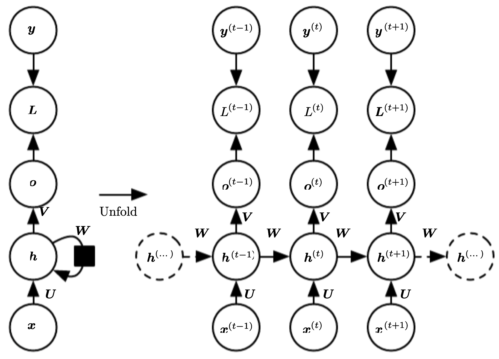

# RNN循环神经网络

在DNN和CNN模型中，训练样本的输入和输出是比较确定的，信息的传递是单向的，这种限制虽然使得网络更加容易学习，但在一定程度上也减弱了神经网络模型的能力。在很多现实任务中，网络的输出不仅和当前时刻的输入有关，也和其过去一段时间的输入相关，此外前馈神经网络的训练样本输入是连续的序列，且序列的长短不一，难以处理时序数据。比如视频、文本、语音等等，时序数据的长度一般是不固定的，而前馈神经网络要求输入和输出的维度都是固定的，不能任意改变。因此，当处理这一类和时序数据相关的问题时，就需要一种能力更强的模型。
循环神经网络(Recurrent Neural Network,RNN)是一类具有短期记忆能力的神经网络，在循环神经网络中，神经元不但可以接收其他神经元的信息，也可以接收自身的信息，形成具有环路的网络结构。

## RNN前向传播算法
RNN的训练样本是基于序列的，对于其中的任意序列索引号$t$，它对应的输入是样本序列中的$x^{(t)}$，模型在序列索引号$t$位置的隐藏状态$h^{(t)}$，则由$x^{(t)}$和在$t-1$位置的隐藏状态$h^{(t-1)}$共同决定。在任意索引号$t$，对应的模型预测输出为$o^{(t)}$，通过预测输出$o^{(t)}$和训练序列真实输出$y^{(t)}$，以及损失函数$L^{(t)}$。那么就可以使用DNN类似的方法训练模型。如下图所示

其中的相关符号表示含义为
| 记号                                                | 含义                                               |
| --------------------------------------------------- | -------------------------------------------------- |
| $x^{(t)}$                                                 | 代表序列索引号$t$时训练样本的输入。                                     |
| $h^{(t)}$                                               | 代表序列索引号$t$时的隐藏状态，$h^{(t)}$由$x^{(t)}$和$h^{(t-1)}$共同决定                               |
|$o^{(t)}$|代表序列索引号$t$时模型的输出，$o^{(t)}$只由当前的隐藏状态$h^{(t)}$决定|
|$y^{(t)}$|代表在序列索引号$t$时训练样本序列的真实输出|
|$L^{(t)}$|代表在序列索引号$t$时模型的损失函数|
$U,W,V$这三个矩阵是模型的线性关系参数，在整个RNN中是共享的，这点和DNN是很不同的，也正是由于共享，才体现除了RNN模型的"循环反馈"的思想。循环神经网络的的前向传播算法公式如下
$$
\begin{aligned}
z_{j}^{(t)}&=\sum_{i} U_{j i} x_{i}^{(t)}+\sum_{i} W_{j i} h_{i}^{(t-1)}+b_{j} \\
h_{j}^{(t)}&=\tanh \left(z_{j}^{(t)}\right) \\
o_{j}^{(t)}&=\sum_{i} V_{j i} h_{i}^{(t)}+c_{j} \\
\hat{y}_{j}^{(t)}&=\operatorname{softmax}\left(o_{j}^{(t)}\right)
\end{aligned}
$$
可以将上面的公式写成矩阵的形式为
$$
\begin{aligned}
z^{(t)}&=U x^{(t)}+W h^{(t-1)}+b \\
h^{(t)}&=\tanh \left(z^{(t)}\right) \\
o^{(t)}&=V h^{(t)}+c \\
\hat{y}^{(t)}&=\operatorname{softmax}\left(o^{(t)}\right)
\end{aligned}
$$
序列中每个时间节点的损失定义为：
$$
L^{(t)}(y^{(t)},\hat{y}^{(t)}) = -y^{(t)}\operatorname{log}\hat{y}^{(t)}
$$
循环神经网络中总损失定义为序列中每个时间节点的损失之和，即
$$
\begin{aligned}
   L
&=\sum_t L^{(t)}(y^{(t)},\hat{y}^{(t)})\\
&=-\sum_t y^{(t)}\operatorname{log}\hat{y}^{(t)}
\end{aligned}
$$

## 误差反向传播算法
RNN的误差反向传播算法称为BPTT(Back-Propagation Through Time, BPTT)算法.BPTT算法也主要应用了链式求导法则，但与DNN和CNN的误差反向传播算法略有不同，其还要计算来自隐含结点的梯度，即所有时间节点的梯度。在RNN中总共需要学习5类参数，分别为$\frac{\partial L}{\partial V},\frac{\partial L}{\partial W},\frac{\partial L}{\partial U},\frac{\partial L}{\partial b},\frac{\partial L}{\partial c}$.

### (1)求$\frac{\partial L}{\partial V}$
$$
\begin{aligned}
\frac{\partial L^{(t)}}{\partial V_{j i}} 
&=\frac{\partial L^{(t)}}{\partial o_{j}^{(t)}} \frac{\partial o_{j}^{(t)}}{\partial V_{j i}} \\
&=\frac{\partial\left(-\sum_{j} y_{j}^{(t)} \log \operatorname{softmax}\left(o_{j}^{(t)}\right)\right)}{\partial o_{j}^{(t)}} \frac{\partial o_{j}^{(t)}}{\partial V_{j i}} \\
&=\frac{\partial\left(-\sum_{j} y_{j}^{(t)} \log \left(e^{(t)} / \sum_{k} e^{(t)}\right)\right)}{\partial o_{j}^{(t)}} h_{i}^{(t)} \\
&=\frac{\partial\left(-\sum_{j} y_{j}^{(t)}\left(o_{j}^{(t)}-\log \sum_{k} e^{(t)}\right)\right)}{\partial o_{j}^{(t)}} h_{i}^{(t)} \\
&=\left(\hat{y}_{j}^{(t)}-y_{j}^{(t)}\right) h_{i}^{(t)} 
\end{aligned}
$$
矩阵的形式为
$$
\begin{aligned}
\frac{\partial L^{(t)}}{\partial V}
&=\left(\hat{y}^{(t)}-y^{(t)}\right)\left(h^{(t)}\right)^{\top}\\
&=\left(\hat{y}^{(t)}-y^{(t)}\right) \otimes h^{(t)}\\
\end{aligned}
$$
所以$\frac{\partial L}{\partial V}$ 的反向传播公式为
$$
\frac{\partial L}{\partial V} 
= \sum_t \frac{\partial L^{(t)}}{\partial V}
=\sum_t \left(\hat{y}^{(t)}-y^{(t)}\right)\left(h^{(t)}\right)^{\top}
$$
这个是最基本的$\operatorname{softmax}$损失函数的反向传播公式。

### (2)求$\frac{\partial L}{\partial c}$
$$
\frac{\partial L^{(t)}}{\partial c_j} =
\frac{\partial L^{(t)}}{\partial o^{(t)}_j}\frac{\partial o^{(t)}_j}{\partial c_j}
=\hat{y}^{(t)}_j-y^{(t)}_j
$$
矩阵的形式为
$$
\frac{\partial L^{(t)}}{\partial c} = \hat{y}^{(t)}-y^{(t)}
$$
所以$\frac{\partial L}{\partial c}$的反向传播公式为
$$
\frac{\partial L}{\partial c} =\sum_t \frac{\partial L^{(t)}}{\partial c}=\sum_t \left( \hat{y}^{(t)}-y^{(t)} \right)  
$$
### (3)求$\frac{\partial L}{\partial W}$
$$
\begin{aligned}
\frac{\partial L^{(t)}}{\partial W} &=\frac{\partial L^{(t)}}{\partial h^{(t)}} \frac{\partial h^{(t)}}{\partial W} \\
&=\frac{\partial L^{(t)}}{\partial h^{(t)}}\left(\frac{\partial h^{(t)}}{\partial W}+\frac{\partial h^{(t)}}{\partial h^{(t-1)}} \frac{\partial h^{(t-1)}}{\partial W}\right) \\
&=\frac{\partial L^{(t)}}{\partial h^{(t)}} \frac{\partial h^{(t)}}{\partial W}+\frac{\partial L^{(t)}}{\partial h^{(t)}} \frac{\partial h^{(t)}}{\partial h^{(t-1)}} \frac{\partial h^{(t-1)}}{\partial W}+\cdots \\
&+\frac{\partial L^{(t)}}{\partial h^{(t)}} \frac{\partial h^{(t)}}{\partial h^{(t-1)}} \frac{\partial h^{(t-1)}}{\partial h^{(t-2)}} \cdots \frac{\partial h^{(0)}}{\partial W} \\
&=\sum_{k=0}^{t} \frac{\partial L^{(t)}}{\partial h^{(t)}} \frac{\partial h^{(t)}}{\partial h^{(k)}} \frac{\partial h^{(k)}}{\partial W}
\end{aligned}
$$
从上面的公式可以看出，由于循环神经网络的循环体共享参数$W$，因此某一个时刻损失函数关于$W$的梯度等于该时刻之前所有的$W$的梯度之和。

令误差$\delta^{(t)}_k=\frac{\partial L^{(t)}}{\partial h^{(k)}}$则
$$
\frac{\partial L^{(t)}}{\partial W}=\delta_{t}^{(t)} \frac{\partial h^{(t)}}{\partial W}+\delta_{t-1}^{(t)} \frac{\partial h^{(t-1)}}{\partial W}+\cdots+\delta_{0}^{(t)} \frac{\partial h^{(0)}}{\partial W}=\sum_{k=0}^{t} \delta_{k}^{(t)} \frac{\partial h^{(k)}}{\partial W}
$$
而
$$
\frac{\partial h^{(k)}}{\partial W}=\frac{\partial h_{j}^{(k)}}{\partial W}=\frac{\partial h_{j}^{(k)}}{\partial o_{j}^{(k)}} \frac{\partial o_{j}^{(k)}}{\partial W_{j i}}=\left(1-\left(h_{j}^{(k)}\right)^{2}\right) h_{i}^{(k-1)}=\left(1-h^{(k)} \odot h^{(k)}\right)\left(h^{(k-1)}\right)^{\top}
$$

因此，下面推导误差的反向传播计算公式。
当$k=t$时，有
$$
\delta_{k, i}^{(t)}=\frac{\partial L^{(t)}}{\partial h_{i}^{(t)}}=\sum_{k} \frac{\partial L^{(t)}}{\partial o_{k}^{(t)}} \frac{\partial o_{k}^{(t)}}{\partial h_{i}^{(t)}}=\sum_{k}\left(\hat{y}_{k}^{(t)}-y_{k}^{(t)}\right) V_{k i}=V^{\top}\left(\hat{y}^{(t)}-y^{(t)}\right)
$$
所以有
$$
\delta_{t}^{(t)}=\frac{\partial L^{(t)}}{\partial h^{(t)}}=\frac{\partial L^{(t)}}{\partial o^{(t)}} \frac{\partial o^{(t)}}{\partial h^{(t)}}=V^{\top}\left(\hat{y}^{(t)}-y^{(t)}\right)
$$
接下来，当已知$\delta_k^{(t)}$时，求$\delta^{(t)}_{k-1}$。因为
$$
\begin{aligned}
\delta_{k-1, i}^{(t)} &=\frac{\partial L^{(t)}}{\partial h_{i}^{(k-1)}} \\
&=\sum_{j} \frac{\partial L^{(t)}}{\partial h_{j}^{(k)}} \frac{\partial h_{j}^{(k)}}{\partial h_{i}^{(k-1)}} \\
&=\sum_{j} \delta_{k, j}^{(t)} \frac{\partial h_{j}^{(k)}}{\partial z_{j}^{(k)}} \frac{\partial z_{j}^{(k)}}{\partial h_{i}^{(k-1)}} \\
&=\sum_{j} \delta_{k, j}^{(t)}\left(1-\left(h_{j}^{(k)}\right)^{2}\right) W_{j i} \\
&=W^{\top} \delta_{k}^{(t)} \odot\left(1-h^{(k)} \odot h^{(k)}\right)
\end{aligned}
$$

所以
$$
\delta_{k-1}^{(t)}=\frac{\partial L^{(t)}}{\partial h^{(k-1)}}=\frac{\partial L^{(t)}}{\partial h^{(k)}} \frac{\partial h^{(k)}}{\partial h^{(k-1)}}=W^{\top} \delta_{k}^{(t)} \odot\left(1-h^{(k)} \odot h^{(k)}\right)
$$

将上面的式子带入即可得到
$$
\frac{\partial L^{(t)}}{\partial W}=\sum_{k=0}^{t} \frac{\partial L^{(t)}}{\partial h^{(k)}} \frac{\partial h^{(k)}}{\partial W}=\sum_{k=0}^{t} \delta_{k}^{(t)}\left(1-h^{(k)} \odot h^{(k)}\right)\left(h^{(k-1)}\right)^{\top}
$$
最终，$\frac{\partial L}{\partial W}$的反向传播公式为
$$
\frac{\partial L}{\partial W}=\sum_{t} \frac{\partial L^{(t)}}{\partial W}=\sum_{t} \sum_{k=0}^{t} \delta_{k}^{(t)}\left(1-h^{(k)} \odot h^{(k)}\right)\left(h^{(k-1)}\right)^{\top}
$$

### (4)求$\frac{\partial L}{\partial U}$
同理，由于循环神经网络的循环体共享$U$参数，因此某一时刻损失函数关于$U$的梯度等于该时刻之前所有的$U$的梯度之和。
$$
\frac{\partial L^{(t)}}{\partial U}=\sum_{k=0}^{t} \frac{\partial L^{(t)}}{\partial h^{(k)}} \frac{\partial h^{(k)}}{\partial U}=\sum_{k=0}^{t} \delta_{k}^{(t)}\left(1-h^{(k)} \odot h^{(k)}\right)\left(x^{(k)}\right)^{\top}
$$
所以$\frac{\partial L}{\partial U}$的反向传播计算公式为
$$
\frac{\partial L}{\partial U}=\sum_{t} \frac{\partial L^{(t)}}{\partial U}=\sum_{t} \sum_{k=0}^{t} \delta_{k}^{(t)}\left(1-h^{(k)} \odot h^{(k)}\right)\left(x^{(k)}\right)^{\top}
$$

### (5)求$\frac{\partial L}{\partial b}$
对于$\frac{\partial L}{\partial b}$，同理可以得到
$$
\begin{aligned}
\frac{\partial L^{(t)}}{\partial b_{j}} &=\sum_{k=0}^{t} \frac{\partial L^{(t)}}{\partial h_{j}^{(k)}} \frac{\partial h_{j}^{(k)}}{\partial b_{j}} \\
&=\sum_{k=0}^{t} \delta_{k, j}^{(t)}\left(1-\left(h_{j}^{(k)}\right)^{2}\right)
\end{aligned}
$$
即
$$
\frac{\partial L}{\partial b}=\sum_{t} \delta_{k}^{(t)}\left(1-h^{(k)} \odot h^{(k)}\right)
$$

所以$\frac{\partial L}{\partial b}$的反向传播计算公式为
$$
\frac{\partial L}{\partial b}=\sum_{t} \sum_{k=0}^{t} \delta_{k}^{(t)}\left(1-h^{(k)} \odot h^{(k)}\right)
$$

## RNN存在的问题
从上面的推导可以到看到，每次误差反向传播都会乘以$W^{\top} \odot\left(1-h^{(k)} \odot h^{(k)}\right)$,由于多个$W$矩阵连续相乘，RNN很容易出现梯度爆炸问题，或梯度消失问题。在RNN中，由于多个$W$矩阵连续相乘，当深层的梯度消失时，深层的输入不再对输出产生影响，导致RNN无法学习到远距离的信息，即远距离的信息不会影响当前的输出，这被称为循环神经网络的长程依赖问题（Long-Term Dependencies Problem）.

解决长期依赖问题的有效方法就是改变循环神经网络的循环体结构，以便某一个时刻的误差能够反向传播足够远的距离，从而让远距离的信息能够决策该时刻的输出。如长短期记忆网络（Long Short-Term Memory Network,LSTM）和门控循环单元网络（Gated Recurrent Unit, GRU）等。