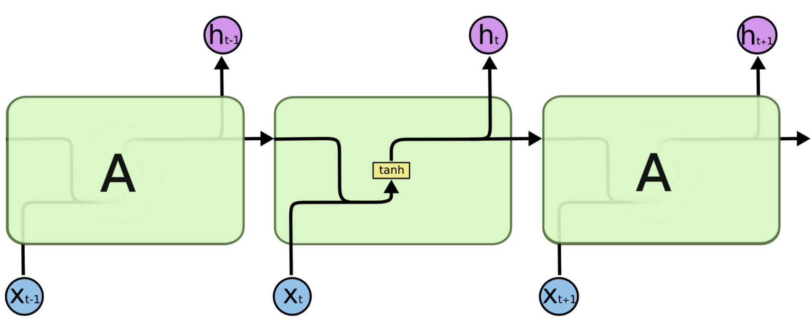
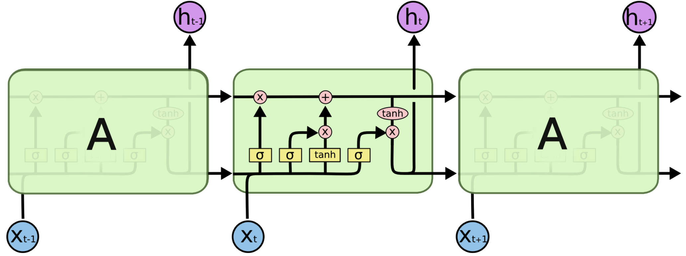
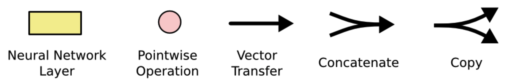
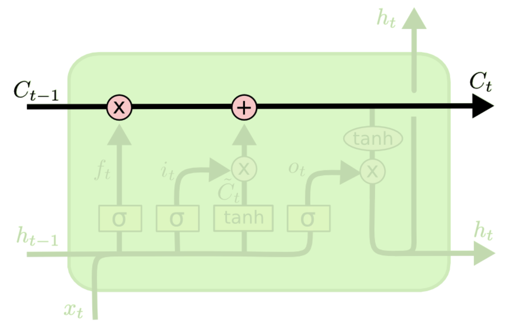
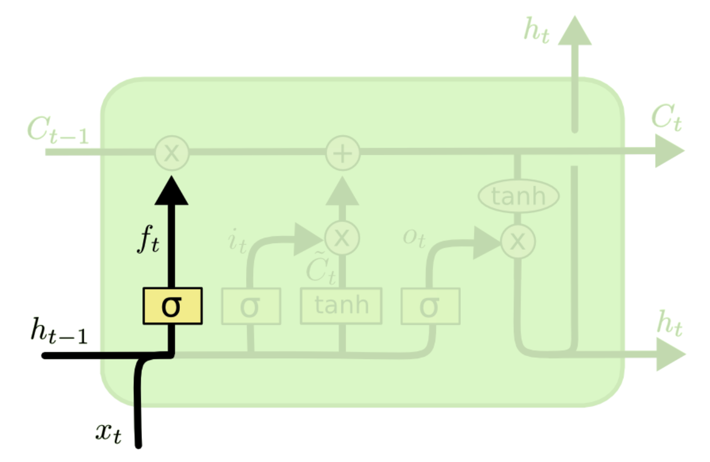
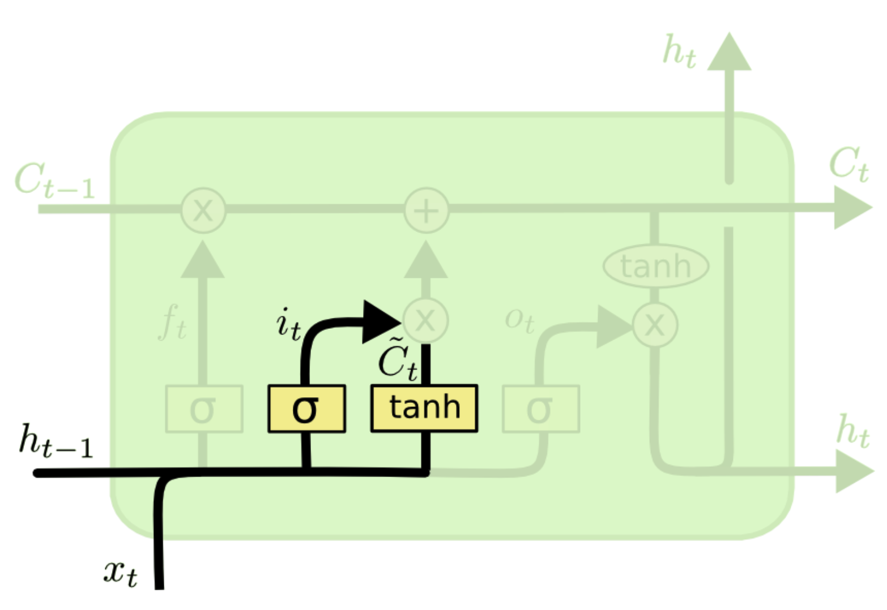
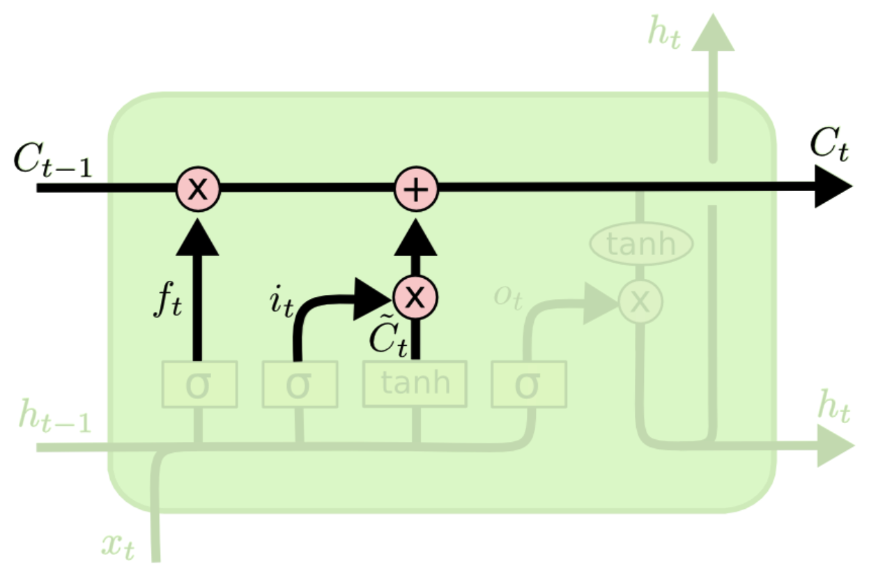
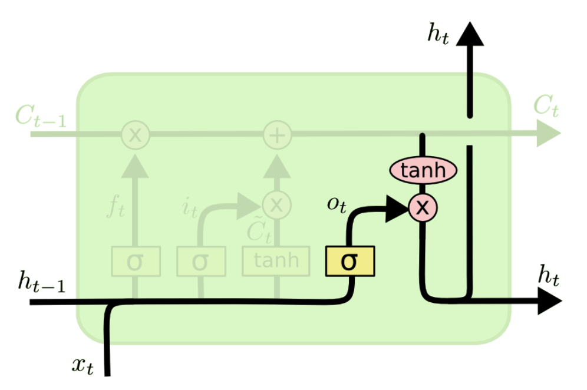
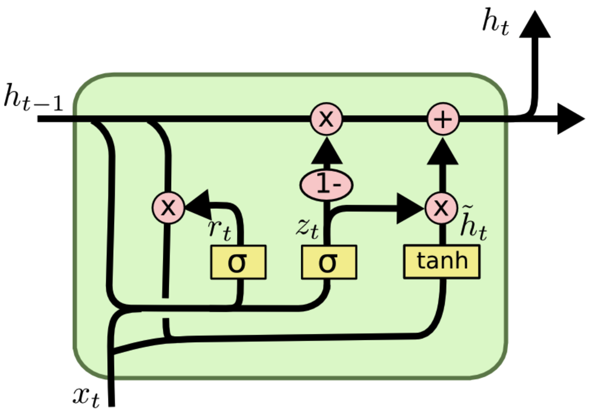

# 基于门控的循环神经网络

原始的RNN传播过程如下

如果我们略去每层都有的 $o^{(t)},y^{(t)},L^{(t)}$ ，则RNN的模型可以简化成如下图的形式：

图中可以很清晰看出在隐藏状态$ℎ^{(𝑡)}$由$𝑥^{(𝑡)}$和$ℎ^{(𝑡−1)}$得到。得到$ℎ^{(𝑡)}$后一方面用于当前层的模型损失计算，另一方面用于计算下一层的$ℎ^{(𝑡+1)}$。

为了改善循环神经网络RNN的长程依赖问题，一种很好地解决方案就是在RNN的基础上引入`门控机制`来控制信息的累积速度，包括有选择地加入新的信息，并有选择的遗忘之前的累积的信息，这一类网络称为`基于门控的循环神经网络`(Gated RNN)，常见的有两种类型：长短期记忆网络和门控循环网络。

## 长短期记忆网络
长短期记忆网络(Long Short-Term Memory Network,LSTM)是循环神经网络的一个变体，可以有效的解决简单神经网络的梯度爆炸或消失问题。

可以看到LSTM的结构要比RNN的复杂的多,在标准的RNN中，每个模块只有一个非常简单的结构，例如一个`tanh`层。但在LSTM模块中有多个交互的层。

首先介绍图中各个结构所表示的含义：

（1）黄色的矩阵就是学习到的神经网络层。
（2）粉色的圆圈代表按位`pointwise`操作，诸如向量的和等。
（3）实体黑线传输着一整个向量，从一个节点的输出到其他节点的输入。
（4）分开的线表示内容被复制，然后分发到不同的位置。
（5）合在一起的线，表示向量的拼接。

### LSTM结构剖析
LSTM 的关键就是`细胞状态`，从下图中可以看出，在每个序列索引位置t时刻向前传播的除了和RNN一样的隐藏状态$ℎ^{(𝑡)}$，还多了另一个隐藏状态，如图中最上面的长横线。这个隐藏状态我们一般称为细胞状态(Cell State)，记为$𝐶^{(𝑡)}$。如下图所示：

除了细胞状态，LSTM图中还有了很多"奇怪"的结构，这些结构一般称之为`门控结构(Gate)`。LSTM在在每个序列索引位置t的门一般包括遗忘门，输入门和输出门三种。下面我们就来研究上图中LSTM的遗忘门，输入门和输出门以及细胞状态。

#### （1）LSTM之遗忘门
遗忘门（forget gate）顾名思义，是控制是否遗忘的，在LSTM中即以一定的概率控制是否遗忘上一层的隐藏细胞状态。遗忘门子结构如下图所示：

图中输入的有上一序列的隐藏状态$h^{(t−1)}$ 和本序列数据$x^{(t)}$,通过一个激活函数，一般是`sigmoid`，得到遗忘门的输出$f^{(t)}$。由于`sigmoid`的输出$f^{(t)}$在[0,1]之间，因此这里的输出$f^{(t)}$代表了遗忘上一层隐藏细胞状态的概率。用数学表达式即为：
$$
f^{(t)}=\sigma\left(W_{f} \cdot\left[h^{(t-1)}, x^{(t)}\right]+b_{f}\right)
$$

#### （2）LSTM之输入门
输入门（input gate）负责处理当前序列位置的输入，它的子结构如下图：

从图中可以看到输入门由两部分组成，第一部分使用了`sigmoid`激活函数，输出为$i^{(t)}$,第二部分使用了`tanh`激活函数，输出为$\tilde{C}^{(t)}$, 两者的结果后面会相乘再去更新细胞状态。用数学表达式即为：
$$
\begin{aligned}
i^{(t)} &=\sigma\left(W_{i} \cdot\left[h^{(t-1)}, x^{(t)}\right]+b_{i}\right) \\
\tilde{C}^{(t)} &=\tanh \left(W_{C} \cdot\left[h^{(t-1)}, x^{(t)}\right]+b_{C}\right)
\end{aligned}
$$

#### （3）LSTM之细胞状态更新
前面的遗忘门和输入门的结果都会作用于细胞状态$𝐶^{(𝑡)}$。我们来看看从细胞状态$𝐶^{(𝑡−1)}$ 如何得到$𝐶^{(𝑡)}$。如下图所示：

细胞状态$𝐶^{(𝑡)}$由两部分组成，第一部分是$𝐶^{(𝑡−1)}$和遗忘门输出$𝑓^{(𝑡)}$的乘积，第二部分是输入门的$i^{(𝑡)}$和$\tilde{C}^{(t)}$的乘积，即：
$$
C^{(t)}=f^{(t)} \odot C^{(t-1)}+i^{(t)} \odot \tilde{C}^{(t)}
$$
其中$\odot$为Hadamard积。

#### （4）LSTM之输出门
有了新的隐藏细胞状态$𝐶^{(𝑡)}$，我们就可以来看输出门了，子结构如下：

从图中可以看出，隐藏状态$ℎ^{(𝑡)}$的更新由两部分组成，第一部分是$𝑜^{(𝑡)}$, 它由上一序列的隐藏状态$ℎ^{(𝑡−1)}$和本序列数据$𝑥^{(𝑡)}$以及激活函数`sigmoid`得到，第二部分由隐藏状态$𝐶^{(𝑡)}$和`tanh`激活函数组成, 即：
$$
\begin{array}{l}
o^{(t)}=\sigma\left(W_{o}\left[h^{(t-1)}, x^{(t)}\right]+b_{o}\right) \\
h^{(t)}=o^{(t)}  \odot \operatorname{tanh}\left(C^{(t)}\right)
\end{array}
$$

通过上面的分析可以知道LSTM网络引入门控机制(Gating Mechanism)来控制信息传递的路径，共有三个"门"结构，分别为遗忘门$f^{(t)}$、输入门$i^{(t)}$和输出门$，o^{(t)}$这三个门的作用为

1. 遗忘门$f^{(t)}$控制上一个时刻的内部状态$C^{(t-1)}$需要遗忘多少信息。
2. 输入门$i^{(t)}$控制当前时刻的候选状态$\tilde{C}^{(t)}$有多少信息需要保存。
3. 输出门$o^{(t)}$控制当前时刻的内部状态$C^{(t)}$有多少信息需要输出给外部状态$h^{(t)}$

LSTM网络中的"门"是一种"软"门，取值在(0,1)之间，表示以一定的比列允许信息通过。

上面介绍的是最典型的一种LSTM,当然，有些LSTM的结构和上面的LSTM图稍有不同，但是原理是相似的。关于LSTM反向传播的公式推导可以看[链接](https://www.zhuanzhi.ai/document/bbc52d1f0b92389dc9b6b4ed7e161577)

## 门控循环单元网络
门控循环单元(Gated Recurrent Unit,GRU)网络是一种比LSTM网络更加简单的循环神经网络，如图所示理解方式和LSTM也类似。

用数学表达式即为：
$$
\begin{aligned}
z^{(t)} &=\sigma\left(W_{z} \cdot\left[h^{(t-1)}, x^{(t)}\right]\right) \\
r^{(t)} &=\sigma\left(W_{r} \cdot\left[h^{(t-1)}, x^{(t)}\right]\right) \\
\tilde{h}^{(t)} &=\tanh \left(W \cdot\left[r^{(t)} * h^{(t-1)}, x^{(t)}\right]\right) \\
h^{(t)} &=\left(1-z^{(t)}\right) * h^{(t-1)}+z^{(t)} * \tilde{h}^{(t)}
\end{aligned}
$$
由于GRU参数更少，所以GRU训练起来比LSTM更快，相比之下需要的数据量更少。
