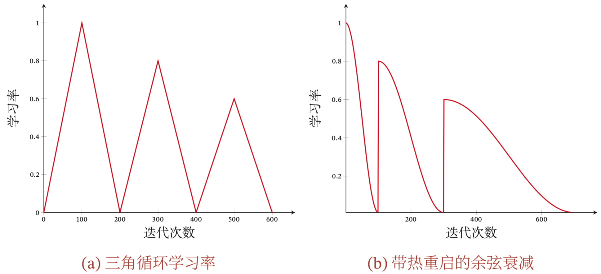

# 神经网络优化概述(一)

神经网络虽然具有很强大的表达能力，但是在实际应用中依然存在一些难点，主要分为两大类：
（1）==优化问题==
深度神经网络的优化十分困难.首先，神经网络的损失函数是一个非凸函数，找到全局最优解通常比较困难.其次，深度神经网络的参数通常非常多，训练数据也比较大，因此也无法使用计算代价很高的二阶优化方法，而一阶优化方法的训练效率通常比较低.此外，深度神经网络存在梯度消失或爆炸问题，导致基于梯度的优化方法经常失效.

（2）==泛化问题==
由于深度神经网络的复杂度比较高，并且拟合能力很强，很容易在训练集上产生过拟合.因此在训练深度神经网络时，同时也需要通过一定的正则化方法来改进网络的泛化能力.

目前，研究者从大量的实践中总结了一些经验方法，在神经网络的表示能力、复杂度、学习效率和泛化能力之间找到比较好的平衡，并得到一个好的网络模型.主要涉及了 ==网络优化== 和 ==网络正则化== 两个方面.
在网络优化方面，包括了一些常用的优化算法、参数初始化方法、数据预处理方法、逐层归一化方法和超参数优化方法.

在网络正则化方面，包括了一些提高网络泛化能力的方法， 包括$\ell_1$和$\ell_2$正则化、权重衰减、提前停止、丢弃法、数据增强和标签平滑.

## 网络优化的难点

### 网络结构的多样性
神经网络的种类非常多，比如卷积网络、循环网络、图网络等.不同网络的结构也非常不同，有些比较深，有些比较宽.不同参数在网络中的作用也有很大的差异，比如连接权重和偏置的不同，以及循环网络中循环连接上的权重和其他权重的不同.
由于网络结构的多样性，我们很难找到一种通用的优化方法.不同优化方法在不同网络结构上的表现也有比较大的差异.
此外，网络的超参数一般比较多，这也给优化带来很大的挑战.

### 高维变量的非凸优化
低维空间的非凸优化问题主要是存在一些局部最优点.基于梯度下降的优化方法会陷入局部最优点，因此在低维空间中非凸优化的主要难点是如何选择初始化参数和逃离局部最优点.深度神经网络的参数非常多，其参数学习是在非常高维空间中的非凸优化问题，其挑战和在低维空间中的非凸优化问题有所不同.
在高维空间中，非凸优化的难点并不在于如何逃离局部最优点，而是如何逃离鞍点.鞍点的梯度是0，但是在一些维度上是最高点，在另一些维度上是最低点。

{ width="50%" height="50%" }

> ==驻点 又叫稳定点或临界点==
> 定义：函数一阶导数等于零的点

> ==极值点==
> 定义：在 $x$ 的邻域内，$f(x)$ 的值总是大于等于或小于等于其他值，则 $x$ 为极值点
> 性质：
> 若极值点一阶可导，则导数为零，此时极值点为驻点。
> 若极值点二阶可导，则一阶导数为零，二阶导数为正（极小值）或者为负（极大值）
> 注意：极值点不一定是可导点，也不一定是连续点。
> 推广：若多维函数 极值点 二阶可导，则梯度为零，Hessian 矩阵为正定或负定矩阵。

> ==拐点==
> 定义：函数$f(x)$的凹凸弧分界点
> 性质：
> 若拐点二阶可导，则二阶导数为零
> 注意: 拐点不一定是可导点，如两个上下半圆连接的点，导数等于无穷。

> ==鞍点==
> 定义：一个不是局部最小值的驻点。
> 数学含义为： 函数在此点一阶导数为零，但该点是某一方向上的函数极大值点，在另一方向上是函数极小值点。
> 在矩阵中，若一个元素是所在行中的最大值，所在列中的最小值，称之为鞍点。
> 判断鞍点的充分条件： 函数在驻点的 Hessian 矩阵为不定矩阵。

## 神经网络优化的改善方法
改善神经网络优化的目标是找到更好的局部最小值和提高优化效率.目前比较有效的经验性改善方法通常分为以下几个方面:
(1) 使用更有效的优化算法来提高梯度下降优化方法的效率和稳定性，比如动态学习率调整、梯度估计修正等.
(2) 使用更好的参数初始化方法、数据预处理方法来提高优化效率.
(3) 修改网络结构比如使用 ReLU 激活函数、残差连接、逐层归一化等. 
(4) 使用更好的超参数优化方法.

### 优化算法
令$f(\boldsymbol{x};\theta)$表示一个深度神经网络，$\theta$为网络参数，每次选取$K$个训练样本$\mathcal{D}_t=\{(\boldsymbol{x}^{(k)},\boldsymbol{y}^{(k)})\}_{k=1}^K$,第$t$次迭代(Iteration)时损失函数关于参数$\theta$的偏导数为

$$
\boldsymbol{g}_t(\theta)=\frac{1}{K}
\sum_{(\boldsymbol{x},\boldsymbol{y})\in \mathcal{D}_t}
\frac{\partial L(\boldsymbol{y},f(\boldsymbol{x};\theta))}{\partial\theta}
$$

第$t$次更新的梯度$\boldsymbol{g}_t$定义为

$$
\boldsymbol{g}_t \triangleq \boldsymbol{g}_t(\theta_{t-1})
$$

使用梯度下降来更新参数

$$
\theta_{t} \leftarrow \theta_{t-1}-\alpha \boldsymbol{g}_t
$$

其中$\alpha \gt 0$为学习率.每次迭代时参数更新的差值$\Delta \theta_t$的定义为

$$
\Delta \theta_t = \theta_t - \theta_{t-1}
$$

$\Delta \theta_t$和$\boldsymbol{g}_t$并不需要完全一致.$\Delta \theta_t$为每次迭代时参数的实际更新方向，即$\theta_t = \theta_{t-1}+\Delta \theta_t$.在标准的梯度下降算法中$\Delta \theta_t=-\alpha \boldsymbol{g}_t$
从上面公式可以看到，影响梯度下降算法的的主要因素有三方面：(1)批量大小；（2）学习率；（3）梯度估计.

#### (1)批量大小选择
在具体实现中，梯度下降法可以分为:`批量梯度下降`、`随机梯度下降`以及`小批量梯度下降`三种形式.根据不同的数据量和参数量，可以选择一种具体的实现形式.在训练深度神经网络时，训练数据的规模通常都比较大.如果在梯度下降时，每次迭代都要计算整个训练数据上的梯度，这就需要比较多的计算资源.另外大规模训练集中的数据通常会非常冗余，也没有必要在整个训练集上计算梯度.因此，在训练深度神经网络时，经常使用小批量梯度下降法(Mini-Batch Gradient Descent).

在小批量梯度下降法中，批量大小(Batch Size)对网络优化的影响也非常大.一般而言，批量大小不影响随机梯度的期望，但是会影响随机梯度的方差.批量大小越大，随机梯度的方差越小，引入的噪声也越小，训练也越稳定，因此可以设置较大的学习率.而批量大小较小时，需要设置较小的学习率，否则模型会不收敛.学习率通常要随着批量大小的增大而相应地增大.一个简单有效的方法是`线性缩放规则(Linear Scaling Rule)`:当批量大小增加$m$倍时，学习率也增加$m$倍.线性缩放规则往往在批量大小比较小时适用，当批量大小非常大时，线性缩放会使得训练不稳定.
> BatchSize：批大小。即每次训练在训练集中取batchsize个样本训练；
>
> Iteration：1个iteration等于使用batchsize个样本训练一次；
>
> Epoch：1个epoch等于使用训练集中的全部样本训练一次；

#### (2)学习率调整
学习率是神经网络优化的重要超参数，在梯度下降法中，学习率$\alpha$如果过大就不会收敛，如果过小则收敛速度太慢。常用的学习率调整方法有学习率衰减、周期性学习率调整以及一些自适应调整学习率的方法（如`AdaGrad/RMSprop/AdaDelta`等）。自适应学习率方法可以针对每个参数设置不同的学习率。

##### 学习率衰减
从经验上看，学习率在一开始要保持大些来保证收敛速度，在收敛到最优点附件时要小些以避免来回振荡。假设初始化学习率为$\alpha_0$,在第$t$次迭代时的学习率为$\alpha_t$，常见的衰减方法有：

| 名称         | 说明                                                         |
| ------------ | ------------------------------------------------------------ |
| 阶段衰减     | 每经过$T_1,T_2,…,T_m$次迭代将学习率衰减为原来的$\beta_1,\beta_2,…,\beta_m$倍,其中$T_m$和$\beta_m \lt 1$是根据设置的超参数 |
| 逆时衰减     | $\alpha_t=\alpha_0 \frac{1}{1+\beta\times t}$,其中$\beta$为衰减率 |
| 指数衰减     | $\alpha_t=\alpha_0 \beta^t$,其中$\beta$为衰减率              |
| 自然指数衰减 | $\alpha_t=\alpha_0\operatorname{exp}(-\beta\times t)$,其中$\beta$为衰减率 |
| 余弦衰减     | $\alpha_t=\frac{1}{2}\alpha_0(1+\operatorname{cos}(\frac{t\pi}{T}))$，其中$T$为总的迭代次数 |

{ width="50%" height="50%" }

##### 周期性学习率调整
为了使得梯度下降法能够逃离鞍点或者尖锐最小值，一种经验性的方式是在训练过程中周期性地增大学习率。周期性地增大学习率虽然可能短期内损害优化过程，使得网络收敛的稳定性变差，但从长期来看有助于找到更好的局部最优解。常见的周期性调整学习率的方法有：三角循环学习率和带热重启的随机梯度下降，如图所示

{  width="80%" height="80%" }

##### AdaGrad算法

在标准的梯度下降法中，每个参数在每次迭代时都使用相同的学习率.由于每个参数的维度上收敛速度都不相同，因此根据不同参数的收敛情况分别设置学习率.

`AdaGrad算法(Adaptive Gradient Algorithm)`是借鉴$\ell_1$正则化的思想，每次迭代时自适应地调整每个参数的学习率，在第$t$次迭代时，先计算每个参数梯度平方的累计值

$$
\begin{aligned}
G_t 
&= G_{t-1}+ \boldsymbol{g}_t\odot\boldsymbol{g}_t \\
&=\sum_{\tau_=1}^t \boldsymbol{g}_\tau \odot \boldsymbol{g}_{\tau}
\end{aligned}
$$

其中$\odot$是按元素乘积，$\boldsymbol{g}_\tau\in \mathbb{R}^{|\theta|}$是第$\tau$次迭代的梯度。
`AdaGrad`算法的参数更新差值为

$$
\Delta\theta_t =-\frac{\alpha}{\sqrt{G_t+\epsilon}}\odot\boldsymbol{g}_t
$$

其中$\alpha$是初始的学习率，$\epsilon$是为了防止数值稳定性而设置的非常小的常数，一般取值在$[\operatorname{e}^{-7},\operatorname{e}^{-10}]$之间,上面公式中的开方、除法、加法等都是按元素进行的操作。
在`AdaGrad`算法中，如果某个参数的偏导数累计比较大，其学习率相对较小；相反，如果偏导数累积较小，其学习率相对较大。但整体是随着迭代次数的增加，学习率逐渐缩小。`AdaGrad`算法的缺点是在经过一定次数的迭代依然没有找到最优解时，由于这时的学习率已经非常小，很难再继续找到最优点。

##### RMSprop算法
`RMSprop`算法是一种自适应学习率的方法，可能在有些情况下避免`AdaGrad`算法中学习率不断单调下降以至于过早衰减的缺点.
`RMSprop`算法首先计算每次迭代梯度$\boldsymbol{g}_t$平方的指数衰减移动平均，即

$$
\begin{aligned}
    G_t 
    &= \beta G_{t-1}+(1-\beta)\boldsymbol{g}_t\odot\boldsymbol{g}_t\\
    &= (1-\beta)\sum_{\tau=1}^t\beta^{t-\tau}\boldsymbol{g}_\tau \odot \boldsymbol{g}_\tau
\end{aligned}
$$

其中$\beta$为衰减率，一般取值为0.9.`RMSprop`算法的参数更新差值为

$$
\Delta \theta_t=-\frac{\alpha}{\sqrt{G_t+\epsilon}}\odot \boldsymbol{g}_t
$$

其中$\alpha$是初始的学习率，比如0.001。`RMSProp`算法和`AdaGrad`算法的区别在于$G_t$的计算由累积方式变成了指数衰减移动平均.在迭代过程中，每个参数的学习率并不是呈衰减趋势，既可以变小也可以变大.

##### AdaDelta算法
`AdaDelta`算法也是`AdaGrad`算法的一个改进.和`RMSprop`算法类似，`AdaDelta`算法也是通过梯度平方的指数衰减移动平均来调整学习率.

$$
\begin{aligned}
    G_t 
    &= \beta G_{t-1}+(1-\beta)\boldsymbol{g}_t\odot\boldsymbol{g}_t= (1-\beta)\sum_{\tau=1}^t\beta^{t-\tau}\boldsymbol{g}_\tau \odot \boldsymbol{g}_\tau\\
    \Delta \theta_t
    &=-\frac{\alpha}{\sqrt{G_t+\epsilon}}\odot \boldsymbol{g}_t
\end{aligned}
$$

此外，`AdaDelta`算法还引入了每次参数更新差值$\Delta\theta$的平方的指数衰减权移动平均.

$$
\Delta x_t^2 = \gamma \Delta x_{t-1}^2+(1-\gamma)\Delta\theta_t \odot \Delta\theta_t
$$

其中$\gamma$为衰减率.因此`AdaDelta`算法参数的更新差值为

$$
\Delta\theta_t =-\frac{\sqrt{\Delta x_{t-1}^2+\epsilon}}{\sqrt{G_t+\epsilon}}\odot \boldsymbol{g}_t
$$

此时由于$\Delta\theta_t$还未知，因此只能计算到$\Delta x_{t-1}$.
> 在原始论文中$\beta$和$\gamma$都是使用相同的超参数$\rho$，因此可见`AdaDelta`算法没有学习率这个超参数，只需要关注超参数$\rho$

#### (3)梯度估计修正
除了学习率的调整之外，还可以进行梯度估计的修正。在随机（小批量）梯度下降法中，如果每次选取样本数量较小，损失会呈现振荡的方式下降，也就是说，随机梯度下降法中每次迭代的梯度估计和整个训练集上的最有梯度并不一致，具有一定的随机性.一种有效地缓 解梯度估计随机性的方式是通过使用最近一段时间内的平均梯度来代替当前时 刻的随机梯度来作为参数更新的方向，从而提高优化速度.

##### 动量法
动量法(Momentum Method)是用之前累积动量来替代真正的梯度.在第$t$次迭代时，计算==负梯度==的"加权移动平均"作为参数的更新方向.

$$
\begin{aligned}
  \Delta \theta_t 
  &= \rho\Delta\theta_{t-1}-\alpha\boldsymbol{g}_t\\
  &=-\alpha \sum_{\tau=1}^t \rho^{t-\tau}\boldsymbol{g}_\tau
\end{aligned}
$$

其中$\rho$是动量因子，通常设置为0.9，$\alpha$为学习率。这里$\boldsymbol{g}_t$实际是对$\theta_{t-1}$的梯度即$\boldsymbol{g}_t=\boldsymbol{g}_{t}(\theta_{t-1})$。
这样，每个参数的实际更新差值取决于最近一段时间内梯度的加权平均值.当某个参数在最近一段时间内的梯度方向不一致时，其真实的参数更新幅度变小;相反，当在最近一段时间内的梯度方向都一致时，其真实的参数更新幅度变大，起到加速作用.一般而言，在迭代初期，梯度方向都比较一致，动量法会起到加速作用，可以更快地到达最优点.在迭代后期，梯度方向会不一致，在收敛值附近振荡，动量法会起到减速作用，增加稳定性.

##### Nesterov加速梯度
`Nesterov加速梯度`(Nesterov Accelerated Gradient，NAG)是一种对动量法的改进,也称为Nesterov动量法,对比`Momentum动量法`的更新方向

$$
  \Delta \theta_t = \rho\Delta\theta_{t-1}-\alpha\boldsymbol{g}_t(\theta_{t-1})
$$

Nesterov的更新方向为

$$
    \Delta \theta_t = \rho\Delta\theta_{t-1}-\alpha\boldsymbol{g}_t(\theta_{t-1}+\rho\Delta\theta_{t-1})
$$

其中$\boldsymbol{g}_t(\theta_{t-1}+\rho\Delta\theta_{t-1})$表示损失函数在点$(\theta_{t-1}+\rho\Delta\theta_{t-1})$的偏导数.所以NAG本质上是多考虑了目标函数的二阶导信息，可以加速收敛了,其实所谓“往前看”的说法.

##### Adam算法
`Adam`算法(`Adaptive Moment Estimation Algorithm`)可以看作动量法和`RMSprop`算法的结合，不但使用动量作为参数更新方向，而且可以自适应调整学习率.

$$
\begin{aligned}
M_{t} &=\beta_{1} M_{t-1}+\left(1-\beta_{1}\right) \boldsymbol{g}_{t} \\
G_{t}=& \beta_{2} G_{t-1}+\left(1-\beta_{2}\right) \boldsymbol{g}_{t} \odot \boldsymbol{g}_{t}
\end{aligned}
$$

假设 $M_0= 0, G_0 = 0$，那么在迭代初期 $M_t$ 和 $G_t$ 的值会比真实的均值和方差要小.特别是当$\beta_1$和$\beta_2$都接近1 时,偏差会很大.因此,需要对偏差进行修正.

$$
\begin{aligned}
   \hat{M}_{t} &= \frac{M_{t}}{1-\beta_1^t} \\
    \hat{G}_{t} &= \frac{G_{t}}{1-\beta_2^t}
\end{aligned}
$$

`Adam`算法的参数更新为

$$
\Delta \theta_t =-\frac{\alpha}{\sqrt{\hat{G}_t+\epsilon}}\hat{M}_t
$$

其中通常$\beta_1=0.9,\beta_2=0.99$,学习率$\alpha$设置为0.001，并且也可以进行衰减如$\alpha_t=\alpha_0/\sqrt{t}$.

`Adam`算法是`RMSprop`算法和动量法的结合，因此一种自然的`Adam`算法改进是引入Nesterov加速度，称为`Nadam`算法。

##### 梯度截断
在深度神经网络或循环神经网络中，除了梯度消失之外，梯度爆炸也是影响学习效率的主要因素.在基于梯度下降的优化过程中，如果梯度突然增大，用大的梯度更新参数反而会导致其远离最优点.为了避免这种情况，当梯度的模大于一定阈值时，就对梯度进行截断，称为`梯度截断(Gradient Clipping)`.
梯度截断是一种比较简单的启发式方法，把梯度的模限定在一个区间，当梯度的模小于或大于这个区间时就进行截断.一般截断的方式有以下几种:
###### (1)按值截断 
在第$t$次迭代时，梯度为$\boldsymbol{g}_t$，给定一个区间$[a,b]$，如果一个参数的梯度小于$a$时，就将其设为$a$;如果大于$b$时，就将其设为$b$.

$$
\boldsymbol{g}_t=\operatorname{max}(\operatorname{min}(\boldsymbol{g}_t,b),a)
$$

###### (2)按模截断
将梯度的模截断到一个给定的截断阈值$b$. 如果$||\boldsymbol{g}_t||^2 ≤ b$，保持$\boldsymbol{g}_t$不变.如果$||\boldsymbol{g}_t||^2>b$，令 

$$
\boldsymbol{g}_t=\frac{b}{||\boldsymbol{g}_t||}\boldsymbol{g}_t
$$

总结

{ width="80%" height="80%" }

### 参数初始化
使用梯度下降法来进行优化网络参数时，参数初始值的选取十分关键，关系到网络的优化效率和泛化能力。参数初始化的方式通常有以下三种：

1. 预训练初始化：不同的参数初始值会收敛到不同的局部最优解，虽然这些局部最优解在训练集上的损失比较接近，但是它们的泛化能力差异很大，一个好的初始值会使得网络收敛到一个泛化能力高的局部最优解。通常情况下，一个已经在大规模数据上训练过的模型可以提供一个好的参数初初始值，这种方法被称为预训练初始化。预训练初始化通常会提升模型的泛化能力的一种解释是预训练任务起到了一定的正则化作用。

2. 固定初始值初始化：对于一些特殊的参数，可以根据用一个特殊的固定值来进行初始化，如：
    + 偏置Bias通常设置为0，但有时可以根据某些经验值可以提高效率；
    + LSTM网络中遗忘门的偏置往往设置为1或2，使得时序上的梯度变大；
    + 对Relu激活函数，有时将偏置设置为0.01，使得Relu在初期训练时更加容易激活；

3. 随机值初始化：在线性模型的训练中（如感知器和Logistic回归）中，一般将参数全部初始化为0，但是在神经网络中就会出现问题，因为如果参数都是0，在第一遍前向计算时，所有的隐藏层神经元激活值都是相同的；那么在反向传播中，所有权重的更新也都相同，从而导致隐藏层神经元灭有区分性，这种现象也称为对称权重现象，为了打破这个平衡，比较好的方式是对每个参数都随机初始化，使得不同神经元之间的区分性更好。比较常见的三种随机初始化方法有：基于固定方差的参数初始化、基于方差缩放的参数初始化和正交初始化方法。

#### 基于固定方差的参数初始化
一种简单的随机初始化方法是从一个固定均值（通常为0）和方差$\sigma$的分布中采样来生成参数的初始值，主要有两种常见的采样方法：
1. 高斯分布初始化：使用一个高斯分布$\mathcal{N}(0,\sigma^2)$对每个参数进行随机初始化
2. 均匀分布初始化：在一个给定区间$[-r,r]$内采用均匀分布来随机初始化

> 假设随机变量$x$在区间$[a,b]$内均匀分布，则其方差为
>
> $$
> \operatorname{var}(x)=\frac{(b-a)^2}{12}
> $$
> 若使用区间为$[-r,r]$的均分分布采样，且满足$\operatorname{var}(x)=\sigma^2$时，则$r$的取值为
>
> $$
> r=\sqrt{3\sigma^2}
> $$

基于固定方差的随机初始化方法中，比较关键的是如何设置方差$\sigma^2$，如果参数范围取得太小：

+ 导致神经元的输出太小，进过多层以后信号就慢慢消失了；
+ 使得`sigmoid`激活函数在0附近，基本上是近似线性的，从而导致激活函数失去了非线性能力。

如果参数范围取得太大，会导致输入状态过大，对于`sigmoid`激活函数而言，激活值变得饱和，梯度将近于0，从而导致梯度消失问题。为了降低固定方差对网络性能以及优化效率的影响，基于固定方差的随机 初始化方法一般需要配合逐层归一化来使用

#### 基于方差缩放的参数初始化
 一般而言，参数初始化的区间应该根据神经元的性质进行差异化的设置。如果一个神经元的输入连接很多，它的每个输入连接上的权重就应该小一些，以避免神经元的输出过大或者过饱和。
 初始化一个深度网络时，为了缓解梯度消失或者爆炸问题，需要尽可能保持每个神经元的输入和输出的方差一致，根据神经元的连接数量来自适应地调整初始化分布的方差，这类方法被称为方差缩放。

##### Xavier初始化
假设在一个神经网络中，第$l$层的一个神经元$a^l$，其接受前一层的$M_{l-1}$个神经元的输出$a_{i}^{l-1},1\le i \le M_{l-1}$

$$
a^{l}=f(\sum_{i=1}^{M_{l-1}}w_{i}^l a_{i}^{l-1})
$$

其中$f(\cdot)$为激活函数，这里为了简单起见，零激活函数为恒等函数即$f(x)=x$.假设$w_i^{l}$和$a_i^{l-1}$的均值都为0，并且互相独立，则$a^{l}$的均值为

$$
 \mathbb{E}[a^l]=\mathbb{E}[\sum_{i=1}^{M_{l-1}}w_{i}^l a_{i}^{l-1}]
= \sum_{i=1}^{M_{l-1}}\mathbb{E}[w_i^l]\mathbb{E}[a_i^{l-1}]=0
$$

$a^l$的方差为

$$
 var(a^l)=\operatorname{var}(\sum_{i=1}^{M_{l-1}}w_{i}^l a_{i}^{l-1})
 =\sum_{i=1}^{M_{l-1}} \operatorname{var}(w_i^l)\operatorname{var}(a_i^{l-1})
 =M_{l-1} \operatorname{var}(w_i^l)\operatorname{var}(a_i^{l-1})
$$

从公式可以看出，输入信号的方差在经过该神经元后被放大或缩小了$M_{l-1}\operatorname{var}(w_i^l)$倍。为了使得在经过多层网络后，信号不被过分放大或过分缩小，应该尽可能保持每个神经元的输入和输出的方差一致，即$M_{l-1}\operatorname{var}(w_i^l)$设置为1比较合理，即

$$
\operatorname{var}(w_i^l)=\frac{1}{M_{l-1}}
$$

同理，为了使得在反向传播中，误差信号也不被放大或缩小，需要将$w_i^l$的方差保持为

$$
\operatorname{var}(w_i^l)=\frac{1}{M_l}
$$

作为折中，考虑信号在前向和后向传播中都不被放大或缩小，可以设置为

$$
\operatorname{var}(w_i^l)=\frac{2}{M_{l}+M_{l-1}}
$$

虽然在Xavier初始化中假设激活函数为恒等函数，但是Xavier初始化也适用于Logistic函数和Tanh函数，在实际使用中，通常将方差$\frac{2}{M_{l}+M_{l-1}}$乘以一个缩放因子$\rho$.

##### He初始化

 当第$l$层神经元使用Relu激活函数时，通常有一半的神经元输出为0.因此其分布的方差也近似为使用恒等函数时的一半，这样，只考虑前向传播时，参数$w_i^l$的理想方差为

$$
 \operatorname{var}(w_i^l)=\frac{2}{M_{l-1}}
$$

因此当使用Relu激活函数时
+ 若采用高斯分布来初始化参数$w_i^l$，其方差为$\frac{2}{M_{l-1}}$;
+ 若采用区间为$[-r,r]$的均分布来初始化参数$w_i^l$，则$r=\sqrt{\frac{6}{M_{l-1}}}$
这种初始化方法为He初始化

下面给出Xavier初始化和He初始化的具体配置

{ width="80%" height="80%" }

##### 正交初始化

前面两种基于方差的初始化方法都是对权重矩阵中的每个参数进行独立采样.由于采样的随机性，采样出来的权重矩阵依然可能存在梯度消失或梯度爆炸问题.

因此，一种更加直接的方式是将$𝑾^l$初始化为正交矩阵，即$𝑾^l(𝑾^l)^{\top} = 𝐼$，这种方法称为正交初始化,正交初始化的具体实现过程可以分为两步:(1)用均值为0、方差为1的高斯分布初始化一个矩阵;(2)将这个矩阵用奇异值分解得到两个正交矩阵，并使用其中之一作为权重矩阵.

根据正交矩阵的性质,这个线性网络在信息的前向传播过程和误差的反向传播过程中都具有范数保持性，从而可以避免在训练开始时就出现梯度消失或梯度爆炸现象.

当在非线性神经网络中应用正交初始化时，通常需要将正交矩阵乘以一个缩放系数$\rho$.比如当激活函数为ReLU 时，激活函数在0附近的平均梯度可以近似为0.5.为了保持范数不变，缩放系数$\rho$可以设置为$\sqrt{2}$
