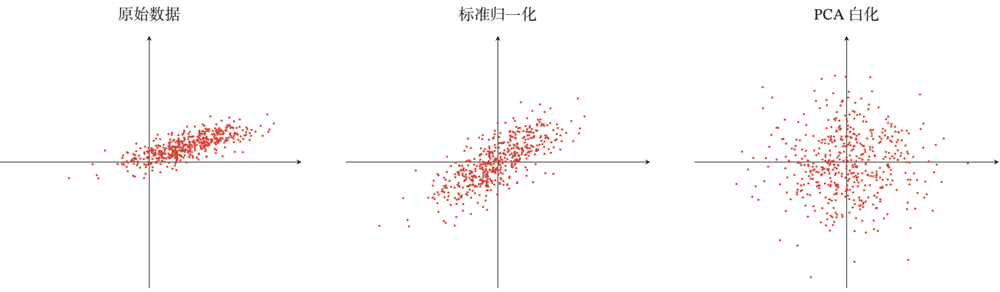

# 神经网络优化概述(二)

## 数据预处理
一般而言，样本特征由于来源以及度量单位不同，它们的`尺度（Scale）`即取值范围往往很大，如果一个机器学习算法在缩放全部或部分特征后不影响它的学习和预测，那么称改算法具有`尺度不变性（Scale Invariance）`.从理论上，神经网络应该具有尺度不变性，可以通过参数的调整来适应不同特征的尺度，但尺度不同的输入特征会增加训练难度.
归一化（Normalization）方法泛指把数据特征转换为相同尺度的方法，比如把数据特征映射到[0,1]或者[-1,1]区间内，或者映射为服从均值为0，方差为1的标准正态分布。归一化的方法有很多种，常用有==最小最大值归一化、标准化和白化==.

### 最小最大值归一化
最小最大值归一化（Min-Max Normalization）是一种简单的归一化方法，通过缩放将每一个特征的取值范围归一到[0,1]或[-1,1]之间，假设有$N$个样本$\{x^n\}_{n=1}^N$,对于每一维特征$x$归一化后的特征为

$$
\hat{x}=\frac{x-\operatorname{min}\{x^n\}_{n=1}^N}{\operatorname{max}\{x^n\}_{n=1}^N-\operatorname{min}\{x^n\}_{n=1}^N}
$$

其中$\operatorname{min}$和$\operatorname{max}$分别是特征$x$在所有样本上的最大值和最小值.

### 标准化
标准化（Standandization）也叫做Z值归一化（Z-Score Normalaization）将每一维特征都调整为均值为0，方差为1.假设有$N$个样本$\{x^n\}_{n=1}^N$,对于每一维特征$x$归一化后的特征为

$$
\begin{aligned}
    \mu &= \frac{1}{N}\sum_{n=1}^N x^n \\
    \sigma^2 &= \frac{1}{N}\sum_{n=1}^N (x^n-\mu)\\
    \hat{x} &= \frac{x-\mu}{\sigma}
\end{aligned}
$$

其中$\sigma$不能为0，如果标准差为0，说明这一维度特征没有任务区分性，可以直接删掉.

### 白化
白化（Whitening）是一种重要的预处理方法，用来降低输入数据特征之间的冗余性，输入数据经过白化处理后，特征之间的相关性降低，并且所有特征具有相同的方差，白化的一个主要实现方式是使用主成分分析（Principal Component Analysis,PCA）方法去除掉各个成分之间的相关性.

## 逐层归一化
逐层归一化（Layer-wise Normalization）是将传统机器学习中的数据归一化方法应用到深度神经网络中，对神经网络中隐藏层的**输入**进行归一化，从而使得网络更加容易训练。逐层归一化可以提高训练效率的原因有以下几个方面：
1. **更好的尺度不变性**：将每个神经元的输入分布都归一化为标准正态分布，使得每个神经层对其输入具有更好的尺度不变性。无论低层的参数如何变化，高层的输入保持相对稳定.此外，尺度不变性可以更加高效地进行参数初始化以及超参数选择；
2. **更平滑地优化地形**：逐层归一化一方面可以使得大部分神经层的输入处于不饱和区域，从而让梯度变大，避免梯度消失问题;另一方面还可以使得 神经网络的优化地形(Optimization Landscape)更加平滑，以及使梯度变得更加稳定，从而允许我们使用更大的学习率，并提高收敛速度.

常见的几种逐层归一化方法有：==批量归一化、层归一化、权重归一化和局部响应归一化==.

## 批量归一化

批量归一化（Batch Normalization，BN）方法是一种有效的逐层归一化方法，可以对神经网络中任意中间层进行归一化操作.对于一个深度神经网络，令第$l$层的净输入为$z^l$，神经元的输出为$a^l$，即

$$
a^l = f(z^l)=f(W a^{l-1}+b)
$$

其中$f(\cdot)$是激活函数，$W$和$b$是可学习参数.

为了提高优化效率，就需要使得净输入$z^l$的分布一致，比如都归一化到标准正态分布.虽然归一化操作也可以应用在输入$a^{l-1}$,但归一化$z^l$更加有利于优化。可以使用数据预处理方法对$z^l$进行归一化，相当于每一层都进行一次数据预处理，从而加速收敛速度，但是逐层归一化需要在中间层进行操作，要求效率比较高，因此复杂度比较高的白化方法不太适合.

为了提高归一化的效率，一般使用标准化将净输入$z^l$的每一维度都归一到标准正态分布。因为目前主要的优化算法是基于小批量的随机梯度下降法，所以准确地计算$z^l$的期望和方差是不可行的.因此，$z^l$的期望和方差通常用当前小批量样本集的均值和方差近似估计.

给定一个包含$K$个样本的小批量样本集合，第$l$层神经元的净输入$\mathcal{B}=\{z^{(1,l)},\cdots,z^{(K,l)}\}$的均值和方差为

$$
\begin{aligned}
  \mu_{\mathcal{B}} &= \frac{1}{K}\sum_{k=1}^K z^{(k,l)}  \\
  \sigma_{\mathcal{B}}^2 &= \frac{1}{k}\sum_{k=1}^{K}(z^{(k,l)}-\mu_{\mathcal{B}}) \odot (z^{(k,l)}-\mu_{\mathcal{B}})
\end{aligned}
$$

对净输入$z^l$的标准归一化使得其取值集中到0附近，如果使用`Sigmoid`型激活函数时，这个取值区间刚好是接近线性变换的区间，减弱了神经网络的非线性性质。因此，为了使得归一化不对网络的表示能力造成负面影响，可以通过加一个==缩放==和==平移==变换改变取值区间

$$
\begin{aligned}
\hat{z}^l &= \frac{z^l -\mu_\mathcal{B}}{\sqrt{\sigma^2_{\mathcal{B}}+\epsilon}}\odot \boldsymbol{\gamma} +\boldsymbol{\beta} \\
&\triangleq \operatorname{BN}_{\boldsymbol{\gamma},\boldsymbol{\beta}}(z^l)  
\end{aligned}
$$

其中$\boldsymbol{\gamma},\boldsymbol{\beta}$分别表示缩放和平移的参数向量.批量归一化操作可以看作一个特殊的神经层，加在每一层非线性激活函数之前，即

$$
\boldsymbol{a}^l
=f(\operatorname{BN}_{\boldsymbol{\gamma},\boldsymbol{\beta}}(z^l))
=f(\operatorname{BN}_{\boldsymbol{\gamma},\boldsymbol{\beta}}(W \boldsymbol{a}^{l-1}))
$$

其中因为批量归一化本身具有平移变换，所以仿射变换$W\boldsymbol{a}^{l-1}$不再需要偏执参数.需要注意的有两点：
+ $\boldsymbol{\gamma},\boldsymbol{\beta}$是可学习的变量，$\operatorname{BN}$可看作是以$\boldsymbol{\gamma},\boldsymbol{\beta}$为参数的映射函数
+ 当预测阶段，用整个数据集上的均值$\mu$和方差$\sigma$来分别代替每次小批量样本的$\mu_\mathcal{B}$和$\sigma_\mathcal{B}$，在实践中，$\mu_\mathcal{B}$和$\sigma_\mathcal{B}$也可以用移动平均来计算.

>逐层归一化不但可以提高优化效率，还可以作为一种隐形的正则化方法.在训练时，神经网络对一个样本的预测不仅和该样本自身相关，也和同一批次中的其他样本相关.由于在选取批次时具有随机性，因此使得神经网 络不会“过拟合”到某个特定样本，从而提高网络的泛化能力 

## 层归一化

批量归一化是对一个中间层的单个神经元进行归一化操作，因此要求小批量样本的数量不能太小，否则难以计算单个神经元的统计信息.此外，如果一个神经元的净输入的分布在神经网络中是动态变化的，比如循环神经网络，那么就无法应用批量归一化操作.

层归一化(Layer Normalization)是和批量归一化非常类似的方法，和批量归一化不同的是，层归一化是对一个中间层的所有神经元进行归一化.对于一个深度神经网络，令第$l$层的神经元的净输入为$\boldsymbol{z}^l$，其均值和方差为

$$
\begin{aligned}
  \mu^{l}&=\frac{1}{M_{l}}\sum_{i=1}^{M_l} \boldsymbol{z}_i^l \\
(\sigma^{l})^2 &=\frac{1}{M_{l}}\sum_{i=1}^{M_l} (\boldsymbol{z}_i^l-\mu^l)^2
\end{aligned}
$$

其中$M_l$是第$l$层神经元的数量
层归一化定义为

$$
\begin{aligned}
\hat{\boldsymbol{z}}^l &= \frac{\boldsymbol{z}^l -\mu}{\sqrt{(\sigma^l)^2+\epsilon}}\odot \boldsymbol{\gamma} +\boldsymbol{\beta} \\
&\triangleq \operatorname{LN}_{\boldsymbol{\gamma},\boldsymbol{\beta}}(\boldsymbol{z}^l)  
\end{aligned}
$$

其中$\boldsymbol{\gamma}$和$\boldsymbol{\beta}$分别代表缩放和平移向量，和$\boldsymbol{z}^l$维度相同.

层归一化可以应用在循环神经网络中，对循环神经网络进行归一化操作，假设在时刻$t$，循环神经网络的隐藏层为$\boldsymbol{h}_t$，其归一化的更新为

$$
\begin{aligned}
  \boldsymbol{z}_l = \boldsymbol{U} \boldsymbol{h}_{t-1}+\boldsymbol{W} \boldsymbol{x}_t \\
  \boldsymbol{h}_t = f( \operatorname{LN}_{\boldsymbol{\gamma},\boldsymbol{\beta}}(\boldsymbol{z}^l) )
\end{aligned}
$$

其中输入为$\boldsymbol{x}_t$为第$t$时刻的输入，$\boldsymbol{U}$和$\boldsymbol{W}$为网络参数.在标准循环神经网络中，循环神经层的净输入一般会随着时间慢慢变大或变小，从而导致梯度爆炸或消失.而层归一化的循环神经网络可以有效地缓解这种状况.

层归一化和批量归一化整体上是十分类似的，差别在于归一化的方法不同. 对于$K$个样本的一个小批量集合$𝒁^{(𝑙)} = [𝒛^{(1,𝑙)}; ⋯ ; 𝒛^{(𝐾,𝑙)}]$，层归一化是对矩阵$𝒁^{(𝑙)}$的每一列进行归一化，而批量归一化是对每一行进行归一化.一般而言，批量归一化是一种更好的选择.当小批量样本数量比较小时，可以选择层归一化.

此外还有一些归一化方法如权重归一化和局部响应归一化等.

# 超参数优化

在神经网络中，除了可学习的参数之外，还存在很多超参数,这些超参数对网络性能的影响也很大，不同的机器学习任务往往需要不同的超参数，常见的超参数有以下三类：
1. 网络结构：包括神经元之间的连接关系、层数、每层神经元数量和激活函数的类型等
2. 优化参数：包括优化方法、学习率和小批量的样本数量等
3. 正则化系数

超参数优化(Hyperparameter Optimization)主要存在两方面的困难:
1. 超参数优化是一个组合优化问题，无法像一般参数那样通过梯度下降方法来优化，也没有一种通用有效的优化方法;
2. 评估一组超参数配置(Configuration) 的时间代价非常高，从而导致一些优化方法(比如演化算法(Evolution Algo- rithm))在超参数优化中难以应用.

对于超参数的配置，比较简单的方法有==网格搜索、随机搜索、贝叶斯优化、动 态资源分配和神经架构搜索==.

