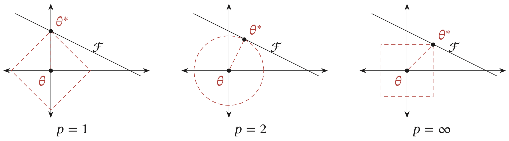
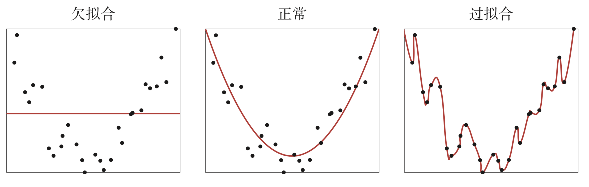
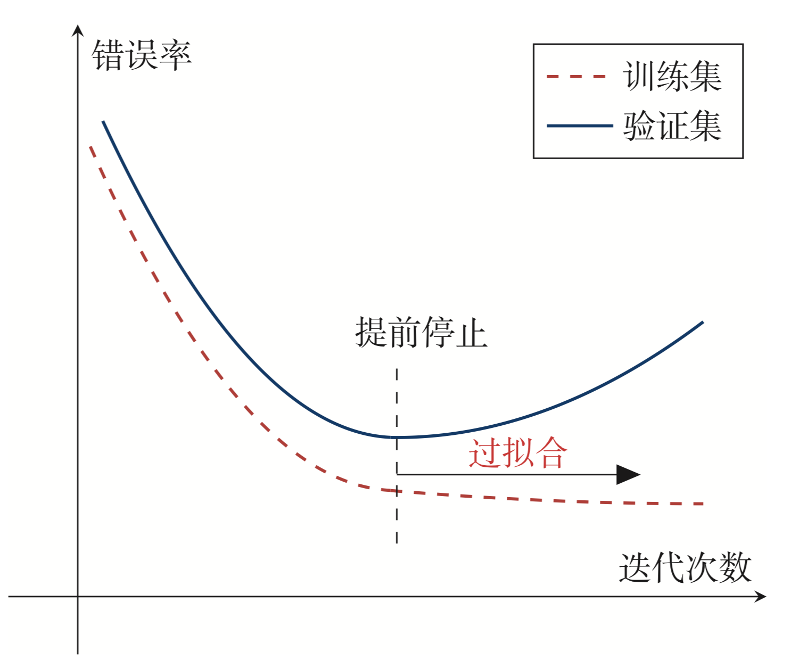

# 网络正则化
机器学习的关键是泛化问题，即在样本真实分布上的期望风险最小化.而训练数据集上的经验风险最小化和期望风险并不一致，由于神经网络的拟合能力非常强，其在训练数据集上的错误率往往可以降到非常低，甚至可以到0，从而导致过拟合.
在传统的机器学习中，提高泛化能力的方法主要是限制模型复杂度，比如采用$\ell_1$和$\ell_2$正则化等方式.而在训练深度神经网络时，特别是在过度参数化过度参数化是指模型时，$\ell_1$和$\ell_2$正则化的效果往往不如浅层机器学习模型中显著.因此训练深度学习模型时，往往还会使用其他的正则化方法，比如数据增强、提前停止、丢弃法、集成法等.

## $\ell_1$和$\ell_2$正则化

$\ell_1$和$\ell_2$正则化是机器学习中最常用的正则化方法.通过约束参数$\ell_1$和$\ell_2$范数来减小模型在训练数据集上的过拟合现象.
通过加入$\ell_1$和$\ell_2$正则化，优化问题可以写成

$$
\theta^{*}=\underset{\theta}{\arg \min } \frac{1}{N} \sum_{n=1}^{N} \mathcal{L}\left(y^{n}, f\left(x^{n} ; \theta\right)\right)+\lambda \ell_{p}(\theta)
$$

其中$\mathcal{L}(\cdot)$为损失函数，$N$为训练样本数量，$f(\cdot)$为待学习的神经网络，$\theta$为其参数，$\ell_p$为范数函数，$p$的取值通常为$\{1,2\}$代表$\ell_1$和$\ell_2$范数，$\lambda$为正则化系数.

带有正则化的优化问题等价于下面带约束条件的优化问题

$$
\begin{aligned}
\theta^{*} &=\underset{\theta}{\arg \min } \frac{1}{N} \sum_{n=1}^{N} \mathcal{L}\left(y^{n}, f\left(\boldsymbol{x}^{n} ; \theta\right)\right), \\
& \text { s.t. } \quad \ell_{p}(\theta) \leq 1
\end{aligned}
$$

$\ell_1$范数在零点不可导，因此经常采用下面的式子来近似

$$
\ell_1(\theta) = \sum_{d=1}^D\sqrt{\theta_d^2+\epsilon}
$$

其中$D$为参数数量，$\epsilon$为一个非常小的常数.

如图红线表示函数$\ell_p$ 为不同范数下约束条件，$\mathcal{F}$表示函数$f(\theta)$的等高线（为了简单起见，这里直接用直线表示）从图中可以看到$\ell_1$范数的约束通常会使得最优解位于坐标轴上，从而使得最终的参数为稀疏性向量.

过拟合的时候，拟合函数的系数往往非常大，为什么？如下图所示，过拟合就是拟合函数需要顾忌每一个点，最终形成的拟合函数波动很大。在某些很小的区间里，函数值的变化很剧烈。这就意味着函数在某些小区间里的导数值（绝对值）非常大，由于自变量值可大可小，所以只有系数足够大，才能保证导数值很大。

## 权重衰减

权重衰减是一种有效的正则化方法，在每次参数更新时，引入一个衰减系数

$$
\theta_t \leftarrow (1-\beta)\theta_{t-1}-\alpha \boldsymbol{g}_t
$$

其中$\boldsymbol{g}_t$为第$t$步更新时的梯度，$\alpha$为学习率，$\beta$为权重衰减系数，一般取值比较小，比如 0.0005。从公式上可以看到权重衰减和$\ell_2$正则化是等价的.

## 提前停止
提前停止对于深度神经网络来说是一种简单有效的正则化方 法.由于深度神经网络的拟合能力非常强，因此比较容易在训练集上过拟合.在 使用梯度下降法进行优化时，可以使用一个和训练集独立的样本集合，称 为验证集(`Validation Set`)，并用验证集上的错误来代替期望错误.当验证集上的错误率不再下降，就停止迭代。然而在实际操作中，验证集上的错误率变化曲线并不一定是图中所示的平衡曲线，很可能是先升高再降低。因此，提前停止的具体停止标准需要根据实际任务进行优化。

{ width="80%", height="80%" }

## 丢弃法
当训练一个深度神经网络时，可以随机丢弃一部分神经元（同时丢弃其对应的连接边）来避免过拟合，这种方法被称为丢弃法（Dropout Method）.每次丢弃的神经元是随机的，最简单的方法是是设置一个固定的概率$p$，对每一个神经元都以概率$p$来判定要不要保留.对于一个神经层$\boldsymbol{y}=f(\boldsymbol{W}\boldsymbol{x}+\boldsymbol{b})$，可以引入一个掩蔽函数$\operatorname{mask}(\cdot)$

$$
\operatorname{mask}(\boldsymbol{x})=\left\{\begin{array}{ll}
\boldsymbol{m} \odot \boldsymbol{x} & \text { 当训练阶段时 } \\
p \boldsymbol{x} & \text { 当测试阶段时 }
\end{array}\right.
$$

其中$\boldsymbol{m}\in \{0,1\}^D$是丢弃掩码，通过以概率为$p$的伯努利分布随机生成.在训练时，激活神经元的平均数量为原来的$p$倍.而在测试时，所有的神经元都是可以激活的，这会造成训练和测试时网络的输出不一致.

为了缓解这个问题，在测试时需要将神经层的输入$\boldsymbol{x}$乘以$p$，也相当于把不同的神经网络做了平均.保留率$p$可以通过验证集来选取一个最优的值.一般来讲，对于隐藏层的神经元，其保留率$p=0.5$时效果最好，这对大部分的网络和任务都比较有效.当$p=0.5$时，在训练时有一半的神经元被丢弃，只剩余一半的神经元是可以激活的，随机生成的网络结构最具多样性.对于输入层的神经元，其保留率通常设为更接近1的数，使得输入变化不会太大.对输入层神经元进行丢弃时，相当于给数据增加噪声，以此来提高网络的鲁棒性.

每做一次丢弃，相当于从原始的网络中采样得到一个子网络.如果一个神经网络有$n$个神经元，那么总共可以采样出$2^n$个子网络.每 次迭代都相当于训练一个不同的子网络，这些子网络都共享原始网络的参数.那么，最终的网络可以近似看作集成了指数级个不同网络的组合模型.

## 数据增强
深度神经网络一般都需要大量的训练数据才能获得比较理想的效果.在数 据量有限的情况下，可以通过数据增强(`Data Augmentation`)来增加数据量，提高模型鲁棒性，避免过拟合。目前，数据增强还主要应用在图像数据上，在文本等 其他类型的数据上还没有太好的方法。图像数据的增强主要是通过算法对图像进行转变，引入噪声等方法来增加 数据的多样性。增强的方法主要有几种:
(1) 旋转(`Rotation`):将图像按顺时针或逆时针方向随机旋转一定角度. 
(2) 翻转(`Flip`):将图像沿水平或垂直方法随机翻转一定角度.
(3) 缩放(`Zoom In/Out`):将图像放大或缩小一定比例.
(4) 平移(`Shift`):将图像沿水平或垂直方法平移一定步长.
(5) 加噪声(`Noise`):加入随机噪声.

## 标签平滑
在数据增强中，可以给样本特征加入随机噪声来避免过拟合.同样，也可以给样本的标签引入一定的噪声.假设训练数据集中有一些样本的标签是被错误标注的，那么最小化这些样本上的损失函数会导致过拟合.一种改善的正则化方法是标签平滑(Label Smoothing)，即在输出标签中添加噪声来避免 模型过拟合.

一个样本$x$的标签可以用 one-hot 向量表示，即

$$
\boldsymbol{y}=[0,\cdots,0,1,0\cdots,0]^\top
$$

这种标签可以看作硬目标(`Hard Target`).我们可以引入一个噪声对标签进行平滑，即假设样本以 𝜖 的概率为其他类.平滑后的标签为

$$
\boldsymbol{\tilde{y}}=\left[\frac{\epsilon}{K-1}, \cdots, \frac{\epsilon}{K-1}, 1-\epsilon, \frac{\epsilon}{K-1}, \cdots, \frac{\epsilon}{K-1}\right]^{\top}
$$

其中$K$为标签数量，这种标签可以看作软目标(Soft Target).标签平滑可以避免模型的输出过拟合到硬目标上，并且通常不会损害其分类能力。上面的标签平滑方法是给其他$K-1$个标签相同的概率$\epsilon$，没有考虑标签$K-1$之间的相关性.

一种更好的做法是按照类别相关性来赋予其他标签不同的概率. 比如先训练另外一个更复杂(一般为多个网络的集成)的教师网络(`Teacher Network`)，并使用大网络的输出作为软目标来训练学生网络(`Student Net-work`).这种方法也称为知识蒸馏(`Knowledge Distillation`)。