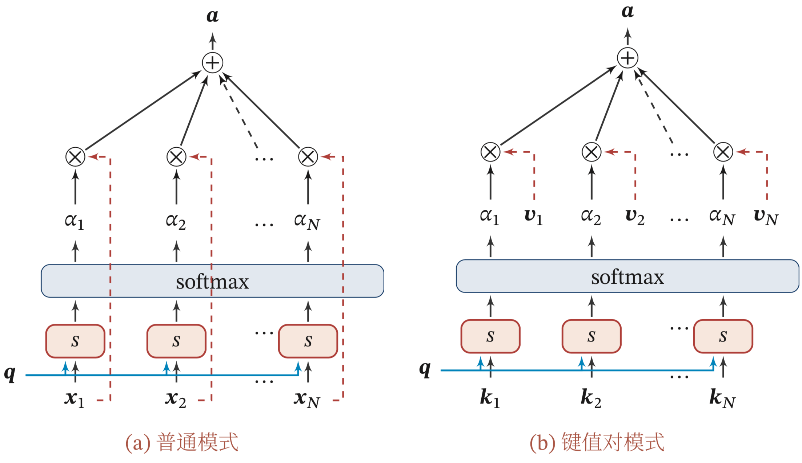
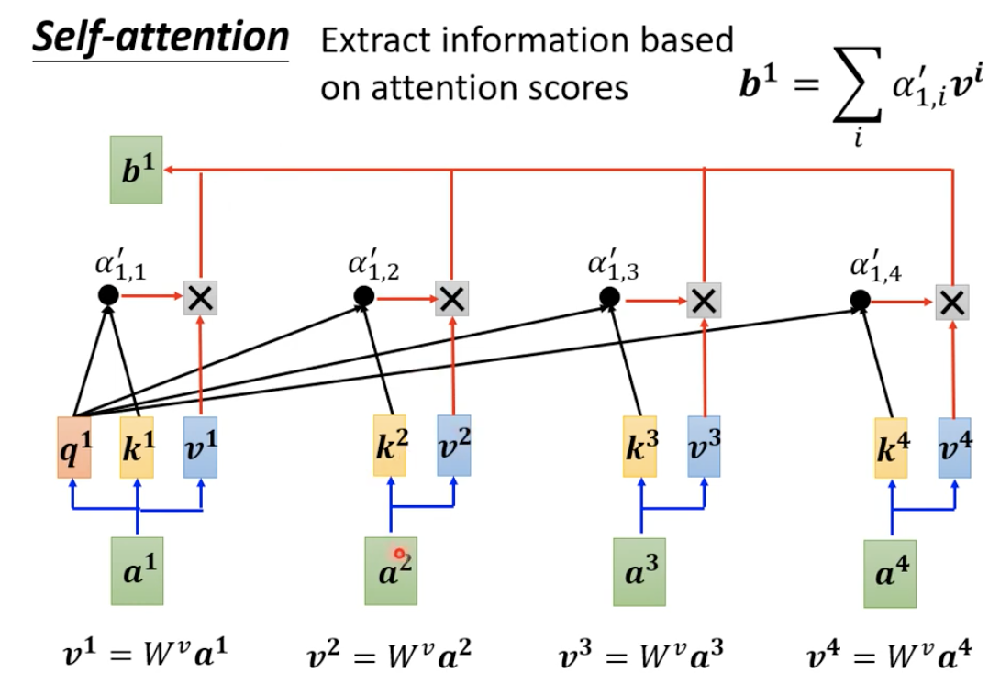
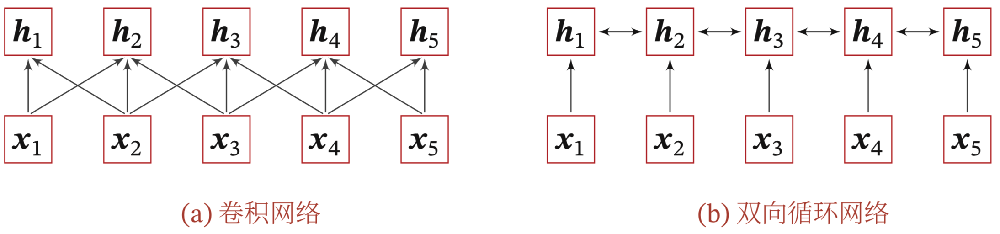
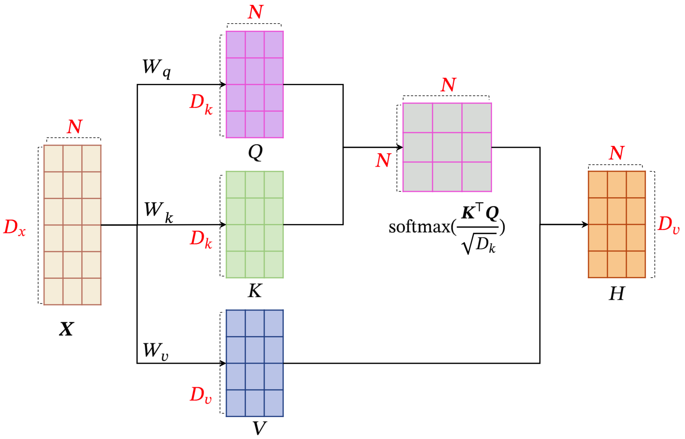
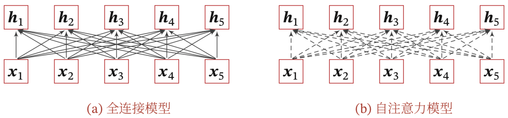


# 注意力机制

注意力是一种人类不可或缺的复杂认知能力，指人可以在关注一些信息的同时忽略另一些信息的选择能力，注意力一般分为两种：

（1）自上而下的有意识的注意力，称为聚焦式注意力(`Focus Attention`)，聚焦式注意力是指有预定目的、依赖任务的，主动有意识得聚焦于某一对象的注意力，后面提到的注意力通常都是指自上而下的聚焦式注意力。

（2）自上下而上的无意识得注意力，称为基于显著性的注意力(`Saliency-Based Attention`)，基于显著性的注意力是由外界刺激驱动的注意，不需要主动干预，也和任务无关。如果一个对象的刺激信息不同于其周围信息，一种无意识的"赢者通吃"(`Winner-Take-All`)或者门控(`Gating`)机制就可以把注意力转向这个对象。不管这些注意力是有意还是无意，大部分的人脑活动都需要依赖注意力，比如记忆信息、阅读或思考等。

在目前的神经网络模型中，可以将最大汇聚(`Max Pooling`)、门控(`Gating`)机制近似地看作自下而上的基于显著性的注意力机制。

除此之外，自 上而下的聚焦式注意力也是一种有效的信息选择方式.以阅读理解任务为例，给 定一篇很长的文章，然后就此文章的内容进行提问.提出的问题只和段落中的一 两个句子相关，其余部分都是无关的.为了减小神经网络的计算负担，只需要把 相关的片段挑选出来让后续的神经网络来处理，而不需要把所有文章内容都输
入给神经网络.

> 聚焦式注意力一般会随着环境、情景或任务的不同而选择不同的信息.比如当要从人群中寻找某个人时，我们会专注于每个人的脸部;而当要统计人群的人数时，我们只需要专注于每个人的轮廓.

在计算能力有限的情况下，注意力机制作为一种资源分配方案，将有限的计算资源用来处理更重要的信息，是解决信息超载问题主要手段。用$\boldsymbol{X}=[\boldsymbol{x}_1,\cdots,\boldsymbol{x}_N]\in \mathbb{R}^{D\times N}$表示$N$组输入信息，其中$D$维向量$\boldsymbol{x}_n\in\mathbb{R}^D,n\in [1,\cdots,N]$表示一组输入信息，为了节省计算资源，不需要将所有信息都输入神经网络，只需要从$\boldsymbol{X}$中选择一些和任务相关的信息。注意力机制的计算可以分为两步：
1. 在所有输入信息上计算注意力分布
2. 根据注意力分布来计算输入信息的加权平均

## 注意力分布

为了从$N$个输入向量$[\boldsymbol{x}_1,\cdots,\boldsymbol{x}_N]$中选择出和某个特定任务相关的信息，需要引入一个和任务相关的表示，称为查询向量(`Query Vector`)并通过一个打分函数来计算每个输入向量和查询向量之间的相关性.

给定一个和任务相关的查询向量$\boldsymbol{q}$，用注意力变量$z\in [1,\cdots,N]$来表示被选择信息的索引位置，即$z=n$表示选择了第$n$个输入向量，为了计算方便，采用一种"软性"的信息选择机制。首先计算在给定$\boldsymbol{q}$和$\boldsymbol{X}$下，选择第$i$个输入向量的概率$\alpha_n$
$$
\begin{aligned}
\alpha_n 
&= p(z=n|\boldsymbol{X},\boldsymbol{q}) \\
&=\operatorname{softmax}(s(\boldsymbol{x}_n,\boldsymbol{q}))\\
&=\frac{\operatorname{exp}(s(\boldsymbol{x}_n,\boldsymbol{q}))}
{\sum_{j=1}^N \operatorname{exp}(s(\boldsymbol{x}_j,\boldsymbol{q})) }    
\end{aligned}
$$
其中$\alpha_n$称为注意力分布，$s(\boldsymbol{x},\boldsymbol{q})$为注意力打分函数，其中可以使用以下几种方式来计算

| 模型      | 公式 |
| --------- | ---- |
| 加权模型 |$s(\boldsymbol{x},\boldsymbol{q})=\boldsymbol{v}^\top\operatorname{tanh(\boldsymbol{W}\boldsymbol{x}+\boldsymbol{U}\boldsymbol{q})}$      |
| 点积模型 | $s(\boldsymbol{x},\boldsymbol{q})=\boldsymbol{x}^\top \boldsymbol{q}$ |
| 缩放点模型 | $s(\boldsymbol{x},\boldsymbol{q})=\frac{\boldsymbol{x}^\top \boldsymbol{q}}{\sqrt{D}}$ |
| 双线性模型 | $s(\boldsymbol{x},\boldsymbol{q})=\boldsymbol{x}^\top \boldsymbol{W} \boldsymbol{q}$ |

其中$\boldsymbol{W},\boldsymbol{U},\boldsymbol{v}$为可学习的参数，$D$为输入向量的维度.

理论上，加性模型和点积模型的复杂度差不多，但是点积模型在实现上可以更好地利用矩阵乘积，从而计算效率更高.

当输入向量的维度$D$比较高时，点积模型的值通常有比较大的方差，从而导致$\operatorname{Softmax}$函数的梯度会比较小。因此，缩放点积模型可以比较好地解决这个问题。

双线性模型是一种泛化的点积模型，当$\boldsymbol{W}=\boldsymbol{U}^\top \boldsymbol{U}$双线性模型可以写为$s(\boldsymbol{x},\boldsymbol{q})=\boldsymbol{x}\boldsymbol{U}^\top \boldsymbol{V}\boldsymbol{q}=(\boldsymbol{U}\boldsymbol{x})^\top (\boldsymbol{V}\boldsymbol{q})$即分别对$\boldsymbol{x}$和$\boldsymbol{q}$进行线性变换后计算点积，相比点积模型，双线性模型在计算相似度时引入了非对称性.

## 加权平均

注意力分布$\alpha_n$可以解释为在给定任务相关的查询$\boldsymbol{q}$时，第$n$个输入向量受关注的程度，可以采用一种"软性"的信息选择机制对输入信息进行汇总，即
$$
\begin{aligned}
\operatorname{att}(\boldsymbol{X},\boldsymbol{q})
&=\sum_{n=1}^N \alpha_n \boldsymbol{x}_n\\
&=\mathbb{E}_{\boldsymbol{z} \sim p(\boldsymbol{z}| \boldsymbol{X},\boldsymbol{q})}[\boldsymbol{x}_z]
\end{aligned}
$$

注意力机制可以单独使用，但更多地用作神经网络中的一个组件.

# 注意力机制的变体

除了上面介绍的基本模式外，注意力机制还存在一些变化的模型。

## 硬性注意力
前面的注意力是软性注意力，其选择地信息是所有输入向量在注意力分布下的期望。此外还有一种注意力只关注某一个输入向量，叫做硬注意力机制。硬注意力机制有两种实现方式：
（1）一种是选取最高概率的一个输入向量，即
$$
\operatorname{att}(\boldsymbol{X},\boldsymbol{q})
=\boldsymbol{x}_{\hat{n}}
$$
其中$\hat{n}$为概率最大的输入向量下标，即$\hat{n}=\underset{n=1}{\arg \max } \alpha_{n}$

（2）另一种硬性注意力可以通过在注意力分布上随机采样的方式实现。

硬性注意力的一个缺点是基于最大采样或随机采样的方式来选择信息，使得最终的损失函数与注意力分布之间的函数关系不可导，无法使用反向传播算 法进行训练.因此，硬性注意力通常需要使用强化学习来进行训练.为了使用反向传播算法，一般使用软性注意力来代替硬性注意力.

## 健值对注意力
更一般地，我们可以用键值对(`key-value pair`)格式来表示输入信息，其中“键”用来计算注意力分布$\alpha_n$，“值”用来计算聚合信息.用$(\boldsymbol{K},\boldsymbol{V}) = [(\boldsymbol{k}_1,\boldsymbol{v}_1),⋯,(\boldsymbol{k}_N,\boldsymbol{v}_N)]$表示$N$组输入信息，给定任务相关的查询向量$\boldsymbol{q}$时，注意力函数为
$$
\begin{aligned}
\operatorname{att}((\boldsymbol{K}, \boldsymbol{V}), \boldsymbol{q}) &=\sum_{n=1}^{N} \alpha_{n} \boldsymbol{v}_{n} \\
&=\sum_{n=1}^{N} \frac{\exp \left(s\left(\boldsymbol{k}_{n}, \boldsymbol{q}\right)\right)}{\sum_{j} \exp \left(s\left(\boldsymbol{k}_{j}, \boldsymbol{q}\right)\right)} \boldsymbol{v}_{n},
\end{aligned}
$$
其中$s(\boldsymbol{k}_n,\boldsymbol{q})$为打分函数。当$\boldsymbol{K}=\boldsymbol{V}$时，键值对模式就等价于普通的注意力机制.

## 多头注意力

多头注意力(`Multi-Head Attention`)是利用多个查询$\boldsymbol{Q}=[\boldsymbol{q}_1,\cdots,\boldsymbol{q}_M]$来并行地输从输入信息中选取多组信息，每个注意力关注输入信息的不同部分
$$
\operatorname{att}((\boldsymbol{K}, \boldsymbol{V}), \boldsymbol{Q})=\operatorname{att}\left((\boldsymbol{K}, \boldsymbol{V}), \boldsymbol{q}_{1}\right) \oplus \cdots \oplus \operatorname{att}\left((\boldsymbol{K}, \boldsymbol{V}), \boldsymbol{q}_{M}\right)
$$
其中$\oplus$表示向量拼接.

# 自注意力模型
当使用神经网络来处理一个变长的向量序列时，我们通常可以使用卷积网络或循环网络进行编码来得到一个相同长度的输出向量序列，如图所示

基于卷积或循环网络的序列编码都是一种局部的编码方式，只建模了输入信息的局部依赖关系.虽然循环网络理论上可以建立长距离依赖关系，但是由于 信息传递的容量以及梯度消失问题，实际上也只能建立短距离依赖关系。

如果要建立输入序列之间的长距离依赖关系，可以使用以下两种方法:(1)一种方法是增加网络的层数，通过一个深层网络来获取远距离的信息交互;(2)另一种方 法是使用全连接网络.全连接网络是一种非常直接的建模远距离依赖的模型，但是无法处理变长的输入序列.不同的输入长度，其连接权重的大小也是不同的. 这时我们就可以利用注意力机制来“动态”地生成不同连接的权重，这就是自注意力模型(`Self-Attention Model`)

为了提高模型能力，自注意力模型经常采用查询-键-值(`Query-Key-Value， QKV`)模式，其计算过程如图8.4所示，其中红色字母表示矩阵的维度.

假设输入序列为$\boldsymbol{X}= [\boldsymbol{x}_1,⋯,\boldsymbol{x}_N] ∈ \mathbb{R}^{D_x \times N}$，输出序列为$\boldsymbol{H} = [\boldsymbol{h}_1,⋯,\boldsymbol{h}_𝑁] ∈ \mathbb{R}^{𝐷_v \times 𝑁}$ ，自注意力模型的具体计算过程如下:

(1)对于每个输入$\boldsymbol{x}_i$，我们首先将其线性映射到三个不同的空间，得到查询向量$\boldsymbol{q}_i \in \mathbb{R}^{D_k}$ 、键向量$\boldsymbol{k}_i \in \mathbb{R}^{D_k}$ 和值向量$\boldsymbol{v}_i \in \mathbb{R}^{D_v}$

对于整个输入序列$\boldsymbol{X}$，线性映射过程可以简写为
$$
\begin{array}{l}
\boldsymbol{Q}=\boldsymbol{W}_{q} \boldsymbol{X} \in \mathbb{R}^{D_{k} \times N} \\
\boldsymbol{K}=\boldsymbol{W}_{k} \boldsymbol{X} \in \mathbb{R}^{D_{k} \times N} \\
\boldsymbol{V}=\boldsymbol{W}_{v} \boldsymbol{X} \in \mathbb{R}^{D_{v} \times N}
\end{array}
$$
其中 $\boldsymbol{W}_{q} \in \mathbb{R}^{D_{k} \times D_{x}}, \boldsymbol{W}_{k} \in \mathbb{R}^{D_{k} \times D_{x}}, \boldsymbol{W}_{v} \in \mathbb{R}^{D_{v} \times D_{x}}$ f分别为线性映射的参数矩阵，$\boldsymbol{Q}=\left[\boldsymbol{q}_{1}, \cdots, \boldsymbol{q}_{N}\right], \boldsymbol{K}=\left[\boldsymbol{k}_{1}, \cdots, \boldsymbol{k}_{N}\right], \boldsymbol{V}=\left[\boldsymbol{v}_{1}, \cdots, \boldsymbol{v}_{N}\right]$ 分别是由查询向量、键向量和值向量构成的矩阵.

(2)对于每一个查询向量$\boldsymbol{q}_n \in \boldsymbol{Q}$，利用键值对注意力机制，可以得到输出向量$\boldsymbol{h}_n$ 
$$
\begin{aligned}
\boldsymbol{h}_{n}
&=\operatorname{att}\left((\boldsymbol{K}, \boldsymbol{V}), \boldsymbol{q}_{n}\right)\\
&=\sum_{j=1}^{N} \alpha_{n j} \boldsymbol{v}_{j} \\
&=\sum_{j=1}^{N} \operatorname{softmax}\left(s\left(\boldsymbol{k}_{j}, \boldsymbol{q}_{n}\right)\right) \boldsymbol{v}_{j}
\end{aligned}
$$
其中$n,j\in [1,\cdots,N]$为输出和输入向量序列的位置，$\alpha_{nj}$表示第$n$个输出关注到第$j$个输入的权重.
如果使用缩放点积来作为注意力打分函数，输出向量序列可以简写为
$$
\boldsymbol{H}=\boldsymbol{V} \operatorname{softmax}\left(\frac{\boldsymbol{K}^{\top} \boldsymbol{Q}}{\sqrt{D_{k}}}\right)
$$
其中$\operatorname{softmax}(\cdot)$为按列进行归一化的函数。下图中给出全连接模型和自注意力模型的对比，其中实线表示可学习的权重，虚线表示动态生成的权重.由于自注意力模型的权重是动态生成的，因此可以处理变长的信息序列.

